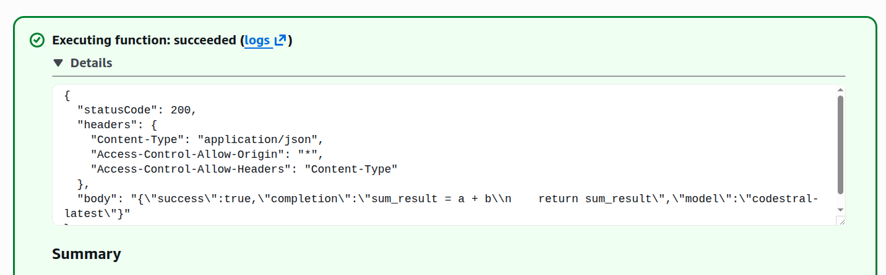
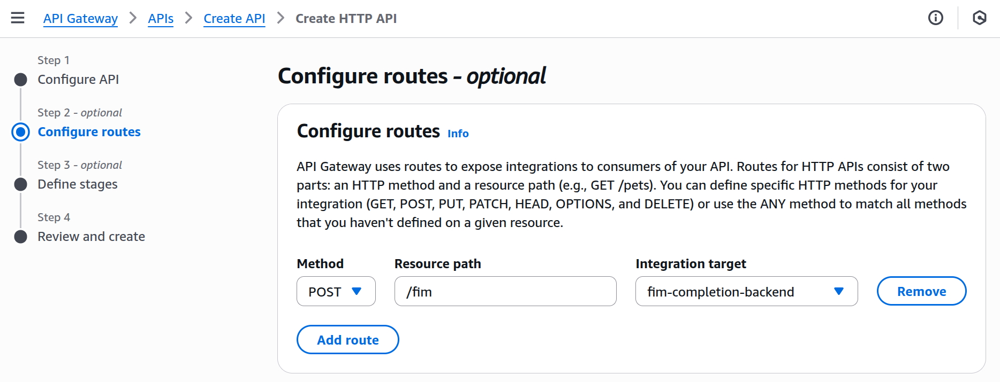

# Deploy FIM Backend on AWS Lambda

AWS Lambda is a powerful serverless compute service that enables you to run code without the complexity of provisioning or managing servers. It automatically scales your applications by running code in response to events, making it an efficient choice for building microservices, event-driven applications, and backend services.

In this hands-on lab, you will create a Lambda function that calls the Codestral FIM (Fill-In-Middle) API to generate AI-powered code completions. You will also expose it via API Gateway to create a production-ready endpoint.

## Prerequisites
- An AWS Account ( It will be provided by `Pordhi's Lab Environment` )
- A Codestral API Key from [Mistral Console](https://console.mistral.ai/codestral) (see Lab 1 for setup instructions)
- Basic knowledge of JavaScript

## Project Overview

This lab is part of a series on building a production-ready code completion system with intelligent caching.

In **Lab 1**, you set up the Codestral API and learned how FIM (Fill-In-Middle) completion works. In **Lab 2**, you'll build an AWS Lambda backend that handles API calls to the LLM, creating a serverless infrastructure for code completion. In **Lab 3**, you'll implement a Radix Trie cache that stores completions by prefix, enabling instant responses as users continue typing. In **Lab 4**, you'll add speculative caching that pre-fetches likely next completions when users accept a suggestion, achieving near-zero latency for the entire coding flow.

The diagram below shows the complete system architecture. The Code Editor sends requests to a Cache layer, which on a cache miss forwards the request through AWS Lambda and API Gateway to the LLM. You'll implement the Lambda and API Gateway components in this lab.


## Architecture Overview

The diagram below shows the specific request flow you'll build. A client sends an HTTP POST request to API Gateway, which invokes your Lambda function. The Lambda function calls the Codestral FIM API and returns the AI-generated completion back through the same path.


## What You'll Learn

By the end of this lab,
- You will understand how to create and deploy AWS Lambda functions.
- You will learn how to securely manage API keys using environment variables.
- You will gain experience in setting up API Gateway to expose Lambda functions as HTTP endpoints.
- You will practice testing and debugging serverless applications.

## Lab Steps

### Step 1: Log in to AWS Management Console

To Create the lambda functio in `AWS`, we need `AWS` credentials. To get the credentials, generate temporary credentials from `Pordhi's Lab Environment` and log in to the AWS Management Console.


After login to the AWS Management Console, ensure you AWS region set to (e.g., `ap-southeast-1`).

### Step 2: Create a Lambda Function

Open the Lambda service in the AWS console by searching for "Lambda" in the search bar. Click **Create function** to start creating your new function. Ensure that the **Author from scratch** option is selected at the top.

Configure your function with the following settings. Set a **Function name** ( e.g.,`fim-completion-backend`). Select **Node.js 20.x** as the Runtime. Keep the Architecture as **x86_64**. For the Execution role, expand **Change default execution role** and verify that **Create a new role with basic Lambda permissions** is selected.


Click **Create function** to proceed. Once the function is created, you'll be taken to the function's configuration page. Scroll down to the **Code** tab where you'll add your function code.

### Step 3: Add the FIM Handler Code

Under **Code source**, you'll see a file called `index.mjs`. Click on it to open the editor. Replace the existing code with the following Lambda handler that processes FIM requests and calls the Codestral API:

```javascript
/**
 * AWS Lambda Handler for FIM (Fill-In-Middle) Completions
 * Calls Mistral Codestral API to generate code completions.
 */

const CODESTRAL_FIM_URL = 'https://codestral.mistral.ai/v1/fim/completions';
const CODESTRAL_MODEL = 'codestral-latest';

export const handler = async (event) => {
    console.log('Received event:', JSON.stringify(event, null, 2));

    try {
        const body = parseRequestBody(event);
        validateRequest(body);
        const completion = await callCodestralFIM(body);

        return createResponse(200, {
            success: true,
            completion: completion,
            model: CODESTRAL_MODEL
        });

    } catch (error) {
        console.error('Error:', error.message);
        return createResponse(error.statusCode || 500, {
            success: false,
            error: error.message
        });
    }
};

function parseRequestBody(event) {
    if (typeof event.body === 'string') {
        return JSON.parse(event.body);
    }
    if (event.body) {
        return event.body;
    }
    return event;
}

function validateRequest(body) {
    if (!body.prompt && body.prompt !== '') {
        throw createError(400, 'Missing required field: prompt');
    }
    if (body.suffix === undefined) {
        body.suffix = '';
    }
    if (!process.env.CODESTRAL_API_KEY) {
        throw createError(500, 'CODESTRAL_API_KEY not configured');
    }
}

async function callCodestralFIM(body) {
    const {
        prompt,
        suffix = '',
        max_tokens = 150,
        temperature = 0.2
    } = body;

    console.log('Calling Codestral FIM:', {
        promptLength: prompt.length,
        suffixLength: suffix.length,
        max_tokens,
        temperature
    });

    const response = await fetch(CODESTRAL_FIM_URL, {
        method: 'POST',
        headers: {
            'Content-Type': 'application/json',
            'Authorization': `Bearer ${process.env.CODESTRAL_API_KEY}`
        },
        body: JSON.stringify({
            model: CODESTRAL_MODEL,
            prompt: prompt,
            suffix: suffix,
            max_tokens: max_tokens,
            temperature: temperature
        })
    });

    if (!response.ok) {
        const errorText = await response.text();
        console.error('Codestral API error:', errorText);
        throw createError(response.status, `Codestral error: ${errorText}`);
    }

    const data = await response.json();
    console.log('Codestral response:', JSON.stringify(data));

    if (data.choices && data.choices.length > 0) {
        const choice = data.choices[0];
        return choice.text || choice.message?.content || '';
    }

    throw createError(500, 'No completion returned');
}

function createError(statusCode, message) {
    const error = new Error(message);
    error.statusCode = statusCode;
    return error;
}

function createResponse(statusCode, body) {
    return {
        statusCode: statusCode,
        headers: {
            'Content-Type': 'application/json',
            'Access-Control-Allow-Origin': '*',
            'Access-Control-Allow-Headers': 'Content-Type'
        },
        body: JSON.stringify(body)
    };
}
```

#### Code Explanation

The Lambda function consists of several key components:

**Constants**: The `CODESTRAL_FIM_URL` and `CODESTRAL_MODEL` define the API endpoint and model version. These are kept as constants for easy maintenance.

**handler()**: The main entry point that AWS Lambda invokes. It parses the incoming request, validates it, calls the Codestral API, and returns a formatted response. All errors are caught and returned with appropriate status codes.

**parseRequestBody()**: Handles different input formats. When called via API Gateway, the body comes as a JSON string. When tested directly in Lambda console, it may already be an object.

**validateRequest()**: Ensures the required `prompt` field exists and checks that the `CODESTRAL_API_KEY` environment variable is configured. Sets a default empty string for `suffix` if not provided.

**callCodestralFIM()**: Makes the actual HTTP request to the Codestral FIM API. It extracts parameters from the request body, sends them to the API with proper authentication, and returns the generated completion text.

**createError()** and **createResponse()**: Helper functions for consistent error handling and response formatting. The response includes CORS headers to allow cross-origin requests from web applications.

After pasting the code, click the **Deploy** button to save your changes. You should see a "Changes deployed" notification.


### Step 4: Configure Environment Variables

Your Lambda function needs access to your Codestral API key, but you should never hardcode API keys in your source code. Instead, use environment variables to securely store sensitive configuration.

Click on the **Configuration** tab at the top of the function page. In the left sidebar, click **Environment variables**. Click **Edit** to add a new variable.

Click **Add environment variable** and enter the following. For **Key**, type `CODESTRAL_API_KEY`. For **Value**, paste your Codestral API key that you obtained from https://console.mistral.ai/codestral in Lab 1.


Click **Save** to store the environment variable. Your Lambda function can now access this key using `process.env.CODESTRAL_API_KEY`.

### Step 5: Increase Function Timeout

The default Lambda timeout is 3 seconds, which is too short for external API calls that may take several hundred milliseconds. Let's increase it to ensure reliable operation.

In the **Configuration** tab, click **General configuration** in the left sidebar. Click **Edit** to modify the settings. Change the **Timeout** value to **30 seconds**. This gives enough buffer for the Codestral API to respond even under high load.


Click **Save** to apply the new timeout setting.

### Step 6: Test the Lambda Function

Before exposing your function via API Gateway, let's verify it works correctly using Lambda's built-in test feature.

Click the **Test** tab next to the Code tab. Click **Create new event** if this is your first test. Enter `fimTest` as the **Event name**. Replace the sample event JSON with the following test payload:

```json
{
    "prompt": "def calculate_sum(a, b):\n    sum_result = a + b\n    ",
    "suffix": "\n\nresult = calculate_sum(5, 3)\nprint(result)",
    "max_tokens": 50
}
```

Click **Save** to save the test event, then click **Test** to execute the function. If everything is configured correctly, you should see a successful execution with a green "Executing function: succeeded" message.



The response shows a `statusCode` of 200, proper CORS headers, and a body containing the completion. The AI correctly generated code to return the sum result.

### Step 7: Create API Gateway

Now that your Lambda function works, let's expose it as an HTTP endpoint so external applications can call it.

Navigate to the **API Gateway** service by searching for "API Gateway" in the AWS console search bar. Click **Create API** to start the wizard. Under **HTTP API**, click the **Build** button. HTTP APIs are simpler and more cost-effective than REST APIs for this use case.


On the next screen, configure your API. Give your API a name like `fim-lambda-function-api`. Then Click **Add integration** and select **Lambda** as the integration type. Select your `fim-completion-backend` lambda function from the dropdown. Click **Next** to proceed.

### Step 8: Configure Routes

Routes define how incoming requests map to your Lambda function. On the Configure routes screen, you need to set up a POST endpoint.

Set the **Method** to `POST`. Set the **Resource path** to `/fim`. Select `fim-completion-backend` as the **Integration target**.



Click **Next** to continue. On the Define stages screen, keep the default stage name (`$default`). Click **Next**, then click **Create** to finish creating your API.

### Step 9: Get Your API Endpoint

After creation, you'll be taken to your API's dashboard. Look for the **Default endpoint** URL in the API details section. This is your public endpoint URL.


Copy this URL - you'll need it to test your API. The URL format is `https://{api-id}.execute-api.{region}.amazonaws.com`.

### Step 10: Test the API Endpoint

Open your terminal and test your new endpoint using curl. Replace `YOUR_API_ENDPOINT` with the URL you copied in the previous step:

```bash
curl -X POST YOUR_API_ENDPOINT/fim \
  -H "Content-Type: application/json" \
  -d '{
    "prompt": "def calculate_sum(a, b):\n    ",
    "suffix": "\n\nprint(calculate_sum(5, 3))",
    "max_tokens": 50
  }'|jq
```

You should receive a response like this:


### Step 11: Test More Examples

Try these additional examples to see the FIM API handle different programming languages and patterns.

**JavaScript Function:**

```bash
curl -X POST YOUR_API_ENDPOINT/fim \
  -H "Content-Type: application/json" \
  -d '{
    "prompt": "function multiply(x, y) {\n    ",
    "suffix": "\n}\n\nconsole.log(multiply(4, 5));",
    "max_tokens": 50
  }'|jq
```

**Python Class:**

```bash
curl -X POST YOUR_API_ENDPOINT/fim \
  -H "Content-Type: application/json" \
  -d '{
    "prompt": "class User:\n    def __init__(self, name):\n        ",
    "suffix": "\n\n    def greet(self):\n        return f\"Hello, {self.name}\"",
    "max_tokens": 50
  }'|jq
```

**TypeScript Interface:**

```bash
curl -X POST YOUR_API_ENDPOINT/fim \
  -H "Content-Type: application/json" \
  -d '{
    "prompt": "interface User {\n    name: string;\n}\n\nfunction createUser(name: string): User {\n    ",
    "suffix": "\n}\n\nconst user = createUser(\"Alice\");",
    "max_tokens": 50
  }'|jq
```

## Cleanup (Optional)

To delete all resources created in this lab.

**Delete API Gateway:** Go to the API Gateway service, select your `fim-lambda-function-api`, and click Actions then Delete.

**Delete Lambda Function:** Go to the Lambda service, select `fim-completion-backend`, and click Actions then Delete.

## Conclusion

Congratulations! You have successfully created and deployed a FIM (Fill-In-Middle) backend using AWS Lambda and API Gateway. In this lab, you learned how to create a serverless function that calls an external AI API, configure environment variables for secure credential storage, set up HTTP endpoints with API Gateway, and test code completion APIs with real examples.

Your API endpoint is now live and can be called from any application that needs AI-powered code completions.

### What's Next

In **Lab 3**, we'll add caching to make responses instant. You'll implement a Radix Trie cache that stores completions by prefix, enabling immediate responses as users continue typing the same code pattern.
