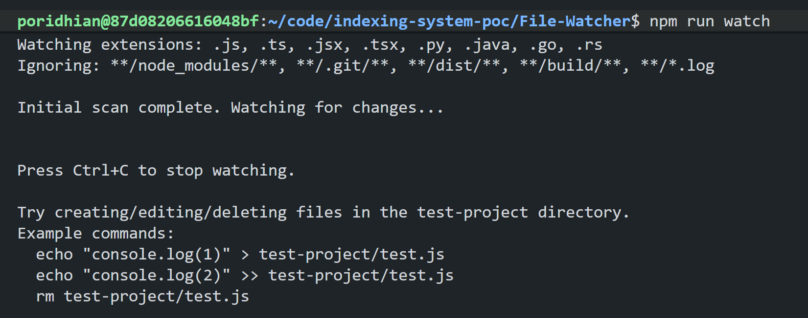
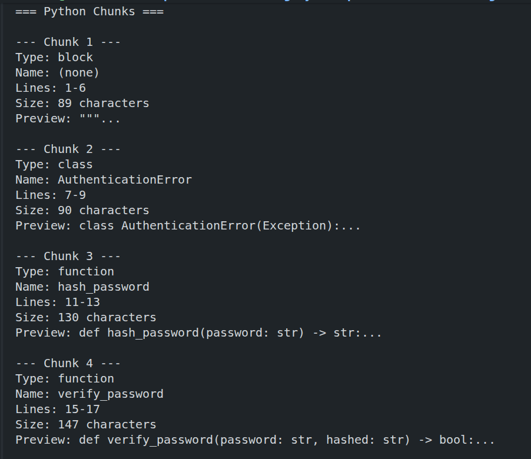

# AST-Based Semantic Code Chunking

When building AI-powered code search or retrieval-augmented generation (RAG) systems, how you split code into chunks dramatically affects quality. In this lab, you'll build a semantic code chunker that uses Tree-sitter ASTs to split code by meaningful boundaries—functions, classes, and methods—instead of arbitrary line counts.

This is exactly how Cursor, PUKU-Editor, GitHub Copilot, and production AI code assistants chunk code for embeddings and search.

## Prerequisites

- Familiarity with JavaScript/TypeScript and Node.js
- Node.js 18+ installed

## Project Overview

## What You'll Learn

1. Why semantic chunking produces better embeddings than line-based
2. Identifying semantic boundaries in code (functions, classes, methods)
3. Building a multi-language semantic chunker
4. Handling edge cases (large functions, nested structures)
5. Adding metadata to chunks for better retrieval
6. Gap-filling strategies for code between functions

## Part 1: Semantic Chunking

### Why Chunk Code at All?

AI embedding models have token limits (typically 512-8192 tokens). A large codebase can't be embedded as one unit. We must split it into chunks that:

1. **Fit the model's context window** - Under token limit
2. **Preserve meaning** - Complete semantic units
3. **Enable retrieval** - Searchable, relevant segments

### Line-Based Chunking Problems

Traditional text splitters fail with code:

```python
# Line-based chunker (500 chars per chunk)
def calculate_order_total(items, tax_rate, discount_co  # ← Cut here!
de):
    """Calculate the total price of an order."""
    subtotal = sum(item.price * item.quantity for item in items)
```

**Problems:**
- `discount_code` becomes `discount_co` and `de`
- Embedding model sees broken identifiers
- Search for "discount" won't match this chunk

### Semantic Chunking

The word `Semantic` means "related to meaning." A semantic chunker splits code at meaningful boundaries:

```python
# Semantic chunker (by function boundaries)

# Chunk 1: Complete function
def calculate_order_total(items, tax_rate, discount_code):
    """Calculate the total price of an order."""
    subtotal = sum(item.price * item.quantity for item in items)
    discount = apply_discount(subtotal, discount_code)
    return (subtotal - discount) * (1 + tax_rate)

# Chunk 2: Complete function
def apply_discount(amount, code):
    """Apply discount code to amount."""
    discounts = {"SAVE10": 0.10, "SAVE20": 0.20}
    return amount * discounts.get(code, 0)
```

**Benefits:**
- Complete functions with full signatures
- Docstrings included for context
- Better embeddings = better search

### What Makes a "Semantic Unit"?

| Language | Semantic Units |
|----------|----------------|
| **JavaScript/TypeScript** | function, class, method, arrow function, interface |
| **Python** | function (def), class, method, async def |
| **Go** | function, method, struct, interface |
| **Rust** | fn, impl, struct, enum, trait |
| **Java** | class, method, interface |


## Part 2: Building the Semantic Chunker

### Project Setup

Create a new project:

```bash
mkdir semantic-chunker
cd semantic-chunker
npm init -y
npm install web-tree-sitter tree-sitter-javascript tree-sitter-typescript tree-sitter-python
npm install -D typescript ts-node @types/node
```

Create `tsconfig.json`:

```json
{
  "compilerOptions": {
    "target": "ES2020",
    "module": "commonjs",
    "lib": ["ES2020"],
    "outDir": "./dist",
    "rootDir": "./src",
    "strict": true,
    "esModuleInterop": true,
    "skipLibCheck": true,
    "forceConsistentCasingInFileNames": true,
    "declaration": true,
    "declarationMap": true,
    "sourceMap": true,
    "resolveJsonModule": true,
    "moduleResolution": "node"
  },
  "include": ["src/**/*"],
  "exclude": ["node_modules", "dist"]
}
```

### Core Architecture



### Step 1: Define Semantic Node Types

Create `src/semantic-nodes.ts`:

```typescript
/**
 * Semantic node types for different languages
 * These are AST node types that represent meaningful code units
 */

export type SupportedLanguage = 'javascript' | 'typescript' | 'python' | 'go' | 'rust';

export interface LanguageNodeTypes {
    function?: string[];
    class?: string[];
    method?: string[];
    arrow?: string[];
    variable?: string[];
    export?: string[];
    interface?: string[];
    type?: string[];
    enum?: string[];
    decorated?: string[];
    struct?: string[];
    impl?: string[];
    trait?: string[];
    mod?: string[];
}

export const SEMANTIC_NODES: Record<SupportedLanguage, LanguageNodeTypes> = {
    javascript: {
        // Top-level declarations
        function: ['function_declaration', 'generator_function_declaration'],
        class: ['class_declaration'],
        method: ['method_definition'],
        arrow: ['arrow_function'],
        variable: ['lexical_declaration', 'variable_declaration'],
        export: ['export_statement'],
    },
    typescript: {
        function: ['function_declaration', 'generator_function_declaration'],
        class: ['class_declaration'],
        method: ['method_definition'],
        arrow: ['arrow_function'],
        interface: ['interface_declaration'],
        type: ['type_alias_declaration'],
        enum: ['enum_declaration'],
        variable: ['lexical_declaration', 'variable_declaration'],
        export: ['export_statement'],
    },
    python: {
        function: ['function_definition'],
        class: ['class_definition'],
        // Python methods are function_definition inside class_definition
        decorated: ['decorated_definition'],
    },
    go: {
        function: ['function_declaration'],
        method: ['method_declaration'],
        type: ['type_declaration'],
        struct: ['struct_type'],
        interface: ['interface_type'],
    },
    rust: {
        function: ['function_item'],
        impl: ['impl_item'],
        struct: ['struct_item'],
        enum: ['enum_item'],
        trait: ['trait_item'],
        mod: ['mod_item'],
    },
};

/**
 * Get all semantic node types for a language (flattened)
 */
export function getSemanticTypes(language: string): string[] {
    const langNodes = SEMANTIC_NODES[language as SupportedLanguage];
    if (!langNodes) return [];
    return Object.values(langNodes).flat();
}
```

### Step 2: The Chunk Data Structure

Create `src/chunk.ts`:

```typescript
/**
 * Types for semantic code chunks
 */

export type ChunkType =
    | 'function'
    | 'class'
    | 'method'
    | 'interface'
    | 'type'
    | 'enum'
    | 'struct'
    | 'impl'
    | 'trait'
    | 'block';

export interface ChunkMetadata {
    parent?: string;
    parameters?: string[];
    returnType?: string;
    async?: boolean;
    exported?: boolean;
    gapFill?: boolean;
    fallback?: boolean;
    [key: string]: unknown;
}

export interface SemanticChunkOptions {
    text: string;
    type: ChunkType;
    name: string | null;
    lineStart: number;
    lineEnd: number;
    language: string;
    metadata?: ChunkMetadata;
}

/**
 * Represents a semantic code chunk
 */
export class SemanticChunk {
    readonly text: string;
    readonly type: ChunkType;
    readonly name: string | null;
    readonly lineStart: number;
    readonly lineEnd: number;
    readonly language: string;
    readonly metadata: ChunkMetadata;

    constructor(options: SemanticChunkOptions) {
        this.text = options.text;
        this.type = options.type;
        this.name = options.name;
        this.lineStart = options.lineStart;
        this.lineEnd = options.lineEnd;
        this.language = options.language;
        this.metadata = options.metadata ?? {};
    }

    /**
     * Character count (for size limits)
     */
    get charCount(): number {
        return this.text.length;
    }

    /**
     * Line count
     */
    get lineCount(): number {
        return this.lineEnd - this.lineStart + 1;
    }

    /**
     * Create a summary string for debugging
     */
    toString(): string {
        return `[${this.type}] ${this.name || '(anonymous)'} (lines ${this.lineStart}-${this.lineEnd}, ${this.charCount} chars)`;
    }
}
```

### Step 3: The Core Chunker

Create `src/chunker.ts`:

```typescript
import { Parser, Language, Node } from 'web-tree-sitter';
import { getSemanticTypes } from './semantic-nodes';
import { SemanticChunk, ChunkType, ChunkMetadata } from './chunk';

/**
 * Configuration for the semantic chunker
 */
export interface ChunkerConfig {
    maxChunkSize: number;      // Max characters per chunk
    minChunkSize: number;      // Min characters (skip tiny chunks)
    fallbackLineSize: number;  // Lines per chunk when falling back
    fallbackOverlap: number;   // Overlap lines in fallback mode
}

/**
 * Default configuration values
 */
export const DEFAULT_CONFIG: ChunkerConfig = {
    maxChunkSize: 8000,
    minChunkSize: 100,
    fallbackLineSize: 50,
    fallbackOverlap: 10,
};

/**
 * Language configuration mapping language name to WASM path
 */
export type LanguageConfigs = Record<string, string>;

/**
 * AST-based Semantic Code Chunker
 * Splits code by semantic boundaries (functions, classes, etc.)
 */
export class SemanticChunker {
    private config: ChunkerConfig;
    private parser: Parser | null = null;
    private languages: Map<string, Language> = new Map();

    constructor(config: Partial<ChunkerConfig> = {}) {
        this.config = { ...DEFAULT_CONFIG, ...config };
    }

    /**
     * Initialize Tree-sitter and load language grammars
     */
    async initialize(languageConfigs: LanguageConfigs): Promise<void> {
        await Parser.init();
        this.parser = new Parser();

        // Load each language grammar
        for (const [lang, wasmPath] of Object.entries(languageConfigs)) {
            const language = await Language.load(wasmPath);
            this.languages.set(lang, language);
        }
    }

    /**
     * Chunk source code into semantic units
     *
     * @param code - Source code to chunk
     * @param language - Language identifier (javascript, python, etc.)
     * @returns Array of semantic chunks
     */
    chunk(code: string, language: string): SemanticChunk[] {
        const langGrammar = this.languages.get(language);

        if (!langGrammar || !this.parser) {
            console.warn(`Language '${language}' not loaded, using fallback`);
            return this.fallbackChunk(code, language);
        }

        // Parse the code
        this.parser.setLanguage(langGrammar);
        const tree = this.parser.parse(code);

        if (!tree) {
            console.warn(`Failed to parse code for language '${language}', using fallback`);
            return this.fallbackChunk(code, language);
        }

        // Extract semantic chunks
        const chunks: SemanticChunk[] = [];
        const semanticTypes = getSemanticTypes(language);

        this.extractChunks(tree.rootNode, code, language, semanticTypes, chunks);

        // Fill gaps between chunks
        return this.fillGaps(chunks, code, language);
    }

    /**
     * Recursively extract semantic chunks from AST
     */
    private extractChunks(
        node: Node,
        code: string,
        language: string,
        semanticTypes: string[],
        chunks: SemanticChunk[],
        parentName: string | null = null
    ): void {
        // Check if this node is a semantic unit
        if (semanticTypes.includes(node.type)) {
            const text = node.text;
            const charCount = text.length;

            // Check size constraints
            if (charCount >= this.config.minChunkSize) {
                if (charCount <= this.config.maxChunkSize) {
                    // Good size - extract as a chunk
                    const chunk = this.createChunk(node, code, language, parentName);
                    chunks.push(chunk);
                    return; // Don't recurse into children
                } else {
                    // Too large - try to split by children
                    const childChunks = this.splitLargeNode(node, code, language, semanticTypes);
                    if (childChunks.length > 0) {
                        chunks.push(...childChunks);
                        return;
                    }
                    // If no children found, fall through to extract anyway
                    const chunk = this.createChunk(node, code, language, parentName);
                    chunks.push(chunk);
                    return;
                }
            }
        }

        // Recurse into named children
        for (let i = 0; i < node.namedChildCount; i++) {
            const child = node.namedChild(i);
            if (child) {
                const newParent = this.getNodeName(node) ?? parentName;
                this.extractChunks(child, code, language, semanticTypes, chunks, newParent);
            }
        }
    }

    /**
     * Create a SemanticChunk from an AST node
     */
    private createChunk(
        node: Node,
        code: string,
        language: string,
        parentName: string | null
    ): SemanticChunk {
        const name = this.getNodeName(node);
        const type = this.getChunkType(node.type);
        const metadata = this.extractMetadata(node, language);

        if (parentName) {
            metadata.parent = parentName;
        }

        return new SemanticChunk({
            text: node.text,
            type,
            name,
            lineStart: node.startPosition.row + 1,
            lineEnd: node.endPosition.row + 1,
            language,
            metadata,
        });
    }

    /**
     * Extract the name from a node (function name, class name, etc.)
     */
    private getNodeName(node: Node): string | null {
        // Try common field names
        const nameNode = node.childForFieldName('name') ??
                         node.childForFieldName('identifier');

        if (nameNode) {
            return nameNode.text;
        }

        // For arrow functions assigned to variables
        if (node.type === 'arrow_function' && node.parent?.type === 'variable_declarator') {
            return node.parent.childForFieldName('name')?.text ?? null;
        }

        // For exported declarations
        if (node.type === 'export_statement') {
            const declaration = node.childForFieldName('declaration');
            if (declaration) {
                return this.getNodeName(declaration);
            }
        }

        return null;
    }

    /**
     * Map AST node type to chunk type
     */
    private getChunkType(nodeType: string): ChunkType {
        const typeMap: Record<string, ChunkType> = {
            'function_declaration': 'function',
            'function_definition': 'function',
            'generator_function_declaration': 'function',
            'arrow_function': 'function',
            'method_definition': 'method',
            'method_declaration': 'method',
            'class_declaration': 'class',
            'class_definition': 'class',
            'interface_declaration': 'interface',
            'type_alias_declaration': 'type',
            'enum_declaration': 'enum',
            'struct_item': 'struct',
            'impl_item': 'impl',
            'trait_item': 'trait',
            'decorated_definition': 'function',
        };
        return typeMap[nodeType] ?? 'block';
    }

    /**
     * Extract metadata from a node (parameters, return type, etc.)
     */
    private extractMetadata(node: Node, _language: string): ChunkMetadata {
        const metadata: ChunkMetadata = {};

        // Extract parameters
        const params = node.childForFieldName('parameters');
        if (params) {
            metadata.parameters = [];
            for (let i = 0; i < params.namedChildCount; i++) {
                const param = params.namedChild(i);
                if (param) {
                    metadata.parameters.push(param.text);
                }
            }
        }

        // Extract return type (TypeScript)
        const returnType = node.childForFieldName('return_type');
        if (returnType) {
            metadata.returnType = returnType.text;
        }

        // Check for async
        if (node.text.startsWith('async ')) {
            metadata.async = true;
        }

        // Check for export
        if (node.parent?.type === 'export_statement') {
            metadata.exported = true;
        }

        return metadata;
    }

    /**
     * Split a large node by extracting its children
     */
    private splitLargeNode(
        node: Node,
        code: string,
        language: string,
        semanticTypes: string[]
    ): SemanticChunk[] {
        const chunks: SemanticChunk[] = [];

        for (let i = 0; i < node.namedChildCount; i++) {
            const child = node.namedChild(i);
            if (child && semanticTypes.includes(child.type) && child.text.length >= this.config.minChunkSize) {
                const parentName = this.getNodeName(node);
                const chunk = this.createChunk(child, code, language, parentName);
                chunks.push(chunk);
            }
        }

        return chunks;
    }

    /**
     * Fill gaps between semantic chunks with block chunks
     */
    private fillGaps(chunks: SemanticChunk[], code: string, language: string): SemanticChunk[] {
        if (chunks.length === 0) {
            return this.fallbackChunk(code, language);
        }

        // Sort chunks by line number
        chunks.sort((a, b) => a.lineStart - b.lineStart);

        const lines = code.split('\n');
        const result: SemanticChunk[] = [];
        let currentLine = 1;

        for (const chunk of chunks) {
            // Check for gap before this chunk
            if (chunk.lineStart > currentLine) {
                const gapText = lines.slice(currentLine - 1, chunk.lineStart - 1).join('\n').trim();

                if (gapText.length >= this.config.minChunkSize) {
                    result.push(new SemanticChunk({
                        text: gapText,
                        type: 'block',
                        name: null,
                        lineStart: currentLine,
                        lineEnd: chunk.lineStart - 1,
                        language,
                        metadata: { gapFill: true },
                    }));
                }
            }

            result.push(chunk);
            currentLine = chunk.lineEnd + 1;
        }

        // Check for gap after last chunk
        if (currentLine <= lines.length) {
            const gapText = lines.slice(currentLine - 1).join('\n').trim();

            if (gapText.length >= this.config.minChunkSize) {
                result.push(new SemanticChunk({
                    text: gapText,
                    type: 'block',
                    name: null,
                    lineStart: currentLine,
                    lineEnd: lines.length,
                    language,
                    metadata: { gapFill: true },
                }));
            }
        }

        return result;
    }

    /**
     * Fallback to line-based chunking when AST parsing fails
     */
    private fallbackChunk(code: string, language: string): SemanticChunk[] {
        const chunks: SemanticChunk[] = [];
        const lines = code.split('\n');
        const { fallbackLineSize, fallbackOverlap, minChunkSize } = this.config;

        for (let i = 0; i < lines.length; i += (fallbackLineSize - fallbackOverlap)) {
            const lineStart = i + 1;
            const lineEnd = Math.min(i + fallbackLineSize, lines.length);
            const chunkLines = lines.slice(i, lineEnd);
            const text = chunkLines.join('\n').trim();

            if (text.length >= minChunkSize) {
                chunks.push(new SemanticChunk({
                    text,
                    type: 'block',
                    name: null,
                    lineStart,
                    lineEnd,
                    language,
                    metadata: { fallback: true },
                }));
            }
        }

        return chunks;
    }
}
```

## Part 3: Using the Chunker

### Basic Usage Example

Create `src/example.ts`:

```typescript
import { SemanticChunker } from './chunker';

async function main(): Promise<void> {
    // Initialize chunker with language grammars
    const chunker = new SemanticChunker({
        maxChunkSize: 4000,
        minChunkSize: 50,
    });

    await chunker.initialize({
        javascript: require.resolve('tree-sitter-javascript/tree-sitter-javascript.wasm'),
        python: require.resolve('tree-sitter-python/tree-sitter-python.wasm'),
    });

    // Sample JavaScript code
    const jsCode = `
/**
 * User management module
 */
import { db } from './database';

const MAX_RETRIES = 3;

/**
 * Fetch a user by ID
 * @param {string} id - User ID
 * @returns {Promise<User>}
 */
async function getUser(id) {
    for (let i = 0; i < MAX_RETRIES; i++) {
        try {
            return await db.users.findById(id);
        } catch (err) {
            if (i === MAX_RETRIES - 1) throw err;
        }
    }
}

/**
 * User service class
 */
class UserService {
    constructor(database) {
        this.db = database;
    }

    async create(userData) {
        const user = new User(userData);
        await this.db.users.insert(user);
        return user;
    }

    async update(id, changes) {
        return await this.db.users.update(id, changes);
    }

    async delete(id) {
        return await this.db.users.remove(id);
    }
}

// Helper function
const validateEmail = (email) => {
    return email.includes('@') && email.includes('.');
};

export { getUser, UserService, validateEmail };
    `.trim();

    console.log('=== JavaScript Chunks ===\n');
    const jsChunks = chunker.chunk(jsCode, 'javascript');

    jsChunks.forEach((chunk, i) => {
        console.log(`--- Chunk ${i + 1} ---`);
        console.log(`Type: ${chunk.type}`);
        console.log(`Name: ${chunk.name || '(none)'}`);
        console.log(`Lines: ${chunk.lineStart}-${chunk.lineEnd} (${chunk.lineCount} lines)`);
        console.log(`Size: ${chunk.charCount} characters`);
        if (Object.keys(chunk.metadata).length > 0) {
            console.log(`Metadata:`, chunk.metadata);
        }
        console.log(`Preview: ${chunk.text.split('\n')[0].substring(0, 60)}...`);
        console.log();
    });

    // Sample Python code
    const pyCode = `
"""
User authentication module
"""
from typing import Optional
from hashlib import sha256

class AuthenticationError(Exception):
    """Raised when authentication fails."""
    pass

def hash_password(password: str) -> str:
    """Hash a password using SHA-256."""
    return sha256(password.encode()).hexdigest()

def verify_password(password: str, hashed: str) -> bool:
    """Verify a password against its hash."""
    return hash_password(password) == hashed

class Authenticator:
    """Handles user authentication."""

    def __init__(self, user_store):
        self.users = user_store

    def login(self, username: str, password: str) -> Optional[str]:
        """Attempt to log in a user."""
        user = self.users.get(username)
        if not user:
            raise AuthenticationError("User not found")

        if not verify_password(password, user.password_hash):
            raise AuthenticationError("Invalid password")

        return self._generate_token(user)

    def _generate_token(self, user) -> str:
        """Generate an authentication token."""
        import secrets
        return secrets.token_urlsafe(32)
    `.trim();

    console.log('\n=== Python Chunks ===\n');
    const pyChunks = chunker.chunk(pyCode, 'python');

    pyChunks.forEach((chunk, i) => {
        console.log(`--- Chunk ${i + 1} ---`);
        console.log(`Type: ${chunk.type}`);
        console.log(`Name: ${chunk.name || '(none)'}`);
        console.log(`Lines: ${chunk.lineStart}-${chunk.lineEnd}`);
        console.log(`Size: ${chunk.charCount} characters`);
        console.log(`Preview: ${chunk.text.split('\n')[0].substring(0, 60)}...`);
        console.log();
    });
}

main().catch(console.error);
```

**Expected Output:**




## Part 4: Advanced Features

### Adding Contextualized Text

For better embeddings, prepend context to each chunk:

```typescript
import { SemanticChunk } from './chunk';

/**
 * Generate contextualized text for embedding
 * Includes file path, scope chain, and metadata
 */
function contextualizeChunk(chunk: SemanticChunk, filePath: string): string {
    const lines: string[] = [];

    // File context
    lines.push(`File: ${filePath}`);

    // Scope/hierarchy
    if (chunk.metadata.parent) {
        lines.push(`Parent: ${chunk.metadata.parent}`);
    }

    // Type and name
    if (chunk.name) {
        lines.push(`${chunk.type}: ${chunk.name}`);
    }

    // Parameters (for functions)
    if (chunk.metadata.parameters && chunk.metadata.parameters.length > 0) {
        lines.push(`Parameters: ${chunk.metadata.parameters.join(', ')}`);
    }

    // Return type (TypeScript)
    if (chunk.metadata.returnType) {
        lines.push(`Returns: ${chunk.metadata.returnType}`);
    }

    // Separator
    lines.push('---');

    // Actual code
    lines.push(chunk.text);

    return lines.join('\n');
}

// Example usage:
// const contextualizedText = contextualizeChunk(chunk, 'src/services/user.ts');

/*
Output:
File: src/services/user.ts
Parent: UserService
method: create
Parameters: userData
---
async create(userData) {
    const user = new User(userData);
    await this.db.users.insert(user);
    return user;
}
*/
```

### Handling Nested Structures

For classes with methods, extract methods as separate chunks:

```typescript
import { Parser, Language, Node } from 'web-tree-sitter';
import { SemanticChunk } from './chunk';

/**
 * Extract methods from a class as separate chunks
 */
function extractMethodsFromClass(
    classChunk: SemanticChunk,
    languages: Map<string, Language>,
    parser: Parser
): SemanticChunk[] {
    const chunks: SemanticChunk[] = [];
    const language = classChunk.language;
    const langGrammar = languages.get(language);

    if (!langGrammar) {
        return chunks;
    }

    // Parse the class body
    parser.setLanguage(langGrammar);
    const tree = parser.parse(classChunk.text);

    if (!tree) {
        return chunks;
    }

    // Find method definitions
    function findMethods(node: Node): void {
        if (node.type === 'method_definition') {
            const name = node.childForFieldName('name')?.text ?? null;
            chunks.push(new SemanticChunk({
                text: node.text,
                type: 'method',
                name: name,
                lineStart: classChunk.lineStart + node.startPosition.row,
                lineEnd: classChunk.lineStart + node.endPosition.row,
                language: language,
                metadata: {
                    parent: classChunk.name ?? undefined,
                },
            }));
        }
        for (let i = 0; i < node.namedChildCount; i++) {
            const child = node.namedChild(i);
            if (child) {
                findMethods(child);
            }
        }
    }

    findMethods(tree.rootNode);
    return chunks;
}
```

### Overlap Support for Boundary Queries

Add overlapping context to help with queries that span chunk boundaries:

```typescript
import { SemanticChunk } from './chunk';

interface ChunkWithOverlap extends SemanticChunk {
    textWithOverlap: string;
}

/**
 * Add overlap to chunks
 */
function addOverlap(
    chunks: SemanticChunk[],
    code: string,
    overlapLines: number = 5
): ChunkWithOverlap[] {
    const lines = code.split('\n');

    return chunks.map((chunk, i) => {
        // Get context from previous chunk
        let prefix = '';
        if (i > 0) {
            const prevEnd = chunks[i - 1].lineEnd;
            const contextStart = Math.max(prevEnd - overlapLines, 0);
            prefix = lines.slice(contextStart, prevEnd).join('\n');
        }

        // Get context from next chunk
        let suffix = '';
        if (i < chunks.length - 1) {
            const nextStart = chunks[i + 1].lineStart - 1;
            const contextEnd = Math.min(nextStart + overlapLines, lines.length);
            suffix = lines.slice(nextStart, contextEnd).join('\n');
        }

        return {
            ...chunk,
            textWithOverlap: [prefix, chunk.text, suffix].filter(Boolean).join('\n\n// ---\n\n'),
            metadata: {
                ...chunk.metadata,
                hasOverlap: true,
            },
        } as ChunkWithOverlap;
    });
}
```

---

## Part 5: Complete Working Example

Create `src/complete-example.ts`:

```typescript
import { Parser, Language, Node } from 'web-tree-sitter';

interface ChunkResult {
    text: string;
    type: string;
    name: string | null;
    lineStart: number;
    lineEnd: number;
    charCount: number;
    language: string;
    filePath: string;
    metadata?: Record<string, unknown>;
    contextualizedText?: string;
}

interface ProductionChunkerConfig {
    maxChunkSize?: number;
    minChunkSize?: number;
    includeMetadata?: boolean;
    contextualizeText?: boolean;
}

interface TraversalContext {
    parent?: string;
}

/**
 * Production-ready Semantic Code Chunker
 */
class ProductionChunker {
    private config: Required<ProductionChunkerConfig>;
    private parser: Parser | null = null;
    private languages: Map<string, Language> = new Map();

    constructor(config: ProductionChunkerConfig = {}) {
        this.config = {
            maxChunkSize: config.maxChunkSize ?? 8000,
            minChunkSize: config.minChunkSize ?? 100,
            includeMetadata: config.includeMetadata !== false,
            contextualizeText: config.contextualizeText ?? false,
        };
    }

    async init(): Promise<void> {
        await Parser.init();
        this.parser = new Parser();
    }

    async loadLanguage(name: string, wasmPath: string): Promise<void> {
        const lang = await Language.load(wasmPath);
        this.languages.set(name, lang);
    }

    chunk(code: string, language: string, filePath: string = 'unknown'): ChunkResult[] {
        const langGrammar = this.languages.get(language);
        if (!langGrammar || !this.parser) {
            return this.fallbackChunk(code, language, filePath);
        }

        this.parser.setLanguage(langGrammar);
        const tree = this.parser.parse(code);

        if (!tree) {
            return this.fallbackChunk(code, language, filePath);
        }

        const chunks: ChunkResult[] = [];
        this.traverse(tree.rootNode, code, language, filePath, chunks);

        // Sort and fill gaps
        return this.fillGaps(chunks, code, language, filePath);
    }

    private traverse(
        node: Node,
        code: string,
        language: string,
        filePath: string,
        chunks: ChunkResult[],
        context: TraversalContext = {}
    ): void {
        const semanticTypes = this.getSemanticTypes(language);

        if (semanticTypes.includes(node.type)) {
            const size = node.text.length;

            if (size >= this.config.minChunkSize && size <= this.config.maxChunkSize) {
                chunks.push(this.createChunk(node, language, filePath, context));
                return; // Don't recurse
            }

            if (size > this.config.maxChunkSize) {
                // Recurse into children with updated context
                const newContext: TraversalContext = {
                    ...context,
                    parent: this.getName(node) ?? context.parent,
                };
                for (let i = 0; i < node.namedChildCount; i++) {
                    const child = node.namedChild(i);
                    if (child) {
                        this.traverse(child, code, language, filePath, chunks, newContext);
                    }
                }
                return;
            }
        }

        // Recurse into children
        for (let i = 0; i < node.namedChildCount; i++) {
            const child = node.namedChild(i);
            if (child) {
                this.traverse(child, code, language, filePath, chunks, context);
            }
        }
    }

    private createChunk(
        node: Node,
        language: string,
        filePath: string,
        context: TraversalContext
    ): ChunkResult {
        const name = this.getName(node);
        const type = this.getType(node.type);

        const chunk: ChunkResult = {
            text: node.text,
            type: type,
            name: name,
            lineStart: node.startPosition.row + 1,
            lineEnd: node.endPosition.row + 1,
            charCount: node.text.length,
            language: language,
            filePath: filePath,
        };

        if (this.config.includeMetadata) {
            chunk.metadata = this.extractMetadata(node, context);
        }

        if (this.config.contextualizeText) {
            chunk.contextualizedText = this.contextualize(chunk);
        }

        return chunk;
    }

    private getName(node: Node): string | null {
        return node.childForFieldName('name')?.text ??
               node.childForFieldName('identifier')?.text ??
               (node.type === 'arrow_function' && node.parent?.type === 'variable_declarator'
                   ? node.parent.childForFieldName('name')?.text ?? null
                   : null);
    }

    private getType(nodeType: string): string {
        const map: Record<string, string> = {
            'function_declaration': 'function',
            'function_definition': 'function',
            'arrow_function': 'function',
            'method_definition': 'method',
            'class_declaration': 'class',
            'class_definition': 'class',
            'interface_declaration': 'interface',
        };
        return map[nodeType] ?? 'block';
    }

    private getSemanticTypes(language: string): string[] {
        const types: Record<string, string[]> = {
            javascript: ['function_declaration', 'class_declaration', 'method_definition', 'arrow_function'],
            typescript: ['function_declaration', 'class_declaration', 'method_definition', 'arrow_function', 'interface_declaration'],
            python: ['function_definition', 'class_definition'],
        };
        return types[language] ?? [];
    }

    private extractMetadata(node: Node, context: TraversalContext): Record<string, unknown> {
        const meta: Record<string, unknown> = {};

        if (context.parent) {
            meta.parent = context.parent;
        }

        const params = node.childForFieldName('parameters');
        if (params) {
            const parameters: string[] = [];
            for (let i = 0; i < params.namedChildCount; i++) {
                const param = params.namedChild(i);
                if (param) {
                    parameters.push(param.text);
                }
            }
            meta.parameters = parameters;
        }

        if (node.text.trimStart().startsWith('async')) {
            meta.async = true;
        }

        return meta;
    }

    private contextualize(chunk: ChunkResult): string {
        const lines: string[] = [`// File: ${chunk.filePath}`];

        if (chunk.metadata?.parent) {
            lines.push(`// Parent: ${chunk.metadata.parent}`);
        }

        if (chunk.name) {
            lines.push(`// ${chunk.type}: ${chunk.name}`);
        }

        lines.push('');
        lines.push(chunk.text);

        return lines.join('\n');
    }

    private fillGaps(
        chunks: ChunkResult[],
        code: string,
        language: string,
        filePath: string
    ): ChunkResult[] {
        if (chunks.length === 0) {
            return this.fallbackChunk(code, language, filePath);
        }

        chunks.sort((a, b) => a.lineStart - b.lineStart);
        const lines = code.split('\n');
        const result: ChunkResult[] = [];
        let current = 1;

        for (const chunk of chunks) {
            if (chunk.lineStart > current) {
                const gap = lines.slice(current - 1, chunk.lineStart - 1).join('\n').trim();
                if (gap.length >= this.config.minChunkSize) {
                    result.push({
                        text: gap,
                        type: 'block',
                        name: null,
                        lineStart: current,
                        lineEnd: chunk.lineStart - 1,
                        charCount: gap.length,
                        language: language,
                        filePath: filePath,
                        metadata: { gapFill: true },
                    });
                }
            }
            result.push(chunk);
            current = chunk.lineEnd + 1;
        }

        // Trailing gap
        if (current <= lines.length) {
            const gap = lines.slice(current - 1).join('\n').trim();
            if (gap.length >= this.config.minChunkSize) {
                result.push({
                    text: gap,
                    type: 'block',
                    name: null,
                    lineStart: current,
                    lineEnd: lines.length,
                    charCount: gap.length,
                    language: language,
                    filePath: filePath,
                    metadata: { gapFill: true },
                });
            }
        }

        return result;
    }

    private fallbackChunk(code: string, language: string, filePath: string): ChunkResult[] {
        const lines = code.split('\n');
        const chunks: ChunkResult[] = [];
        const size = 50;
        const overlap = 10;

        for (let i = 0; i < lines.length; i += size - overlap) {
            const start = i + 1;
            const end = Math.min(i + size, lines.length);
            const text = lines.slice(i, end).join('\n').trim();

            if (text.length >= this.config.minChunkSize) {
                chunks.push({
                    text: text,
                    type: 'block',
                    name: null,
                    lineStart: start,
                    lineEnd: end,
                    charCount: text.length,
                    language: language,
                    filePath: filePath,
                    metadata: { fallback: true },
                });
            }
        }

        return chunks;
    }
}

// ============================================
// Demo
// ============================================

async function demo(): Promise<void> {
    const chunker = new ProductionChunker({
        maxChunkSize: 4000,
        minChunkSize: 50,
        includeMetadata: true,
        contextualizeText: true,
    });

    await chunker.init();
    await chunker.loadLanguage('javascript',
        require.resolve('tree-sitter-javascript/tree-sitter-javascript.wasm'));

    const code = `
/**
 * Shopping cart module
 */
const TAX_RATE = 0.08;

class ShoppingCart {
    constructor() {
        this.items = [];
    }

    addItem(product, quantity) {
        this.items.push({ product, quantity });
    }

    removeItem(productId) {
        this.items = this.items.filter(i => i.product.id !== productId);
    }

    getTotal() {
        const subtotal = this.items.reduce(
            (sum, item) => sum + item.product.price * item.quantity,
            0
        );
        return subtotal * (1 + TAX_RATE);
    }
}

function formatCurrency(amount) {
    return '$' + amount.toFixed(2);
}

export { ShoppingCart, formatCurrency };
    `.trim();

    console.log('=== Semantic Chunking Demo ===\n');
    const chunks = chunker.chunk(code, 'javascript', 'src/cart.ts');

    chunks.forEach((chunk, i) => {
        console.log(`\n========== Chunk ${i + 1} ==========`);
        console.log(`Type: ${chunk.type}`);
        console.log(`Name: ${chunk.name ?? '(anonymous)'}`);
        console.log(`Lines: ${chunk.lineStart}-${chunk.lineEnd}`);
        console.log(`Size: ${chunk.charCount} chars`);
        console.log(`Metadata:`, JSON.stringify(chunk.metadata, null, 2));
        console.log(`\n--- Code ---`);
        console.log(chunk.text);
    });

    // Show contextualized version for one chunk
    const funcChunk = chunks.find(c => c.type === 'function');
    if (funcChunk?.contextualizedText) {
        console.log('\n\n========== Contextualized Text (for embeddings) ==========');
        console.log(funcChunk.contextualizedText);
    }
}

demo().catch(console.error);
```

## Summary

In this lab, you learned:

| Concept | Description |
|---------|-------------|
| **Semantic Chunking** | Splitting code by meaningful boundaries (functions, classes) |
| **Why It Matters** | Better embeddings, better AI search results |
| **Node Type Mapping** | Different AST node types for each language |
| **Size Constraints** | Min/max chunk sizes to balance granularity and context |
| **Gap Filling** | Handling code between semantic units |
| **Metadata Extraction** | Parameters, return types, parent scope |
| **Contextualization** | Adding file/scope info for better embeddings |

### Key Takeaways

1. **Line-based chunking breaks code semantics** - Function names get split, context is lost
2. **AST-based chunking preserves meaning** - Complete functions, classes, methods
3. **Metadata improves retrieval** - Know what a chunk is without reading it
4. **Contextualized text helps embeddings** - AI understands scope and relationships
5. **Fallback is important** - Some files can't be parsed, handle gracefully

## What's Next

In upcoming labs, you'll use this semantic chunker to:

- **File Watcher**: Detect code changes in real-time
- **Chunk Hashing**: Generate content-based hashes for chunks
- **Merkle Tree**: Implement file-level Merkle trees for incremental re-indexing
- **Embedding Database**: Store and query embeddings for semantic search
