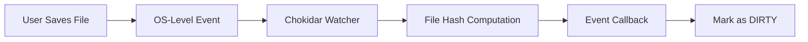
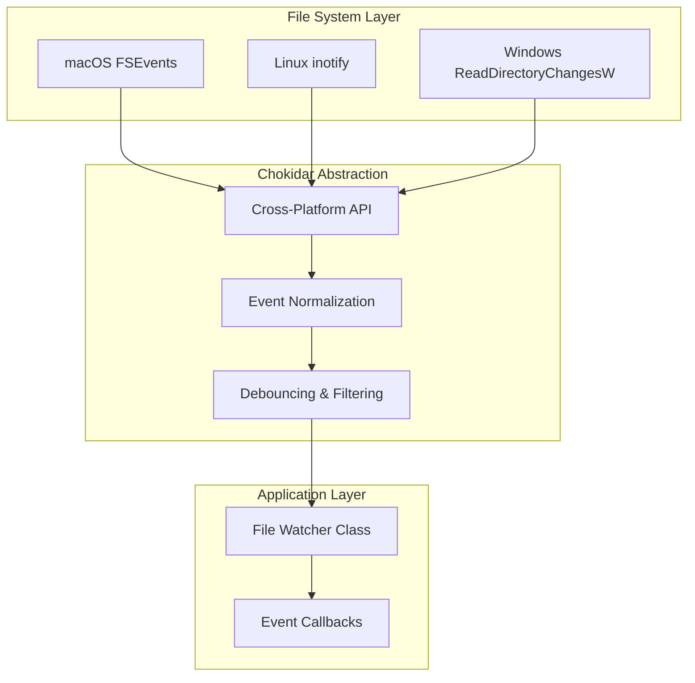
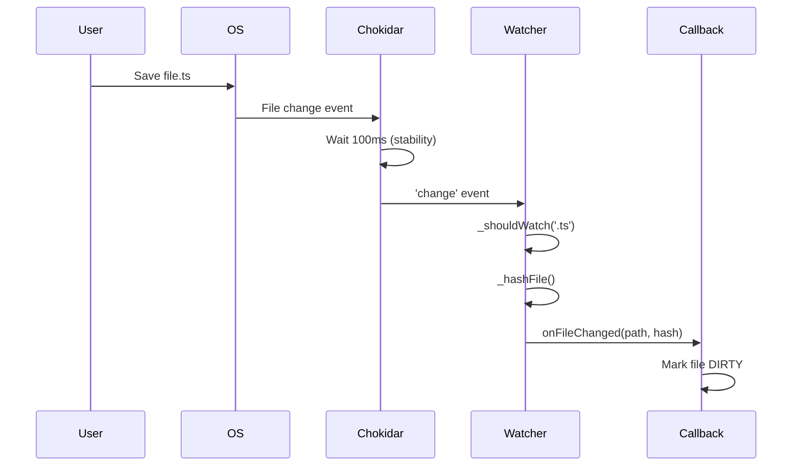
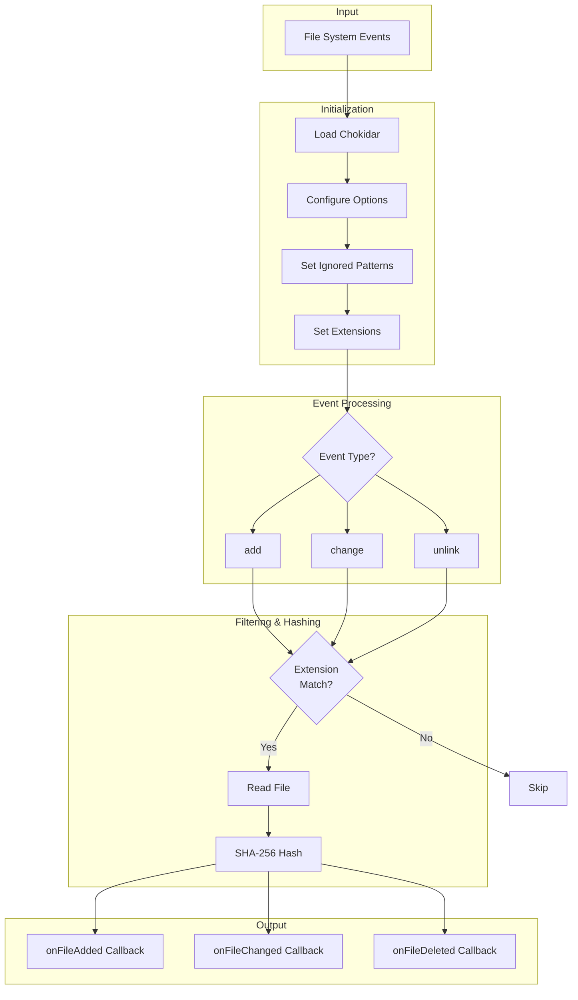
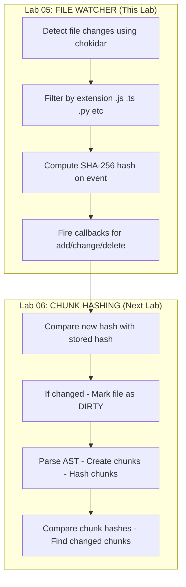

# File Watching for Change Detection

Before you can detect code changes for incremental re-indexing, you need a way to know when files change. This lab teaches you how to implement a file watcher using OS-level APIs that forms the foundation of the change detection pipeline.

When a user saves a file, the watcher fires an event. This triggers hash computation and determines whether the file needs to be re-indexed.

## Prerequisites

- Completed **AST-Based Semantic Code Chunking Lab**
- Node.js 18+ installed
- Basic understanding of event-driven programming

## What You'll Learn

1. How file watching works at the OS level
2. Setting up chokidar for cross-platform file watching
3. Filtering watched files by extension
4. Computing content hashes on file changes
5. Handling file add, change, and delete events

## Part 1: Why File Watching?

### The Real-Time Detection Problem

In a code indexing system, you need to know when files change so you can:

1. **Update the hash registry** - Detect if content actually changed
2. **Mark files as dirty** - Queue for next sync cycle
3. **Trigger re-indexing** - Only for files that changed

Without a file watcher, you'd have to scan the entire codebase periodically, which is slow and inefficient.

### High-Level Overview



The file watcher sits between the operating system and your indexing pipeline. When a user saves a file, the OS notifies chokidar, which triggers hash computation and fires callbacks to mark files as dirty for re-indexing.

### File Watcher in the Pipeline


This diagram shows the complete flow from user action to callback execution. When a user saves a file, the OS fires an fs.watch event that Chokidar captures. The event handler performs a file extension check—if the file is ignored (like images or binaries), it's skipped. For source files, the watcher computes a SHA-256 hash of the file content and fires the appropriate callback (add, change, or delete) with the file path and hash value.

### Key Concepts

| Concept | Description |
|---------|-------------|
| **fs.watch** | Node.js built-in file watcher (OS-level, but unreliable) |
| **chokidar** | Cross-platform wrapper with better reliability |
| **Debouncing** | Wait for writes to finish before firing event |
| **Filtering** | Only watch source files (`.js`, `.ts`, `.py`, etc.) |
| **Ignored paths** | Skip `node_modules`, `.git`, build directories |

## Part 2: Chokidar vs fs.watch

### Why Not Use fs.watch Directly?

Node.js provides `fs.watch()` for file watching, but it has platform-specific issues:

| Issue | fs.watch | chokidar |
|-------|----------|----------|
| **macOS rename bug** | Fires duplicate events | Handles correctly |
| **Recursive watching** | Not on all platforms | Works everywhere |
| **File vs directory** | Confusing behavior | Consistent API |
| **Write stability** | No debouncing | Configurable |
| **Glob patterns** | Not supported | Full support |

### Architecture Overview



Chokidar abstracts OS-level differences (FSEvents on macOS, inotify on Linux, ReadDirectoryChangesW on Windows) into a consistent cross-platform API. It normalizes events, handles debouncing, and provides filtering capabilities that our FileWatcher class consumes.

## Part 3: Project Setup

Clone the repository and navigate to the File-Watcher project:

```bash
git clone https://github.com/poridhioss/indexing-system-poc.git
cd indexing-system-poc/File-Watcher
npm install
```

### Project Structure

```
File-Watcher/
├── src/
│   └── watcher.ts           # SimpleFileWatcher implementation
├── dist/                    # Compiled output
├── package.json
└── tsconfig.json
```

### Dependencies

| Package | Version | Purpose |
|---------|---------|---------|
| `chokidar` | ^5.0.0 | Cross-platform file watching |
| `@types/node` | ^20.10.0 | Node.js type definitions |
| `typescript` | ^5.3.0 | TypeScript compiler |

The project uses TypeScript with ES2020 module system and generates type declarations for better IDE support.

## Part 4: Implementation

The implementation is in [src/watcher.ts](../../File-Watcher/src/watcher.ts). Let's examine the key components:

### Step 1: Interface Definition

```typescript
export interface FileWatcherOptions {
    watchPath?: string;
    ignored?: string[];
    extensions?: string[];
    onFileAdded?: (filePath: string, hash: string | null) => void;
    onFileChanged?: (filePath: string, hash: string | null) => void;
    onFileDeleted?: (filePath: string, hash: string | null) => void;
    onReady?: () => void;
    onError?: (err: Error) => void;
}
```

The `FileWatcherOptions` interface defines configuration for the watcher. It specifies which path to watch, patterns to ignore, file extensions to track, and callback functions for different events (add, change, delete). This design allows flexible customization while providing sensible defaults.

### Step 2: Class Constructor

```typescript
export class SimpleFileWatcher {
    private watchPath: string;
    private ignored: string[];
    private extensions: string[];
    private watcher: FSWatcher | null = null;

    constructor(options: FileWatcherOptions = {}) {
        this.watchPath = options.watchPath || '.';
        this.ignored = options.ignored || [
            '**/node_modules/**',
            '**/.git/**',
            '**/dist/**',
            '**/build/**',
            '**/*.log',
        ];
        this.extensions = options.extensions || ['.js', '.ts', '.jsx', '.tsx', '.py', '.java', '.go', '.rs'];

        this.onFileAdded = options.onFileAdded || this._defaultHandler('added');
        this.onFileChanged = options.onFileChanged || this._defaultHandler('changed');
        this.onFileDeleted = options.onFileDeleted || this._defaultHandler('deleted');
        this.onReady = options.onReady || (() => {});
        this.onError = options.onError || ((err: Error) => console.error('Watcher error:', err));
    }
}
```

The constructor initializes the watcher with defaults. It sets up ignored patterns to skip non-source directories (node_modules, .git, dist, build) and defines source file extensions (.js, .ts, .py, etc.). Callbacks default to simple logging handlers if not provided.

### Step 3: Extension Filtering

```typescript
private _shouldWatch(filePath: string): boolean {
    const ext = path.extname(filePath).toLowerCase();
    return this.extensions.includes(ext);
}
```

This method performs extension-based filtering. It extracts the file extension, converts it to lowercase for case-insensitive comparison, and checks against the allowed extensions list. This prevents processing of non-source files like images, PDFs, or binaries.

### Step 4: Hash Computation

```typescript
private _hashFile(filePath: string): string | null {
    try {
        const content = fs.readFileSync(filePath, 'utf8');
        return crypto.createHash('sha256').update(filePath + content).digest('hex');
    } catch (err) {
        return null;
    }
}
```

The hash function computes a SHA-256 digest of the file path concatenated with content. Including the path in the hash ensures that identical files in different locations have unique hashes. If the file cannot be read (permissions, file deleted), it returns null gracefully.

### Step 5: Starting the Watcher

```typescript
async start(): Promise<this> {
    const chokidar = await import('chokidar');

    this.watcher = chokidar.watch(this.watchPath, {
        ignored: this.ignored,
        persistent: true,
        ignoreInitial: false,
        awaitWriteFinish: {
            stabilityThreshold: 100,
            pollInterval: 50,
        },
    });

    this.watcher.on('add', (filePath: string) => {
        if (this._shouldWatch(filePath)) {
            const hash = this._hashFile(filePath);
            this.onFileAdded(filePath, hash);
        }
    });

    this.watcher.on('change', (filePath: string) => {
        if (this._shouldWatch(filePath)) {
            const hash = this._hashFile(filePath);
            this.onFileChanged(filePath, hash);
        }
    });

    this.watcher.on('unlink', (filePath: string) => {
        if (this._shouldWatch(filePath)) {
            this.onFileDeleted(filePath, null);
        }
    });

    return this;
}
```

The `start()` method initializes chokidar with configured options. `awaitWriteFinish` ensures events fire only after writes complete (100ms stability threshold). The watcher listens for 'add', 'change', and 'unlink' events, filters by extension, computes hashes, and invokes appropriate callbacks.

### Step 6: Event Flow



This sequence shows the complete event flow from user saving a file to the callback execution. The stability threshold prevents premature events during active writing, ensuring the hash is computed on the final file state.

### Step 7: Stopping the Watcher

```typescript
stop(): void {
    if (this.watcher) {
        this.watcher.close();
        console.log('File watcher stopped.');
    }
}
```

The `stop()` method cleanly closes the chokidar watcher, releasing OS resources and file handles. This should be called during application shutdown or when watching is no longer needed.

## Part 5: Running the Watcher

### Interactive Mode

Run the watcher to monitor the test-project directory:

```bash
npm install
npm run build
npm run watch
```

This automatically creates a `test-project` directory if it doesn't exist and starts monitoring for changes.

### Expected Output

```
Starting file watcher on: /path/to/indexing-system-poc/File-Watcher/test-project
Watching extensions: .js, .ts, .jsx, .tsx, .py, .java, .go, .rs
Ignoring: **/node_modules/**, **/.git/**, **/dist/**, **/build/**, **/*.log

Initial scan complete. Watching for changes...

Press Ctrl+C to stop watching.

Try creating/editing/deleting files in the test-project directory.
Example commands:
  echo "console.log(1)" > test-project/test.js
  echo "console.log(2)" >> test-project/test.js
  rm test-project/test.js
```

### Manual Testing

In another terminal, test the watcher with file operations:

```bash
# Navigate to test-project
cd test-project

# Create a file
echo "console.log('Hello');" > demo.js

# Modify the file
echo "console.log('World');" >> demo.js

# Delete the file
rm demo.js
```

You'll see real-time output in the watcher terminal:

```
[ADD]    test-project/demo.js
         Hash: a7f3e2b1c4d5e6f7...

[CHANGE] test-project/demo.js
         Hash: 8b9c0d1e2f3a4b5c...

[DELETE] test-project/demo.js
```

Notice how each operation shows a different hash value, demonstrating content-based change detection.

## Part 6: Processing Flow



This flow diagram illustrates the complete processing pipeline: initialization loads chokidar and configures options, events are filtered by type and extension, valid files are hashed, and appropriate callbacks are invoked with the computed hash.

## Summary

In this lab, you learned:

| Concept | Description |
|---------|-------------|
| **File Watching** | Using OS-level APIs to detect file changes |
| **Chokidar** | Cross-platform file watcher with reliability |
| **Event Types** | add, change, unlink (delete) |
| **Extension Filtering** | Only watch source files |
| **Hash on Event** | Compute content hash immediately |
| **Debouncing** | Wait for writes to finish before firing events |

### Key Takeaways

1. **File watcher is the first step** - Detects when users save files in real-time
2. **OS-level APIs are fast** - Events fire within milliseconds of file changes
3. **Chokidar handles edge cases** - Cross-platform reliability across macOS, Linux, Windows
4. **Hash immediately** - Compute hash when event fires for accurate change detection
5. **Filter early** - Process only source files to reduce overhead

### How This Fits in the Pipeline



The file watcher serves as the entry point for the indexing pipeline. It detects file changes in real-time and computes hashes, which the next lab will use to identify which chunks need re-indexing.

## What's Next

In upcoming labs, you'll build upon the file watcher:

- **Lab 06: Chunk Hashing** - Hash file content, detect changes, and compare chunk hashes
- **Lab 07: Merkle Tree** - Build file-level Merkle trees using SHA-256 hashes
- **Lab 08: Client-Server Sync** - Sync Merkle trees between client and server
- **Lab 09: Selective Re-indexing** - Only re-embed chunks that actually changed

By completing this lab, you've built the foundation for incremental code indexing—a critical component of modern AI-powered development tools like Cursor and GitHub Copilot.
