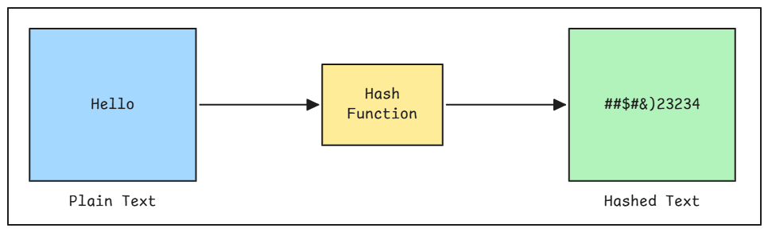

# Real-Time File Monitoring

Before you can detect code changes for incremental re-indexing, you need a way to know when files change. This lab teaches you how to implement a file watcher using OS-level APIs that forms the foundation of the change detection pipeline.

When a user saves a file, the watcher fires an event. This triggers hash computation and determines whether the file needs to be re-indexed.

## Prerequisites

- Completed **AST-Based Semantic Code Chunking Lab**
- Node.js 18+ installed
- Basic understanding of event-driven programming

## What You'll Learn

1. How file watching works at the OS level
2. Setting up @parcel/watcher for high-performance file watching
3. Filtering watched files by extension
4. Computing content hashes on file changes
5. Handling file create, update, and delete events

## Part 1: Why File Watching?

### The Real-Time Detection Problem

In a code indexing system, you need to know when files change so you can:

1. **Update the hash registry** - Detect if content actually changed
2. **Mark files as dirty** - Queue for next sync cycle
3. **Trigger re-indexing** - Only for files that changed

Without a file watcher, you'd have to scan the entire codebase periodically, which is slow and inefficient.

### High-Level Overview


The file watcher monitors a folder containing multiple files and provides instant detection when any file changes. It acts as the bridge between your file system and the change detection system. When files are added, modified, or deleted within the watched folder, the watcher immediately captures these events and triggers the appropriate callbacks—enabling real-time response to code changes without polling or manual scanning.

### File Watcher in the Pipeline


This diagram shows the complete flow from user action to callback execution. When a user saves a file, the operating system fires a native file system event that @parcel/watcher captures through its native bindings. The event handler performs a file extension check—if the file is ignored (like images or binaries), it's skipped. For source files, the watcher computes a SHA-256 hash of the file content and fires the appropriate callback (create, update, or delete) with the file path and hash value.

## Part 2: Why @parcel/watcher?

`Parcel Watcher` is a high-performance file watcher library that is used by `VS Code`, `PUKU IDE by Poridhi`, `Cursor`, `Tailwind`, `Nx`, and other popular IDEs and tools. It is a native library that is written in Rust and C++ and is used to watch files and directories for changes.

### The Performance Advantage

Node.js provides `fs.watch()` for file watching, but production IDEs need better performance:

| Feature | fs.watch | @parcel/watcher |
|---------|----------|-----------------|
| **Implementation** | JavaScript | Native (Rust + C++) |
| **Performance** | Moderate | Extremely fast |
| **CPU Usage** | Higher | Lower |
| **Large Projects** | Struggles | Handles thousands of files |
| **Used By** | Basic tools | VS Code, Cursor, Tailwind, Nx |

### Architecture Overview


The architecture has three distinct layers working together:

**File System Layer**: Each operating system has its own way of detecting file changes. macOS uses FSEvents, Linux uses inotify, and Windows uses ReadDirectoryChangesW. These are fast, native mechanisms built directly into the operating system.

**Parcel Watcher Layer**: This is where @parcel/watcher shines. It takes the different OS-specific events and normalizes them into a single, consistent API. The Cross-Platform API means you write code once and it works everywhere. Event Batching groups multiple file changes together for efficiency—if you save 10 files at once, it processes them as a batch instead of 10 separate events. The High Performance Engine, written in Rust and C++, handles all this with minimal CPU usage.

**Application Layer**: This is your code. The File Watcher Class (our SimpleFileWatcher) subscribes to events from Parcel Watcher and receives clean, batched notifications. When files change, your Event Callbacks fire with the file path and computed hash, ready for processing.

This layered approach is why @parcel/watcher can handle thousands of files efficiently—the same architecture powering VS Code, Cursor, and other professional development tools.

## Part 3: Project Setup

Clone the repository and navigate to the File-Watcher project:

```bash
git clone https://github.com/poridhioss/indexing-system-poc.git
cd indexing-system-poc/File-Watcher
npm install
```

### Project Structure

```
File-Watcher/
├── src/
│   └── watcher.ts           # SimpleFileWatcher implementation
├── dist/                    # Compiled output
├── package.json
└── tsconfig.json
```

### Dependencies

| Package | Version | Purpose |
|---------|---------|---------|
| `@parcel/watcher` | ^2.4.1 | High-performance native file watching |
| `@types/node` | ^20.10.0 | Node.js type definitions |
| `typescript` | ^5.3.0 | TypeScript compiler |

The project uses TypeScript with ES2020 module system and generates type declarations for better IDE support. @parcel/watcher provides native bindings that compile during installation.

## Part 4: Implementation

The implementation is in [src/watcher.ts](../../File-Watcher/src/watcher.ts). Let's examine the key components:

### Step 1: Interface Definition

```typescript
export interface FileWatcherOptions {
    watchPath?: string;
    ignored?: string[];
    extensions?: string[];
    onFileAdded?: (filePath: string, hash: string | null) => void;
    onFileChanged?: (filePath: string, hash: string | null) => void;
    onFileDeleted?: (filePath: string, hash: string | null) => void;
    onReady?: () => void;
    onError?: (err: Error) => void;
}
```

The `FileWatcherOptions` interface defines configuration for the watcher. It specifies which path to watch, patterns to ignore, file extensions to track, and callback functions for different events (add, change, delete). This design allows flexible customization while providing sensible defaults.

### Step 2: Class Constructor

```typescript
export class SimpleFileWatcher {
    private watchPath: string;
    private ignored: string[];
    private extensions: string[];
    private subscription: parcelWatcher.AsyncSubscription | null = null;
    private trackedFiles = new Set<string>();

    constructor(options: FileWatcherOptions = {}) {
        this.watchPath = options.watchPath || '.';
        this.ignored = options.ignored || [
            '**/node_modules/**',
            '**/.git/**',
            '**/dist/**',
            '**/build/**',
            '**/*.log',
        ];
        this.extensions = options.extensions || ['.js', '.ts', '.jsx', '.tsx', '.py', '.java', '.go', '.rs'];

        this.onFileAdded = options.onFileAdded || this._defaultHandler('added');
        this.onFileChanged = options.onFileChanged || this._defaultHandler('changed');
        this.onFileDeleted = options.onFileDeleted || this._defaultHandler('deleted');
    }
}
```

The constructor initializes the watcher with defaults. It sets up ignored patterns to skip non-source directories (node_modules, .git, dist, build) and defines source file extensions (.js, .ts, .py, etc.). The `trackedFiles` Set prevents duplicate events, and `subscription` holds the Parcel watcher subscription (a connection handle returned by `parcelWatcher.subscribe()` that receives file system events and can be used to stop watching via `unsubscribe()`).

### Step 3: Extension Filtering

```typescript
private _shouldWatch(filePath: string): boolean {
    const ext = path.extname(filePath).toLowerCase();
    return this.extensions.includes(ext);
}
```

This method performs extension-based filtering. It extracts the file extension, converts it to lowercase for case-insensitive comparison, and checks against the allowed extensions list. This prevents processing of non-source files like images, PDFs, or binaries.

### Step 4: Ignore Pattern Matching

```typescript
private _shouldIgnore(filePath: string): boolean {
    const relativePath = path.relative(this.watchPath, filePath);

    for (const pattern of this.ignored) {
        const regexPattern = pattern
            .replace(/\*\*/g, '.*')
            .replace(/\*/g, '[^/]*')
            .replace(/\//g, '[\\\\/]');

        const regex = new RegExp(regexPattern);
        if (regex.test(relativePath) || regex.test(filePath)) {
            return true;
        }
    }
    return false;
}
```

This method checks if a file should be ignored based on patterns like `**/node_modules/**` or `**/.git/**`. Since @parcel/watcher doesn't understand glob patterns directly, we convert them to regular expressions. For example, `**/node_modules/**` becomes a regex that matches any path containing "node_modules". The method converts the file path to be relative to the watch directory, then tests it against each ignore pattern. If any pattern matches, the file is ignored. This prevents the watcher from processing thousands of dependency files in node_modules or git metadata files.

### Step 5: Hash Computation

```typescript
private _hashFile(filePath: string): string | null {
    try {
        const content = fs.readFileSync(filePath, 'utf8');
        return crypto.createHash('sha256').update(filePath + content).digest('hex');
    } catch (err) {
        return null;
    }
}
```

The hash function computes a SHA-256 digest of the file path concatenated with content. Including the path in the hash ensures that identical files in different locations have unique hashes. If the file cannot be read (permissions, file deleted), it returns null gracefully.

### Step 6: Initial Scan

```typescript
private async _initialScan(): Promise<void> {
    const scanDir = (dir: string) => {
        try {
            const entries = fs.readdirSync(dir, { withFileTypes: true });

            for (const entry of entries) {
                const fullPath = path.join(dir, entry.name);

                if (this._shouldIgnore(fullPath)) {
                    continue;
                }

                if (entry.isDirectory()) {
                    scanDir(fullPath);
                } else if (entry.isFile() && this._shouldWatch(fullPath)) {
                    this.trackedFiles.add(fullPath);
                    const hash = this._hashFile(fullPath);
                    this.onFileAdded(fullPath, hash);
                }
            }
        } catch (err) {
            // Ignore directories we can't read
        }
    };

    scanDir(this.watchPath);
}
```

Unlike some watchers, @parcel/watcher doesn't automatically report existing files during initialization. We perform a manual recursive directory scan to discover all existing source files. Each file is added to `trackedFiles` and triggers the `onFileAdded` callback with its hash. This ensures the initial state is captured.

### Step 7: Starting the Watcher

```typescript
async start(): Promise<this> {
    console.log(`Starting file watcher on: ${path.resolve(this.watchPath)}`);

    // Perform initial scan
    await this._initialScan();

    // Start watching for changes
    this.subscription = await parcelWatcher.subscribe(
        this.watchPath,
        (err: Error | null, events: parcelWatcher.Event[]) => {
            if (err) {
                this.onError(err);
                return;
            }

            for (const event of events) {
                const filePath = event.path;

                if (this._shouldIgnore(filePath) || !this._shouldWatch(filePath)) {
                    continue;
                }

                if (event.type === 'create') {
                    if (!this.trackedFiles.has(filePath)) {
                        this.trackedFiles.add(filePath);
                        const hash = this._hashFile(filePath);
                        this.onFileAdded(filePath, hash);
                    }
                } else if (event.type === 'update') {
                    const hash = this._hashFile(filePath);
                    this.onFileChanged(filePath, hash);
                } else if (event.type === 'delete') {
                    this.trackedFiles.delete(filePath);
                    this.onFileDeleted(filePath, null);
                }
            }
        }
    );

    console.log('Initial scan complete. Watching for changes...\n');
    this.onReady();

    return this;
}
```

The `start()` method subscribes to file system events using @parcel/watcher's subscription API. Events arrive in batches, and we filter each event by extension and ignore patterns. Event types are `create`, `update`, and `delete`. The `trackedFiles` Set prevents duplicate "create" events for files discovered during the initial scan.

### Step 8: Event Flow


This sequence shows the complete event flow. @parcel/watcher uses native OS APIs for maximum performance, batches events to reduce overhead, and delivers them to our callback. We filter by extension and ignore patterns before computing the hash and invoking the appropriate callback.

### Step 9: Stopping the Watcher

```typescript
async stop(): Promise<void> {
    if (this.subscription) {
        await this.subscription.unsubscribe();
        this.subscription = null;
        console.log('File watcher stopped.');
    }
}
```

The `stop()` method asynchronously unsubscribes from file system events, releasing native resources and file handles. This should be called during application shutdown or when watching is no longer needed.

## Part 5: Running the Watcher

### Interactive Mode

Run the watcher to monitor the test-project directory:

```bash
npm run build
npm run watch
```

This automatically creates a `test-project` directory if it doesn't exist and starts monitoring for changes.

### Expected Output



### Manual Testing

Now inside the `test-project` directory, create a file called `demo.js` and add the following content:
```javascript
console.log('Hello');
```

You'll see real-time output in the watcher terminal:


Notice how each operation shows a different hash value, demonstrating content-based change detection.

Now modify the file and save it, and you'll see the the changes in the terminal with different hash values. Try to delete the file and you'll see the delete event in the terminal.

## Conclusion

You've built a production-grade file watcher using @parcel/watcher—the same technology powering VS Code, Cursor IDE, and other professional development tools. This watcher uses native OS-level APIs (FSEvents on macOS, inotify on Linux, ReadDirectoryChangesW on Windows) to detect file changes in real-time with minimal CPU overhead. By filtering files based on extensions and ignore patterns, then computing SHA-256 hashes immediately when changes occur, you've created the foundation for an intelligent code indexing system. The event batching and initial scan capabilities ensure efficient handling of large codebases, while the subscription-based API provides clean integration points for downstream processing. This file watcher is the critical first step in the change detection pipeline—it detects when users save files, computes content hashes, and triggers the re-indexing process that will identify exactly which code chunks need to be updated.