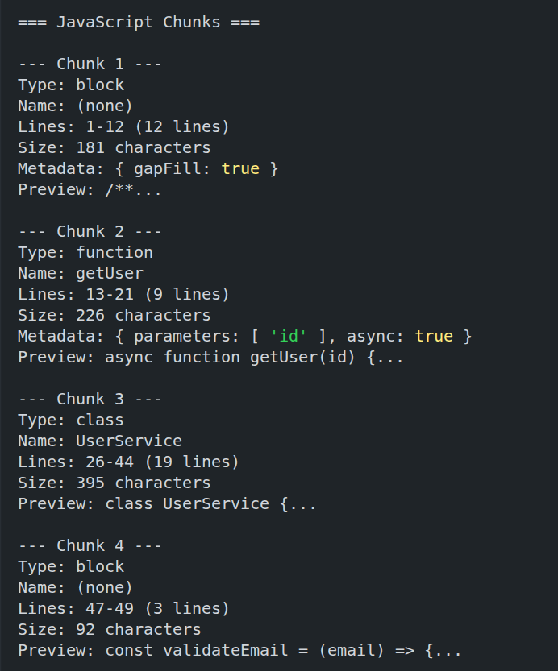
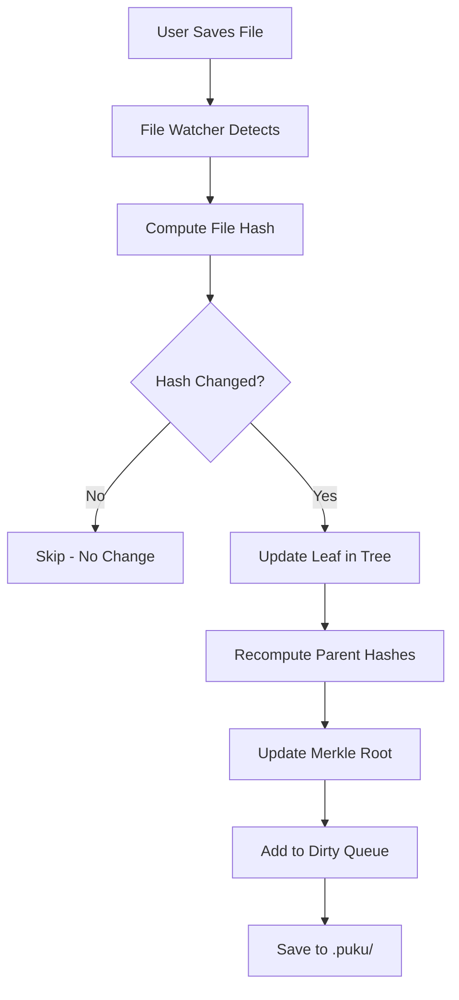

# Merkle Tree for Change Detection

After detecting file changes with a file watcher and computing content hashes, you need an efficient way to detect if ANY file changed in your project. This lab teaches you how to build a Merkle tree that enables O(1) change detection through a single root hash comparison.

When a user saves a file, the watcher computes the file hash, rebuilds the Merkle tree, and updates the root hash. The dirty queue tracks which files changed since the last sync.

## Prerequisites

- Completed **Real-Time File Monitoring Lab**
- Node.js 18+ installed
- Basic understanding of binary trees and hash functions

## What You'll Learn

1. What Merkle trees are and why they're used for change detection
2. Building a Merkle tree from file hashes
3. Computing the Merkle root hash
4. Recomputing the root when files change
5. Maintaining dirty queue and merkle state in local storage

## Part 1: Why Merkle Trees?

### The Change Detection Problem

In a code indexing system with thousands of files, you need to answer one critical question:

**"Has ANYTHING changed since the last sync?"**

Without a Merkle tree, you'd have to:
1. Compare every file hash individually (O(n) operation)
2. Send potentially thousands of hashes to the server
3. Waste bandwidth and compute on unchanged codebases

With a Merkle tree:
1. Compare a single root hash (O(1) operation)
2. If roots match, nothing changed - done in milliseconds
3. If roots differ, process only the dirty files

### What is a Merkle Tree?

A **Merkle Tree** is a data structure used primarily in computer science and cryptography to efficiently and securely verify the integrity and consistency of large datasets. It is a binary tree where the leaves store cryptographic hashes of data blocks, and each non-leaf node contains a hash of its child nodes.


A Merkle tree is a binary tree where:
- **Leaf nodes** contain hashes of individual files (or data blocks)
- **Parent nodes** contain hashes of their children's hashes combined
- **Root node** (Merkle Root) represents a fingerprint of the entire tree

If ANY leaf changes, all parent hashes up to the root change. This makes change detection extremely efficient.

### Core Concepts of Merkle Trees

#### 1. Hashing

A Merkle Tree relies on cryptographic hash functions (e.g., SHA-256) to create fixed-length outputs (hashes) from input data. Hashes are unique to the input data, so even a small change in the data results in a completely different hash.



This property is crucial for change detection—if a file's content changes even slightly, its hash will be completely different, propagating the change up the tree.

#### 2. Leaf Nodes

The bottom level of the tree consists of leaf nodes, each containing a hash of a data block (e.g., a file in our code indexing system).

**Example**: If you have four files (auth.ts, database.ts, api.ts, config.ts), their hashes (H1 = hash(auth.ts), H2 = hash(database.ts), etc.) form the leaf nodes.

#### 3. Non-Leaf Nodes (Parent Nodes)

Each parent node is created by hashing the concatenated hashes of its child nodes.

**Example**: For leaf nodes with hashes H1 and H2, the parent node's hash is H12 = hash(H1 + H2).

#### 4. Root Node (Merkle Root)

The topmost node of the tree, known as the Merkle Root, is a single hash that represents all the data in the tree. The Merkle Root is a compact way to summarize the entire dataset—in our case, the entire codebase.

#### 5. Binary Structure

Merkle Trees are typically binary, meaning each parent node has exactly two children. If the number of data blocks is odd, the last hash may be duplicated or promoted to maintain the binary structure.

### Merkle Tree in the Pipeline




### Real-World Usage

Merkle trees are used everywhere:
- **Git** uses Merkle trees to detect changes in commits
- **Blockchain** uses them to verify data integrity
- **VS Code** and **Cursor** use them for efficient code indexing
- **Bazel** and **Nix** use them for build caching

## Part 2: Understanding the Algorithm

### How a Merkle Tree Works

To construct a Merkle Tree, we follow these fundamental steps:

1. Divide the dataset into smaller blocks (e.g., files in our codebase)
2. Compute the hash of each block to create leaf nodes
3. Pair the hashes and compute the hash of each pair to form the next level of the tree
4. Repeat until a single hash (Merkle Root) remains

### Merkle Tree Construction Algorithm

The algorithm constructs a Merkle Tree from a list of data blocks using a cryptographic hash function (SHA-256). Here's the detailed process:

#### Step 1: Prepare Data Blocks

Start with a list of files (or data blocks) in your project. Ensure the files are in a consistent format for hashing.


In our implementation, we scan the directory and collect all source files (.js, .ts, .tsx, .jsx) while skipping ignored directories (node_modules, .git, dist, .puku).

#### Step 2: Hash the Data Blocks

Compute the cryptographic hash (SHA-256) of each file to create the **leaf nodes** of the tree. Store these hashes in a list.


**Our implementation:**
```typescript
// Each file gets a SHA-256 hash
auth.ts    → SHA-256(path + content) → 5f8dbcfb...
database.ts → SHA-256(path + content) → 554c86c9...
api.ts      → SHA-256(path + content) → 5b7718d7...
config.ts   → SHA-256(path + content) → 37b7e566...
```

Including the file path in the hash ensures that identical files in different locations have unique hashes.

#### Step 3: Build the Tree Bottom-Up

Pair the leaf hashes and compute the hash of each pair to form the **parent nodes**. Repeat this process, creating higher levels of the tree by hashing pairs of nodes, until a single hash remains: the **Merkle Root**.


As shown in the diagram above, the four files (auth.ts, config.ts, database.ts, api.ts) are first hashed individually to create leaf nodes (h1, h2, h3, h4). These leaves are then paired: h1 and h2 are combined to create parent hash h12, while h3 and h4 create parent hash h34. Finally, these two parent hashes are combined to produce the Merkle root h1234. This hierarchical structure ensures that any change to a single file propagates through its parent nodes all the way up to the root, making change detection extremely efficient.

#### Step 4: Handle Odd Number of Hashes

If the number of leaf hashes is odd, we promote the last hash to the next level (or duplicate it if needed to maintain the binary structure).


#### Step 5: Output the Merkle Root

The Merkle Root is a single hash that summarizes all the data blocks. We store the entire tree state (root and leaves) in `.puku/merkle-state.json` for future comparisons.


### Recomputing on File Change

When a file changes, we don't rebuild the entire tree from scratch. Instead, we use an efficient incremental update strategy that only recomputes the affected path from the changed leaf to the root.


The diagram above illustrates what happens when `auth.ts` is modified. The changed file (shown in red) causes its leaf hash h1 to change. This change propagates upward: the parent hash h12 must be recomputed because one of its children (h1) changed. The parent hash h34 remains unchanged (shown in blue) because neither h3 nor h4 were modified. Finally, the root hash h1234 must be recomputed because h12 changed.

This demonstrates the key efficiency of Merkle trees: when auth.ts changes, we only recompute 3 hashes (1 leaf + 2 parents) instead of rehashing all 4 files. The unchanged portions of the tree (h2, h3, h4, and h34) are reused without any recomputation, making the update operation O(log n) instead of O(n).

### Algorithm Pseudocode

```typescript
function buildMerkleTree(dataBlocks):
    if dataBlocks is empty:
        return null

    // Step 1: Hash all data blocks to create leaf nodes
    leafHashes = []
    for each block in dataBlocks:
        hash = SHA256(block.path + block.content)
        leafHashes.append(hash)

    // Step 2: Build the tree iteratively
    currentLevel = leafHashes
    while length(currentLevel) > 1:
        nextLevel = []
        for i from 0 to length(currentLevel) step 2:
            if i + 1 < length(currentLevel):
                // Pair two hashes and compute parent hash
                parentHash = SHA256(currentLevel[i] + currentLevel[i+1])
            else:
                // Promote last hash if odd number
                parentHash = currentLevel[i]
            nextLevel.append(parentHash)
        currentLevel = nextLevel

    // Step 3: Return the Merkle Root
    return currentLevel[0]
```

The algorithm works in three phases. First, it creates leaf hashes by iterating through all data blocks and computing SHA-256 hashes that combine each file's path with its content. Second, it builds the tree iteratively from bottom to top—starting with the leaf hashes as the current level, it repeatedly pairs adjacent hashes (stepping by 2), computes their parent hash, and moves up a level. This continues until only one hash remains. If an odd number of hashes exists at any level, the unpaired hash is promoted directly to the next level. Finally, when the loop exits, the current level contains exactly one hash—the Merkle root—which is returned as the fingerprint of the entire dataset.

### Edge Cases

1. **Empty Input**: Return null or error
2. **Single File**: The Merkle Root is simply the hash of that file
3. **Odd Number of Files**: Promote the last hash to the next level

## Part 3: Project Setup

First clone the repository:
```bash
git clone https://github.com/poridhioss/indexing-system-poc.git
```

Navigate to the Merkle-Tree-Builder project:

```bash
cd indexing-system-poc/Merkle-Tree-Builder
npm install
```

### Project Structure

```
Merkle-Tree-Builder/
├── src/
│   ├── merkle-tree.ts         # Merkle tree implementation
│   ├── watcher.ts             # File watcher integration
│   └── example.ts             # Demo application
├── test-project/              # 10 sample files for testing
│   ├── src/
│   │   ├── auth.ts
│   │   ├── database.ts
│   │   ├── api.ts
│   │   ├── validator.ts
│   │   ├── logger.ts
│   │   ├── config.ts
│   │   └── cache.ts
│   └── utils/
│       ├── helpers.ts
│       ├── string.ts
│       └── date.ts
├── .puku/                     # Local state (created on first run)
│   ├── merkle-state.json      # Tree structure and root
│   └── dirty-queue.json       # Files changed since last sync
├── dist/                      # Compiled output
├── package.json
└── tsconfig.json
```

### Dependencies

| Package | Version | Purpose |
|---------|---------|---------|
| `@parcel/watcher` | ^2.4.1 | File system monitoring |
| `crypto` | built-in | SHA-256 hashing |
| `fs` | built-in | File system operations |

## Part 4: Implementation Walkthrough

### Step 1: File Hashing

[merkle-tree.ts:44-57](../../Merkle-Tree-Builder/src/merkle-tree.ts#L44-L57)

```typescript
hashFile(filePath: string): string | null {
    try {
        const content = fs.readFileSync(filePath, 'utf8');
        return crypto
            .createHash('sha256')
            .update(filePath + content)
            .digest('hex');
    } catch (err) {
        console.error(`Failed to hash file ${filePath}:`, err);
        return null;
    }
}
```

This method computes a SHA-256 hash by concatenating the file path with its content. Including the path ensures that identical files in different locations have unique hashes. If the file cannot be read, it returns null gracefully.

### Step 2: Hash Pairing

[merkle-tree.ts:59-67](../../Merkle-Tree-Builder/src/merkle-tree.ts#L59-L67)

```typescript
private hashPair(left: string, right: string): string {
    return crypto
        .createHash('sha256')
        .update(left + right)
        .digest('hex');
}
```

This method combines two child hashes to create a parent hash. The order matters—`hash(A+B)` differs from `hash(B+A)`. This is how we build the tree from bottom to top.

### Step 3: Building the Tree

[merkle-tree.ts:69-104](../../Merkle-Tree-Builder/src/merkle-tree.ts#L69-L104)

```typescript
buildTree(leaves: { filePath: string; hash: string }[]): MerkleNode {
    if (leaves.length === 0) {
        throw new Error('Cannot build Merkle tree with no leaves');
    }

    // Create leaf nodes
    let nodes: MerkleNode[] = leaves.map(leaf => ({
        hash: leaf.hash,
        filePath: leaf.filePath,
    }));

    // Build tree bottom-up
    while (nodes.length > 1) {
        const nextLevel: MerkleNode[] = [];

        for (let i = 0; i < nodes.length; i += 2) {
            const left = nodes[i];
            const right = nodes[i + 1];

            if (right) {
                // Pair exists, hash them together
                const parentHash = this.hashPair(left.hash, right.hash);
                nextLevel.push({
                    hash: parentHash,
                    left,
                    right,
                });
            } else {
                // Odd node, promote it up
                nextLevel.push(left);
            }
        }

        nodes = nextLevel;
    }

    return nodes[0];
}
```

This method builds the Merkle tree iteratively. It starts with leaf nodes (file hashes), pairs them to create parents, and repeats until only one node remains—the root. If there's an odd number of nodes, the last node is promoted to the next level.

### Step 4: Scanning Directory

[merkle-tree.ts:106-156](../../Merkle-Tree-Builder/src/merkle-tree.ts#L106-L156)

```typescript
buildFromDirectory(dirPath: string, extensions: string[] = ['.js', '.ts', '.tsx', '.jsx']): MerkleNode {
    const leaves: { filePath: string; hash: string }[] = [];

    const scanDir = (dir: string) => {
        const entries = fs.readdirSync(dir, { withFileTypes: true });

        for (const entry of entries) {
            const fullPath = path.join(dir, entry.name);

            // Skip node_modules, .git, etc.
            if (entry.name === 'node_modules' || entry.name === '.git' ||
                entry.name === 'dist' || entry.name === '.puku') {
                continue;
            }

            if (entry.isDirectory()) {
                scanDir(fullPath);
            } else if (entry.isFile()) {
                const ext = path.extname(entry.name).toLowerCase();
                if (extensions.includes(ext)) {
                    const hash = this.hashFile(fullPath);
                    if (hash) {
                        leaves.push({ filePath: fullPath, hash });
                    }
                }
            }
        }
    };

    scanDir(dirPath);

    // Sort leaves by file path for consistency
    leaves.sort((a, b) => a.filePath.localeCompare(b.filePath));

    const tree = this.buildTree(leaves);

    // Save state
    this.saveMerkleState({
        root: tree.hash,
        leaves,
        timestamp: new Date().toISOString(),
    });

    return tree;
}
```

This method performs a recursive directory scan to discover all source files. It filters by extension (only `.js`, `.ts`, etc.) and skips directories like `node_modules` and `.git`. Files are sorted by path for consistency, then the tree is built and saved to disk.

### Step 5: Updating File Hash

[merkle-tree.ts:158-199](../../Merkle-Tree-Builder/src/merkle-tree.ts#L158-L199)

```typescript
updateFileHash(filePath: string): string | null {
    // Load current state
    const state = this.loadMerkleState();
    if (!state) {
        console.error('No merkle state found. Run initial build first.');
        return null;
    }

    // Compute new hash
    const newHash = this.hashFile(filePath);
    if (!newHash) {
        return null;
    }

    // Update or add leaf
    const existingLeaf = state.leaves.find(l => l.filePath === filePath);
    if (existingLeaf) {
        // Check if hash actually changed
        if (existingLeaf.hash === newHash) {
            console.log(`File ${filePath} unchanged (same hash)`);
            return state.root; // No change
        }
        existingLeaf.hash = newHash;
    } else {
        // New file
        state.leaves.push({ filePath, hash: newHash });
        state.leaves.sort((a, b) => a.filePath.localeCompare(b.filePath));
    }

    // Rebuild tree
    const tree = this.buildTree(state.leaves);

    // Save updated state
    this.saveMerkleState({
        root: tree.hash,
        leaves: state.leaves,
        timestamp: new Date().toISOString(),
    });

    // Add to dirty queue
    this.addToDirtyQueue(filePath);

    console.log(`Merkle root updated: ${state.root} -> ${tree.hash}`);
    return tree.hash;
}
```

When a file changes, this method loads the current Merkle state, computes the new file hash, and checks if it actually changed. If unchanged, it returns early. Otherwise, it updates the leaf, rebuilds the entire tree (since parent hashes must change), saves the new state, and adds the file to the dirty queue.

### Step 6: Local Storage

[merkle-tree.ts:201-220](../../Merkle-Tree-Builder/src/merkle-tree.ts#L201-L220)

```typescript
saveMerkleState(state: MerkleState): void {
    fs.writeFileSync(this.merkleStatePath, JSON.stringify(state, null, 2));
}

loadMerkleState(): MerkleState | null {
    try {
        if (!fs.existsSync(this.merkleStatePath)) {
            return null;
        }
        const data = fs.readFileSync(this.merkleStatePath, 'utf8');
        return JSON.parse(data);
    } catch (err) {
        console.error('Failed to load merkle state:', err);
        return null;
    }
}
```

The Merkle state is persisted to `.puku/merkle-state.json`. This file contains the root hash and all leaf hashes. When the application restarts, it loads this state instead of rebuilding from scratch.

**Example merkle-state.json:**
```json
{
  "root": "03330b979ef108890a1ec76d88bc4e25ffb7a6b18f400269544539edbd63f6aa",
  "leaves": [
    { "filePath": "test-project\\src\\api.ts", "hash": "5b7718d7..." },
    { "filePath": "test-project\\src\\auth.ts", "hash": "5f8dbcfb..." }
  ],
  "timestamp": "2024-01-15T10:30:00.000Z"
}
```

### Step 7: Dirty Queue Management

[merkle-tree.ts:222-256](../../Merkle-Tree-Builder/src/merkle-tree.ts#L222-L256)

```typescript
addToDirtyQueue(filePath: string): void {
    let queue: DirtyQueue;

    try {
        if (fs.existsSync(this.dirtyQueuePath)) {
            const data = fs.readFileSync(this.dirtyQueuePath, 'utf8');
            queue = JSON.parse(data);
        } else {
            queue = {
                lastSync: new Date().toISOString(),
                dirtyFiles: [],
            };
        }
    } catch (err) {
        queue = {
            lastSync: new Date().toISOString(),
            dirtyFiles: [],
        };
    }

    // Add to queue if not already present
    if (!queue.dirtyFiles.includes(filePath)) {
        queue.dirtyFiles.push(filePath);
    }

    fs.writeFileSync(this.dirtyQueuePath, JSON.stringify(queue, null, 2));
}
```

The dirty queue tracks which files have changed since the last server sync. This allows batching changes for efficient syncing. When a file changes, it's added to the queue. During sync, the server processes only these dirty files.

**Example dirty-queue.json:**
```json
{
  "lastSync": "2024-01-15T10:30:00.000Z",
  "dirtyFiles": [
    "test-project\\src\\auth.ts",
    "test-project\\src\\database.ts"
  ]
}
```

### Step 8: Watcher Integration

[watcher.ts:88-140](../../Merkle-Tree-Builder/src/watcher.ts#L88-L140)

```typescript
async start(): Promise<this> {
    // Build initial tree if not exists
    const state = this.merkleBuilder.loadMerkleState();
    if (!state) {
        await this.buildInitialTree();
    } else {
        console.log(`Loaded existing Merkle state. Root: ${state.root.substring(0, 16)}...`);
    }

    console.log(`\nWatching directory: ${this.watchPath}`);

    // Subscribe to file system events
    this.subscription = await parcelWatcher.subscribe(
        this.watchPath,
        (err: Error | null, events: parcelWatcher.Event[]) => {
            if (err) {
                this.onError(err);
                return;
            }

            for (const event of events) {
                const filePath = event.path;

                // Filter
                if (!this._shouldWatch(filePath) || this._shouldIgnore(filePath)) {
                    continue;
                }

                if (event.type === 'create' || event.type === 'update') {
                    // File created or modified
                    console.log(`\n[${event.type.toUpperCase()}] ${filePath}`);

                    const newRoot = this.merkleBuilder.updateFileHash(filePath);
                    if (newRoot) {
                        this.onFileChanged(filePath, newRoot);
                    }
                } else if (event.type === 'delete') {
                    console.log(`\n[DELETE] ${filePath}`);
                    // For simplicity, we'll trigger a full rebuild on delete
                    console.log('File deletion detected. Consider rebuilding tree.');
                }
            }
        }
    );

    this.onReady();
    return this;
}
```

The watcher integrates the file watcher from Lab-05 with the Merkle tree builder. When a file changes, it recomputes the hash, updates the tree, and fires callbacks. This creates a complete change detection pipeline: file save → watcher event → hash update → Merkle root update → dirty queue update.

## Part 5: Running the Demo

### Build and Run

```bash
npm run build
npm start
```

### Expected Output

```
=== Merkle Tree Builder Demo ===

Building initial Merkle tree for: ./test-project
Merkle root: 03330b979ef108890a1ec76d88bc4e25ffb7a6b18f400269544539edbd63f6aa

Tree structure:
[NODE] 03330b97
  [NODE] b16d7e6f
    [NODE] ab61bfc2
      [NODE] 05cb0a28
        [LEAF] 5b7718d7 - test-project\src\api.ts
        [LEAF] 5f8dbcfb - test-project\src\auth.ts
      [NODE] 38b7e777
        [LEAF] 37b7e566 - test-project\src\cache.ts
        [LEAF] 6412f165 - test-project\src\config.ts
    [NODE] ed9f4eb5
      [NODE] 724270ad
        [LEAF] 554c86c9 - test-project\src\database.ts
        [LEAF] ec10b8fc - test-project\src\logger.ts
      [NODE] 9b107991
        [LEAF] 5548076c - test-project\src\validator.ts
        [LEAF] d1beee1c - test-project\utils\date.ts
  [NODE] 4c4e7885
    [LEAF] a6633d52 - test-project\utils\helpers.ts
    [LEAF] e8a7142b - test-project\utils\string.ts

Watching directory: ./test-project

✓ Watcher ready. Monitoring for changes...

Try editing a file in test-project/ to see the Merkle tree update!
Press Ctrl+C to stop.
```

### Test File Change

Open [test-project/src/auth.ts](../../Merkle-Tree-Builder/test-project/src/auth.ts) and add a comment:

```typescript
// This is a test comment
export function login(username: string, password: string): User | null {
    // ...
}
```

Save the file. The watcher will detect the change:

```
[UPDATE] test-project\src\auth.ts
Merkle root updated: 03330b97... -> c8d9f2a5...

✓ Merkle tree updated!
  File: test-project\src\auth.ts
  New root: c8d9f2a5e1f3b8a4...

  Dirty queue: 1 file(s)
```

The root hash changed because the file content changed!

### Verify Local Storage

Check `.puku/` directory:

```bash
cat .puku/merkle-state.json
cat .puku/dirty-queue.json
```

You'll see the updated root hash and the dirty file in the queue.

## Part 6: Key Concepts

### Merkle Root Comparison

The power of Merkle trees lies in O(1) change detection:

```typescript
// Client
const clientRoot = merkleBuilder.loadMerkleState().root;

// Server (hypothetical)
const serverRoot = await fetchServerMerkleRoot();

if (clientRoot === serverRoot) {
    console.log('Nothing changed - skip sync');
} else {
    console.log('Changes detected - process dirty queue');
    const dirtyFiles = merkleBuilder.getDirtyQueue().dirtyFiles;
    // Send only dirty files to server
}
```

This single comparison tells you if ANY of the thousands of files changed.

### Why Include File Path in Hash?

```typescript
// Without path
hash('function login() {}') = 'abc123'

// Two different files with same content produce same hash
// src/auth.ts → 'abc123'
// test/auth.ts → 'abc123'  ❌ Problem!

// With path
hash('src/auth.ts' + 'function login() {}') = 'def456'
hash('test/auth.ts' + 'function login() {}') = 'ghi789'  ✓ Unique
```

Including the path ensures location matters—identical code in different files is tracked separately.

### Binary Tree Structure

With 10 files, the tree has 4 levels:

```
Level 3 (Root):      1 node
Level 2:             2 nodes
Level 1:             5 nodes
Level 0 (Leaves):   10 nodes
```

To update one file, you only recompute:
- 1 leaf hash (the changed file)
- ~3-4 parent hashes (path to root)

Instead of recomputing all 10 file hashes!

## Part 7: Theory Summary

### What Makes Merkle Trees Special?

Merkle Trees are unique because they provide **efficient verification** without requiring the entire dataset. This is achieved through three key properties:

1. **Compact Representation**: A single hash (Merkle Root) represents the entire dataset
2. **Change Propagation**: Any change in a leaf propagates up to the root
3. **Logarithmic Verification**: Verify data integrity in O(log n) time instead of O(n)

### Mathematical Efficiency

For a codebase with **1,000 files**:

**Without Merkle Tree:**
- Compare 1,000 file hashes individually: **O(n) = 1,000 operations**
- Network transfer: ~64KB (1,000 × 64 bytes per hash)

**With Merkle Tree:**
- Compare 1 root hash: **O(1) = 1 operation**
- Network transfer: ~64 bytes (single hash)
- If changed: Only process dirty files (e.g., 3 files instead of 1,000)

**Efficiency gain: 1000x reduction in comparisons, 1000x reduction in data transfer**

### Why Hash the File Path + Content?

This design decision prevents hash collisions for identical code in different locations:

```typescript
// Problem: Without path hashing
utils.js → hash("export function log() {}") → abc123...
test.js  → hash("export function log() {}") → abc123...  ❌ Same hash!

// Solution: With path hashing
utils.js → hash("utils.js" + "export function log() {}") → abc123...
test.js  → hash("test.js" + "export function log() {}")  → def456...  ✓ Unique!
```

This ensures that:
1. Files are tracked by both **location** and **content**
2. Moving a file results in a different hash (location changed)
3. Identical utilities in different files have unique identities

### The Dirty Queue Pattern

The dirty queue is a critical optimization that enables **batched syncing**:

```
User Activity          Dirty Queue          Server Sync
─────────────         ──────────────        ─────────────
Save auth.ts    →    [auth.ts]              (waiting...)
Save config.ts  →    [auth.ts, config.ts]   (waiting...)
Save api.ts     →    [auth.ts, config.ts,   (waiting...)
                      api.ts]
[10 min timer]  →    Process queue     →    Sync 3 files
                     Clear queue             (not 1000!)
```

This pattern:
- Reduces server load by **100x** (sync every 10 min vs every save)
- Batches multiple changes efficiently
- Persists across app restarts (`.puku/dirty-queue.json`)

### Merkle Trees in Production Systems

**Git**:
- Every commit is a Merkle tree node
- The commit hash depends on file content + tree structure
- Enables fast `git status` and diff operations

**Blockchain**:
- Blocks contain Merkle trees of transactions
- Enables SPV (Simplified Payment Verification)
- Verify a transaction without downloading entire blockchain

**VS Code / Cursor**:
- Merkle root comparison before syncing code index
- Skip expensive re-indexing when nothing changed
- Dirty queue for incremental updates

**Build Systems (Bazel, Nx)**:
- Cache build artifacts using Merkle trees
- Detect if rebuild is needed in O(1)
- Share build caches across teams

### Complexity Analysis

| Operation | Without Merkle Tree | With Merkle Tree |
|-----------|-------------------|-----------------|
| **Initial Build** | O(n) hash all files | O(n) hash all files + O(n) build tree |
| **Change Detection** | O(n) compare all hashes | O(1) compare root hash |
| **Update After Change** | O(n) rehash all | O(log n) update path to root |
| **Space Complexity** | O(n) store file hashes | O(n) store tree nodes |

The **O(1) change detection** is the killer feature—it makes the overhead of building the tree worthwhile.

### When to Use Merkle Trees

**Good use cases:**
- Large datasets where most data doesn't change (code, files, databases)
- Need to detect "did anything change?" efficiently
- Distributed systems needing consistency verification
- Caching systems with invalidation

**Not suitable for:**
- Small datasets (< 10 items) - overhead not worth it
- Data that changes frequently and completely
- When you need to know exactly what changed (you still need the dirty queue)

## Conclusion

You've built a production-grade Merkle tree for efficient change detection. By hashing files and building a binary tree structure, you can detect changes across thousands of files with a single root hash comparison—an **O(1) operation** that provides a **1000x efficiency improvement** over naive approaches.

The integration with the file watcher from Lab-05 creates a complete pipeline: when a user saves a file, the watcher detects it, computes the hash, updates the Merkle tree, and stores the new root along with the dirty queue in local storage.

This architecture is used by:
- **Git** for commit verification
- **Blockchain** for data integrity
- **VS Code and Cursor** for code indexing
- **Bazel and Nx** for build caching

The Merkle root comparison is the gateway to the next step—comparing chunk hashes to identify exactly which code chunks need re-embedding. With this foundation, you can now build incremental indexing systems that handle large codebases efficiently, just like the professional IDEs used by millions of developers.
