# Chunk Hashing for Two-Phase Sync

After creating semantic chunks with Tree-sitter, you need to compute hashes for each chunk to enable efficient server synchronization. This lab teaches you how to hash chunks and store references—not the actual code—so that code is only sent to the server when explicitly requested.

This is exactly how PUKU Editor, Cursor and other production AI code editors implement their two-phase sync protocol to minimize data transfer and protect user code privacy.

## Prerequisites

- Completed **Semantic Code Chunking Lab** (Lab-04)
- Understanding of the two-phase sync protocol (see `Pipeline/cursor-architecture.md`)
- Node.js 18+ installed

## What You'll Learn

1. Why chunk hashing enables efficient sync
2. Computing SHA-256 hashes for semantic chunks
3. Storing chunk references instead of code
4. Creating sync payloads for server communication
5. The two-phase sync protocol in practice

## Part 1: Why Chunk Hashing?

### The Data Transfer Problem

When syncing code to a server for embedding generation, you face a key challenge: **how do you minimize data transfer while still enabling the server to generate embeddings?**


Consider a typical development workflow. You open a project with 1,000 files containing 10,000 semantic chunks. Throughout the day, you edit maybe 5-10 files, changing perhaps 20 chunks total. Without an efficient sync mechanism, every sync would send all 10,000 chunks to the server—megabytes of code transferred just to update a handful of changes. The server would re-embed everything, wasting compute resources on 9,980 unchanged chunks. At scale, this becomes prohibitively expensive in bandwidth, API costs, and time.

Chunk hashing solves this by introducing a two-phase protocol. In Phase 1, the client computes SHA-256 hashes for each chunk and sends only these hashes to the server—no actual code. The server checks each hash against its cache to identify which chunks are new or changed. In Phase 2, the client sends code only for the chunks the server explicitly requests. This means if you changed 20 chunks out of 10,000, only those 20 chunks' code gets transferred.

### The Two-Phase Sync Protocol

The two-phase protocol separates metadata exchange from code transfer:


In **Phase 1**, the client sends only hashes and metadata—no actual code. The server checks its cache to determine which chunks are new or changed. In **Phase 2**, the client sends code only for the chunks the server requests. The server generates embeddings from this code, then immediately discards it. This approach achieves **97% bandwidth savings** compared to sending all code upfront.

### Why Store References, Not Code?

A key design decision: **HashedChunk stores a reference to the code, not the code itself.**

```mermaid
flowchart TB
    subgraph "SemanticChunk"
        A1[text: function code...]
        A2[type: function]
        A3[name: login]
        A4[lines: 10-25]
        A1 ~~~ A2 ~~~ A3 ~~~ A4
    end

    subgraph "HashedChunk"
        B1[hash: abc123...]
        B2[type: function]
        B3[name: login]
        B4[reference → file:line]
        B1 ~~~ B2 ~~~ B3 ~~~ B4
    end

    C[Code Content] -->|Stored In| A1
    C -->|Hash Only| B1
    D[Disk Location] -->|Reference| B4
```



In `SemanticChunk` Lab, we store the actual code text along with metadata like type, name, and line numbers. This works fine for immediate processing, but becomes inefficient when you need to track thousands of chunks across a large codebase.

`HashedChunk` takes a different approach. Instead of storing the code, it stores a SHA-256 hash of the code plus a reference (file path and line numbers) that can retrieve the code later. The code is read from disk only when the server actually requests it.

This design is memory efficient because large codebases don't bloat memory with stored code strings. It's always fresh because code is read from disk when needed, not from a potentially stale cache. It's simpler because there's no local chunk cache to sync. And it lets the server decide what's needed—only chunks with unknown hashes require code transfer.

## Part 2: Project Setup

Clone the repository and navigate to the Chunk-Hashing project:

```bash
git clone https://github.com/poridhioss/indexing-system-poc.git
cd indexing-system-poc/Chunk-Hashing
npm install
```

### Project Structure

```
Chunk-Hashing/
├── src/
│   ├── hashed-chunk.ts      # HashedChunk class (hash + reference)
│   ├── chunk-hasher.ts      # ChunkHasher (parse → chunk → hash)
│   ├── semantic-nodes.ts    # Language-specific AST node mappings
│   ├── example.ts           # Usage demonstration
│   └── index.ts             # Public exports
├── dist/                    # Compiled output
├── package.json
└── tsconfig.json
```

### Dependencies

| Package | Version | Purpose |
|---------|---------|---------|
| `web-tree-sitter` | ^0.20.8 | AST parsing for semantic chunking |
| `tree-sitter-javascript` | ^0.20.1 | JavaScript grammar |
| `tree-sitter-python` | ^0.20.4 | Python grammar |
| `crypto` | built-in | SHA-256 hashing |

## Part 3: Implementation Walkthrough

### Step 1: The ChunkReference Interface

[hashed-chunk.ts:25-32](../../Chunk-Hashing/src/hashed-chunk.ts#L25-L32)

```typescript
export interface ChunkReference {
    filePath: string;     // Absolute path to source file
    lineStart: number;    // 1-indexed start line
    lineEnd: number;      // 1-indexed end line
    charStart: number;    // Character offset from file start
    charEnd: number;      // Character offset end
}
```

The `ChunkReference` interface stores everything needed to retrieve the code from disk later. When the server requests a specific chunk (by hash), we use this reference to read the exact lines from the file.

### Step 2: The HashedChunk Class

[hashed-chunk.ts:48-78](../../Chunk-Hashing/src/hashed-chunk.ts#L48-L78)

```typescript
export class HashedChunk {
    readonly hash: string;           // SHA-256 hash of code content
    readonly type: ChunkType;
    readonly name: string | null;
    readonly language: string;
    readonly reference: ChunkReference;
    readonly metadata: ChunkMetadata;
    readonly charCount: number;      // Size info (without storing actual code)

    constructor(options: HashedChunkOptions) {
        // Compute hash from code content
        this.hash = HashedChunk.computeHash(options.text);
        this.charCount = options.text.length;

        // Store metadata (NOT the code!)
        this.type = options.type;
        this.name = options.name;
        this.language = options.language;
        this.reference = options.reference;
        this.metadata = options.metadata ?? {};

        // The `text` parameter is NOT stored - it's only used for hashing
    }

    static computeHash(content: string): string {
        return crypto.createHash('sha256').update(content, 'utf8').digest('hex');
    }
}
```

**Critical design point**: The `text` parameter is passed to the constructor for hash computation, but is NOT stored as a class property. After `computeHash()` runs, the code is discarded. Only the hash and reference remain.

### Step 3: Creating Sync Payloads

[hashed-chunk.ts:85-100](../../Chunk-Hashing/src/hashed-chunk.ts#L85-L100)

```typescript
/**
 * Convert to metadata-only object for sending to server (Phase 1)
 * NO code included - only hash and reference info
 */
toSyncPayload(): ChunkSyncPayload {
    return {
        hash: this.hash,
        type: this.type,
        name: this.name,
        lines: [this.reference.lineStart, this.reference.lineEnd],
        charCount: this.charCount,
    };
}
```

The `toSyncPayload()` method creates the object sent to the server during Phase 2. Notice there's no `code` field—only the hash and metadata. This is what enables the bandwidth savings.

### Step 4: The ChunkHasher Class

[chunk-hasher.ts:45-85](../../Chunk-Hashing/src/chunk-hasher.ts#L45-L85)

```typescript
export class ChunkHasher {
    /**
     * Hash a file's code into chunks
     * Returns HashedChunk[] (hash + reference, no code stored)
     */
    hashFile(code: string, language: string, filePath: string): HashedChunk[] {
        const langGrammar = this.languages.get(language);

        if (!langGrammar || !this.parser) {
            return this.fallbackHash(code, language, filePath);
        }

        // Parse the code with Tree-sitter
        this.parser.setLanguage(langGrammar);
        const tree = this.parser.parse(code);

        // Extract semantic chunks and compute hashes
        const chunks: HashedChunk[] = [];
        const semanticTypes = getSemanticTypes(language);

        this.extractAndHashChunks(tree.rootNode, code, language, filePath, semanticTypes, chunks);

        // Fill gaps between chunks
        return this.fillGaps(chunks, code, language, filePath);
    }
}
```

The `ChunkHasher` class combines semantic chunking with hash computation. It parses code with Tree-sitter, extracts semantic units, and creates `HashedChunk` objects for each.

### Step 5: Creating HashedChunks from AST Nodes

[chunk-hasher.ts:130-165](../../Chunk-Hashing/src/chunk-hasher.ts#L130-L165)

```typescript
private createHashedChunk(
    node: Node,
    code: string,
    language: string,
    filePath: string,
    parentName: string | null
): HashedChunk {
    const name = this.getNodeName(node);
    const type = this.getChunkType(node.type);
    const metadata = this.extractMetadata(node, language);

    if (parentName) {
        metadata.parent = parentName;
    }

    // Create reference to locate code on disk
    const reference: ChunkReference = {
        filePath,
        lineStart: node.startPosition.row + 1,
        lineEnd: node.endPosition.row + 1,
        charStart: node.startIndex,
        charEnd: node.endIndex,
    };

    return new HashedChunk({
        text: node.text,  // Used for hashing, then discarded
        type,
        name,
        language,
        reference,
        metadata,
    });
}
```

This method extracts information from an AST node and creates a `HashedChunk`. The `node.text` is passed for hash computation, but remember—it's not stored in the resulting object.

### Step 6: File Sync Payload

[chunk-hasher.ts:87-95](../../Chunk-Hashing/src/chunk-hasher.ts#L87-L95)

```typescript
/**
 * Create a file sync payload for Phase 1 (metadata exchange)
 * This is what gets sent to the server - hashes only, no code
 */
createSyncPayload(chunks: HashedChunk[], filePath: string): FileSyncPayload {
    return {
        filePath,  // Could be obfuscated before sending
        chunks: chunks.map(chunk => chunk.toSyncPayload()),
    };
}
```

The `FileSyncPayload` aggregates all chunk hashes for a single file. This is the complete payload sent to the server during Phase 1.

## Part 4: The Two-Phase Protocol in Action

### Complete Sync Flow


### Phase 1: Metadata Exchange

Client sends `FileSyncPayload` containing only hashes and metadata:

```json
{
  "filePath": "src/auth.ts",
  "chunks": [
    { "hash": "abc123...", "type": "function", "name": "login", "lines": [10, 25] },
    { "hash": "def456...", "type": "class", "name": "AuthService", "lines": [30, 80] }
  ]
}
```

Server checks cache:
- `abc123` → EXISTS (skip)
- `def456` → NOT FOUND (need code)

Server responds: `"Send code for: def456"`

### Phase 2: Code Transfer

Client reads code using the stored reference and sends only the requested chunk:

```json
{
  "hash": "def456...",
  "code": "class AuthService { ... }"
}
```

Server then:
1. Generates embedding from code
2. **DISCARDS** the code immediately
3. Stores embedding in vector database
4. Caches hash for future comparisons

### Reading Code from Reference

When the server requests a chunk, the client uses the reference to read the code:

```typescript
// Server requests chunk by hash
const neededHash = "def456...";
const chunk = hashedChunks.find(c => c.hash === neededHash);

// Read code using reference
const fileContent = fs.readFileSync(chunk.reference.filePath, 'utf8');
const lines = fileContent.split('\n');
const chunkCode = lines.slice(
    chunk.reference.lineStart - 1,
    chunk.reference.lineEnd
).join('\n');

// Send to server
sendToServer({ hash: neededHash, code: chunkCode });
```

## Part 5: Running the Example

### Build and Run

```bash
npm run build
npm start
```

### Expected Output

```
=== Chunk Hashing Demo ===

This demonstrates the two-phase sync protocol:

Phase 2: Compute hashes locally, send ONLY metadata to server
Phase 3: Server requests specific chunks by hash, client sends code

────────────────────────────────────────────────────────────

📁 Processing file: C:\project\src\user-service.js

--- Hashed Chunks (no code stored!) ---

Chunk 1:
  Type: block
  Name: (none)
  Hash: 487855891acbe530...
  Lines: 1-12
  Size: 181 chars
  Metadata: { gapFill: true }

Chunk 2:
  Type: function
  Name: getUser
  Hash: 495864761bf8e61d...
  Lines: 13-21
  Size: 226 chars
  Metadata: { parameters: [ 'id' ], async: true }

Chunk 3:
  Type: class
  Name: UserService
  Hash: 4b8a25b5e7dac3a2...
  Lines: 26-44
  Size: 395 chars

📤 Phase 2 Payload (sent to server):

FileSyncPayload:
  filePath: C:\project\src\user-service.js
  chunks: [
    { hash: "487855891acbe530...", type: "block", lines: [1, 12] }
    { hash: "495864761bf8e61d...", type: "function", name: "getUser", lines: [13, 21] }
    { hash: "4b8a25b5e7dac3a2...", type: "class", name: "UserService", lines: [26, 44] }
  ]

⚡ Notice: NO actual code in the payload!

📊 Summary:
  Payload size: ~614 bytes (hashes only)
  Code size: ~997 bytes (NOT sent unless requested)
  Savings: 38.4% less data in Phase 2
```

The output demonstrates:
1. **Chunks extracted** - Functions, classes, and gap-fill blocks identified
2. **Hashes computed** - SHA-256 for each chunk's content
3. **No code in payload** - Only hashes and metadata sent to server
4. **Bandwidth savings** - 38% less data in Phase 2 (more savings at scale)

## Part 6: Integration with the Pipeline

### Where Chunk Hashing Fits


The pipeline flows from file changes through chunk hashing to server sync:

1. **File Watcher (Lab-05)** - Detects file changes, adds to dirty queue
2. **Merkle Tree (Lab-06)** - O(1) change detection via root comparison
3. **Semantic Chunking (Lab-04)** - Parse AST, extract functions/classes/methods
4. **Chunk Hashing (Lab-07)** ← YOU ARE HERE - Compute SHA-256 hashes, store references
5. **Two-Phase Sync** - Send hashes first, code only when requested
6. **Server Processing** - Generate embeddings, discard code, store in VectorDB

### Bandwidth Savings at Scale

| Scenario | Without Two-Phase | With Two-Phase | Savings |
|----------|-------------------|----------------|---------|
| 100 chunks, 1 changed | 200 KB (all code) | 6.4 KB + 2 KB | 96% |
| 500 chunks, 5 changed | 1 MB (all code) | 32 KB + 10 KB | 96% |
| 1000 chunks, 10 changed | 2 MB (all code) | 64 KB + 20 KB | 96% |

The savings scale linearly—the more chunks you have, the more you save by only sending hashes first.

## Conclusion

You've built a chunk hashing system that enables efficient two-phase synchronization—the same protocol used by Cursor and production AI code editors. By computing SHA-256 hashes and storing references instead of code, you've created the foundation for bandwidth-efficient server communication.

The key insight: **send metadata first, code only when needed**. This approach achieves 96%+ bandwidth savings while maintaining the ability to generate embeddings for any code chunk on demand. Combined with the Merkle tree from Lab-06, you now have a complete change detection and synchronization system ready for production use.
