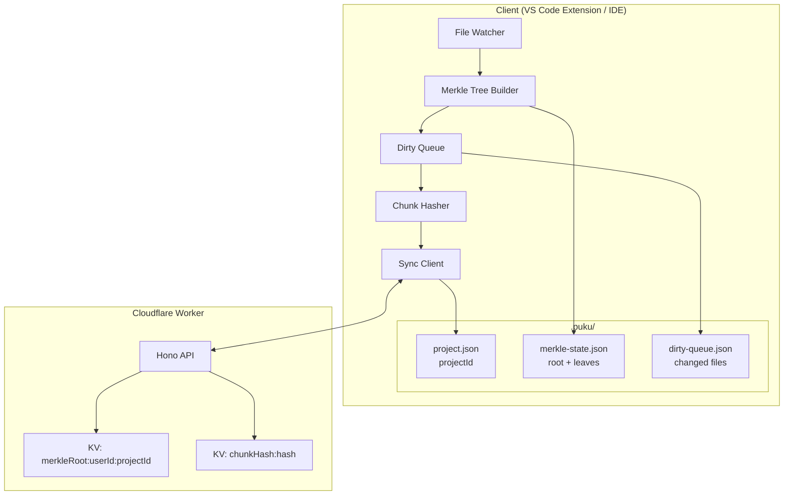
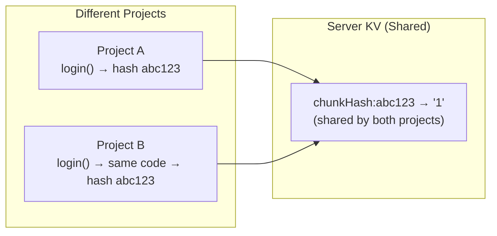
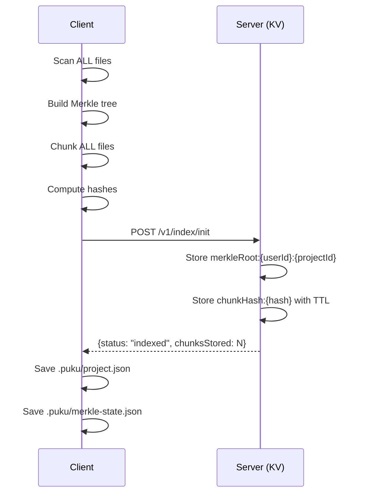
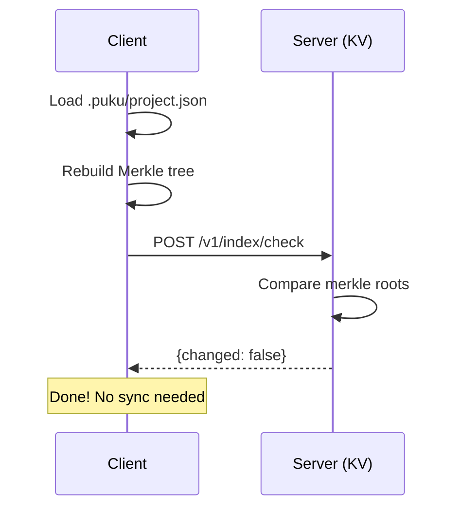
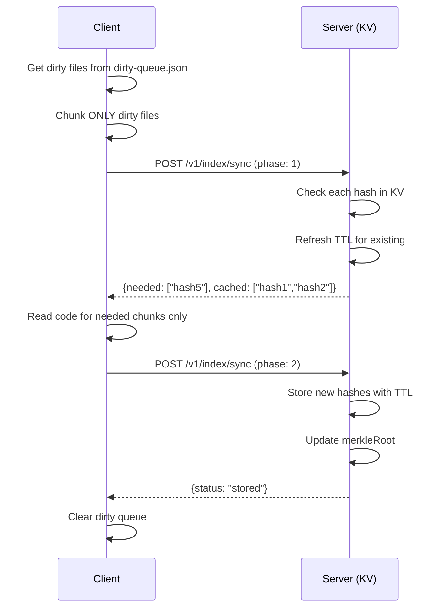

# Cloudflare Worker for Code Indexing

After building the client-side pipeline (file watcher, Merkle tree, semantic chunking, chunk hashing), you need a server to receive and store chunk hashes. This lab teaches you how to deploy a Cloudflare Worker that implements the two-phase sync protocol with KV storage.

This is the server-side counterpart to the client pipeline—it stores Merkle roots per project and chunk hashes with TTL for automatic cleanup.

## Prerequisites

- Completed **Chunk Hashing Lab**
- Cloudflare account (free tier works)
- Wrangler CLI installed (`npm install -g wrangler`)
- Basic understanding of REST APIs

## What You'll Learn

1. Setting up a Cloudflare Worker with Hono framework
2. Implementing the two-phase sync protocol on the server
3. Using Cloudflare KV for hash storage with TTL
4. Handling different sync scenarios (new project, existing project, reopen)
5. Testing APIs locally with Wrangler

## Part 1: System Architecture

### The Complete Sync Pipeline



The client-side pipeline (Labs 04-07) detects file changes, builds Merkle trees, chunks code semantically, and computes hashes. This lab builds the server-side component that receives those hashes, stores them in Cloudflare KV, and enables the two-phase sync protocol.

### Hash-Only Storage (Inspired by Cursor)

We use **hash-based caching** where data is stored by chunk hash only—not tied to any specific project. This enables cross-project cache sharing.



**Benefits:**
- Cross-project cache sharing (same code = same hash = shared cache)
- Simpler sync logic (no per-project chunk tracking)
- Cloudflare KV TTL handles cleanup automatically (30-day expiration)

### API Endpoints Overview

| Endpoint | Method | Purpose |
|----------|--------|---------|
| `/v1/health` | GET | Health check |
| `/v1/index/init` | POST | First-time full indexing |
| `/v1/index/check` | POST | O(1) change detection via Merkle root |
| `/v1/index/sync` | POST | Two-phase sync (Phase 1: hashes, Phase 2: code) |

## Part 2: Project Setup

### Create the Worker Project

```bash
cd indexing-system-poc
mkdir indexing-poc-worker
cd indexing-poc-worker
npm init -y
npm install hono
npm install -D wrangler typescript @cloudflare/workers-types
```

### Project Structure

```
indexing-poc-worker/
├── src/
│   ├── index.ts              # Main Hono app entry point
│   ├── types.ts              # Request/response interfaces
│   └── routes/
│       ├── health.ts         # GET /v1/health
│       ├── index-init.ts     # POST /v1/index/init
│       ├── index-check.ts    # POST /v1/index/check
│       └── index-sync.ts     # POST /v1/index/sync
├── wrangler.toml             # Cloudflare configuration
├── package.json
└── tsconfig.json
```

### Configure wrangler.toml

```toml
name = "indexing-poc"
main = "src/index.ts"
compatibility_date = "2024-11-24"
compatibility_flags = ["nodejs_compat"]

[[kv_namespaces]]
binding = "INDEX_KV"
id = "your-kv-namespace-id"
preview_id = "your-preview-kv-namespace-id"
```

To create the KV namespace:
```bash
wrangler kv:namespace create "INDEX_KV"
wrangler kv:namespace create "INDEX_KV" --preview
```

Copy the generated IDs into your `wrangler.toml`.

## Part 3: Implementation Walkthrough

### Step 1: Type Definitions

[src/types.ts](../../indexing-poc-worker/src/types.ts)

```typescript
// Chunk types
export type ChunkType =
    | 'function'
    | 'class'
    | 'method'
    | 'interface'
    | 'type'
    | 'enum'
    | 'block';

// Request/Response interfaces for each endpoint

export interface IndexInitRequest {
    projectId: string;
    merkleRoot: string;
    chunks: InitChunk[];
}

export interface InitChunk {
    hash: string;
    code: string;
    type: ChunkType;
    name: string | null;
    languageId: string;
    lines: [number, number];
    charCount: number;
}

export interface IndexCheckRequest {
    projectId: string;
    merkleRoot: string;
}

export interface IndexSyncPhase1Request {
    phase: 1;
    projectId: string;
    merkleRoot: string;
    chunks: SyncChunkMeta[];
}

export interface SyncChunkMeta {
    hash: string;
    type: ChunkType;
    name: string | null;
    lines: [number, number];
    charCount: number;
}

export interface IndexSyncPhase2Request {
    phase: 2;
    projectId: string;
    merkleRoot: string;
    chunks: SyncChunkWithCode[];
}
```

These types define the contract between client and server. The client sends requests matching these interfaces, and the server responds with matching response types.

### Step 2: Main Application Entry

[src/index.ts](../../indexing-poc-worker/src/index.ts)

```typescript
import { Hono } from 'hono';
import { cors } from 'hono/cors';

type Bindings = {
    INDEX_KV: KVNamespace;
};

const app = new Hono<{ Bindings: Bindings }>();

// Enable CORS for all routes
app.use('/*', cors());

// Health check
app.get('/', (c) => {
    return c.json({
        status: 'ok',
        service: 'indexing-poc-worker',
        version: '1.0.0',
    });
});

app.get('/v1/health', (c) => {
    return c.json({
        status: 'ok',
        timestamp: new Date().toISOString(),
        version: '1.0.0',
    });
});

// Import and register routes
// ... route handlers ...

export default app;
```

The Hono framework provides a lightweight, fast HTTP server. The `Bindings` type tells TypeScript about the KV namespace available in the worker environment.

### Step 3: The /init Endpoint (First-Time Indexing)

[src/routes/index-init.ts](../../indexing-poc-worker/src/routes/index-init.ts)

```typescript
app.post('/v1/index/init', async (c) => {
    const body = await c.req.json<IndexInitRequest>();
    const { projectId, merkleRoot, chunks } = body;

    // Extract userId from auth token (simplified for POC)
    const authHeader = c.req.header('Authorization') ?? '';
    const userId = authHeader.replace('Bearer ', '') || 'anonymous';

    const kv = c.env.INDEX_KV;
    const TTL_SECONDS = 30 * 24 * 60 * 60; // 30 days

    let stored = 0;
    let skipped = 0;

    // Store each chunk hash with TTL
    for (const chunk of chunks) {
        const key = `chunkHash:${chunk.hash}`;
        const existing = await kv.get(key);

        if (existing) {
            // Hash exists, refresh TTL
            await kv.put(key, '1', { expirationTtl: TTL_SECONDS });
            skipped++;
        } else {
            // New hash, store it
            await kv.put(key, '1', { expirationTtl: TTL_SECONDS });
            stored++;
        }
    }

    // Store merkle root (no TTL - permanent per project)
    const merkleKey = `merkleRoot:${userId}:${projectId}`;
    await kv.put(merkleKey, merkleRoot);

    return c.json({
        status: 'indexed',
        merkleRoot,
        chunksStored: stored,
        chunksSkipped: skipped,
    });
});
```

**Key implementation details:**

1. **Hash storage with TTL**: Each chunk hash is stored with a 30-day TTL. If the chunk is already cached, we refresh the TTL (keeping frequently-used chunks alive).

2. **Merkle root storage**: The merkle root is stored per user/project without TTL—it's needed for change detection on every sync.

3. **Cross-project sharing**: Chunks are keyed by hash only (`chunkHash:{hash}`), enabling sharing across projects.

### Step 4: The /check Endpoint (O(1) Change Detection)

[src/routes/index-check.ts](../../indexing-poc-worker/src/routes/index-check.ts)

```typescript
app.post('/v1/index/check', async (c) => {
    const body = await c.req.json<IndexCheckRequest>();
    const { projectId, merkleRoot } = body;

    const authHeader = c.req.header('Authorization') ?? '';
    const userId = authHeader.replace('Bearer ', '') || 'anonymous';

    const kv = c.env.INDEX_KV;
    const merkleKey = `merkleRoot:${userId}:${projectId}`;

    // Get stored merkle root
    const serverRoot = await kv.get(merkleKey);

    // Compare roots
    const changed = serverRoot !== merkleRoot;

    return c.json({
        changed,
        serverRoot,
    });
});
```

**This is the power of the Merkle tree**: A single KV read and string comparison tells us if ANY of the thousands of files changed. No need to compare individual file or chunk hashes.

**Response scenarios:**
- `{ changed: false, serverRoot: "abc123" }` → Nothing changed, skip sync
- `{ changed: true, serverRoot: "xyz789" }` → Changes detected, proceed to sync
- `{ changed: true, serverRoot: null }` → Server has no data, do full init

### Step 5: The /sync Endpoint (Two-Phase Protocol)

[src/routes/index-sync.ts](../../indexing-poc-worker/src/routes/index-sync.ts)

```typescript
app.post('/v1/index/sync', async (c) => {
    const body = await c.req.json();
    const phase = body.phase;

    if (phase === 1) {
        // Phase 1: Check which hashes exist
        return handlePhase1(c, body as IndexSyncPhase1Request);
    } else if (phase === 2) {
        // Phase 2: Store new chunks
        return handlePhase2(c, body as IndexSyncPhase2Request);
    }

    return c.json({ error: 'Invalid phase' }, 400);
});
```

#### Phase 1: Hash Check

```typescript
async function handlePhase1(c: Context, body: IndexSyncPhase1Request) {
    const { chunks } = body;
    const kv = c.env.INDEX_KV;
    const TTL_SECONDS = 30 * 24 * 60 * 60;

    const needed: string[] = [];
    const cached: string[] = [];

    for (const chunk of chunks) {
        const key = `chunkHash:${chunk.hash}`;
        const existing = await kv.get(key);

        if (existing) {
            // Hash exists, refresh TTL and mark as cached
            await kv.put(key, '1', { expirationTtl: TTL_SECONDS });
            cached.push(chunk.hash);
        } else {
            // Hash not found, need the code
            needed.push(chunk.hash);
        }
    }

    return c.json({ needed, cached });
}
```

**The bandwidth optimization**: Phase 1 only receives hashes (64 bytes each), not code. The server checks each hash against KV and returns two lists:
- `needed`: Hashes that don't exist in cache → client must send code
- `cached`: Hashes that exist → no code transfer needed, TTL refreshed

#### Phase 2: Code Transfer

```typescript
async function handlePhase2(c: Context, body: IndexSyncPhase2Request) {
    const { projectId, merkleRoot, chunks } = body;
    const authHeader = c.req.header('Authorization') ?? '';
    const userId = authHeader.replace('Bearer ', '') || 'anonymous';

    const kv = c.env.INDEX_KV;
    const TTL_SECONDS = 30 * 24 * 60 * 60;

    const received: string[] = [];

    for (const chunk of chunks) {
        const key = `chunkHash:${chunk.hash}`;
        await kv.put(key, '1', { expirationTtl: TTL_SECONDS });
        received.push(chunk.hash);

        // In Phase 2 POC (future): Generate embeddings here
        // const embedding = await generateEmbedding(chunk.code);
        // await vectorize.insert(chunk.hash, embedding);
    }

    // Update merkle root
    const merkleKey = `merkleRoot:${userId}:${projectId}`;
    await kv.put(merkleKey, merkleRoot);

    return c.json({
        status: 'stored',
        received,
        merkleRoot,
        message: 'Chunks stored. AI processing disabled in Phase 1.',
    });
}
```

**Phase 2 receives actual code** only for chunks the server requested. In this Phase 1 POC, we just store the hash. In Phase 2 (future), this is where AI summarization and embedding generation would happen.

## Part 4: KV Storage Schema

### Key Structure

```
merkleRoot:{userId}:{projectId}  →  "rootHash"          (no TTL)
chunkHash:{hash}                 →  "1"                 (30-day TTL)
```

### Why This Schema?

1. **Merkle roots are per-user, per-project**: Each user's project has its own state
2. **Chunk hashes are global**: Same code = same hash = shared across all projects
3. **TTL for automatic cleanup**: Unused chunks expire after 30 days
4. **Minimal storage**: We only store "1" as the value—we just need to know the hash exists

### TTL Refresh Strategy

Every time a chunk hash is checked (Phase 1) or stored (Phase 2), its TTL is refreshed to 30 days. This keeps frequently-used chunks alive while letting unused chunks expire naturally.

## Part 5: Running the Worker

### Local Development

```bash
cd indexing-poc-worker
npm run dev
```

This starts the worker at `http://localhost:8787`.

### Testing with curl Commands

Test all endpoints using curl:

#### 1. Health Check

```bash
curl http://localhost:8787/v1/health
```

**Expected Response:**
```json
{
  "status": "ok",
  "timestamp": "2026-01-13T10:00:00.000Z",
  "version": "1.0.0"
}
```

#### 2. First-Time Init

```bash
curl -X POST http://localhost:8787/v1/index/init \
  -H "Authorization: Bearer dev-token-123" \
  -H "Content-Type: application/json" \
  -d '{
    "projectId": "test-project-001",
    "merkleRoot": "abc123def456",
    "chunks": [
      {
        "hash": "chunk-hash-001",
        "code": "function login() { return true; }",
        "type": "function",
        "name": "login",
        "languageId": "typescript",
        "lines": [1, 3],
        "charCount": 35
      }
    ]
  }'
```

**Expected Response:**
```json
{
  "status": "indexed",
  "merkleRoot": "abc123def456",
  "chunksStored": 1,
  "chunksSkipped": 0
}
```

#### 3. Check for Changes

```bash
curl -X POST http://localhost:8787/v1/index/check \
  -H "Authorization: Bearer dev-token-123" \
  -H "Content-Type: application/json" \
  -d '{
    "projectId": "test-project-001",
    "merkleRoot": "abc123def456"
  }'
```

**Expected Response (no changes):**
```json
{
  "changed": false,
  "serverRoot": "abc123def456"
}
```

**Expected Response (with changes):**
```json
{
  "changed": true,
  "serverRoot": "abc123def456"
}
```

#### 4. Sync Phase 1 (Hash Check)

```bash
curl -X POST http://localhost:8787/v1/index/sync \
  -H "Authorization: Bearer dev-token-123" \
  -H "Content-Type: application/json" \
  -d '{
    "phase": 1,
    "projectId": "test-project-001",
    "merkleRoot": "new-merkle-root",
    "chunks": [
      {
        "hash": "chunk-hash-001",
        "type": "function",
        "name": "login",
        "lines": [1, 3],
        "charCount": 35
      },
      {
        "hash": "chunk-hash-002",
        "type": "function",
        "name": "logout",
        "lines": [5, 8],
        "charCount": 40
      }
    ]
  }'
```

**Expected Response:**
```json
{
  "needed": ["chunk-hash-002"],
  "cached": ["chunk-hash-001"]
}
```

#### 5. Sync Phase 2 (Code Transfer)

```bash
curl -X POST http://localhost:8787/v1/index/sync \
  -H "Authorization: Bearer dev-token-123" \
  -H "Content-Type: application/json" \
  -d '{
    "phase": 2,
    "projectId": "test-project-001",
    "merkleRoot": "new-merkle-root",
    "chunks": [
      {
        "hash": "chunk-hash-002",
        "code": "function logout() { session.destroy(); }",
        "type": "function",
        "name": "logout",
        "languageId": "typescript",
        "lines": [5, 8],
        "charCount": 40
      }
    ]
  }'
```

**Expected Response:**
```json
{
  "status": "stored",
  "received": ["chunk-hash-002"],
  "merkleRoot": "new-merkle-root",
  "message": "Chunks stored. AI processing disabled in Phase 1."
}
```

#### Complete Test Flow Script

You can run all tests in sequence with this script:

```bash
#!/bin/bash
BASE_URL="http://localhost:8787"
AUTH="Authorization: Bearer dev-token-123"

echo "=== 1. Health Check ==="
curl -s $BASE_URL/v1/health | jq .

echo -e "\n=== 2. Init Project ==="
curl -s -X POST $BASE_URL/v1/index/init \
  -H "$AUTH" -H "Content-Type: application/json" \
  -d '{"projectId":"test-001","merkleRoot":"root1","chunks":[{"hash":"h1","code":"code1","type":"function","name":"fn1","languageId":"ts","lines":[1,5],"charCount":20}]}' | jq .

echo -e "\n=== 3. Check (no change) ==="
curl -s -X POST $BASE_URL/v1/index/check \
  -H "$AUTH" -H "Content-Type: application/json" \
  -d '{"projectId":"test-001","merkleRoot":"root1"}' | jq .

echo -e "\n=== 4. Check (with change) ==="
curl -s -X POST $BASE_URL/v1/index/check \
  -H "$AUTH" -H "Content-Type: application/json" \
  -d '{"projectId":"test-001","merkleRoot":"root2"}' | jq .

echo -e "\n=== 5. Sync Phase 1 ==="
curl -s -X POST $BASE_URL/v1/index/sync \
  -H "$AUTH" -H "Content-Type: application/json" \
  -d '{"phase":1,"projectId":"test-001","merkleRoot":"root2","chunks":[{"hash":"h1","type":"function","name":"fn1","lines":[1,5],"charCount":20},{"hash":"h2","type":"function","name":"fn2","lines":[6,10],"charCount":25}]}' | jq .

echo -e "\n=== 6. Sync Phase 2 ==="
curl -s -X POST $BASE_URL/v1/index/sync \
  -H "$AUTH" -H "Content-Type: application/json" \
  -d '{"phase":2,"projectId":"test-001","merkleRoot":"root2","chunks":[{"hash":"h2","code":"function fn2() {}","type":"function","name":"fn2","languageId":"ts","lines":[6,10],"charCount":25}]}' | jq .

echo -e "\n=== Done ==="
```

Save this as `test-api.sh` and run with `bash test-api.sh`.

### Deploy to Cloudflare

```bash
wrangler deploy
```

This deploys the worker to `https://indexing-poc.{your-subdomain}.workers.dev`.

## Part 6: Complete Sync Flows

### Flow 1: First-Time Project Open



### Flow 2: Project Reopen (No Changes)



### Flow 3: Periodic Sync (With Changes)



## Part 7: Error Handling

The worker returns consistent error responses:

```typescript
interface ErrorResponse {
    error: string;
    message: string;
}
```

| Status | Error | When |
|--------|-------|------|
| 400 | Bad Request | Invalid JSON, missing fields |
| 401 | Unauthorized | Missing or invalid token |
| 500 | Internal Server Error | KV operation failed |

## Conclusion

You've built a Cloudflare Worker that implements the server side of the two-phase sync protocol. The worker uses KV storage with TTL for automatic cleanup and enables O(1) change detection via Merkle root comparison.

**Key achievements:**
- Hash-only storage for cross-project cache sharing
- Two-phase sync protocol (metadata first, code on demand)
- 30-day TTL with automatic refresh on access
- O(1) change detection via single Merkle root comparison

In the next lab, you'll build the complete client-side integration that ties the file watcher, Merkle tree, chunk hasher, and sync client together for end-to-end testing.
