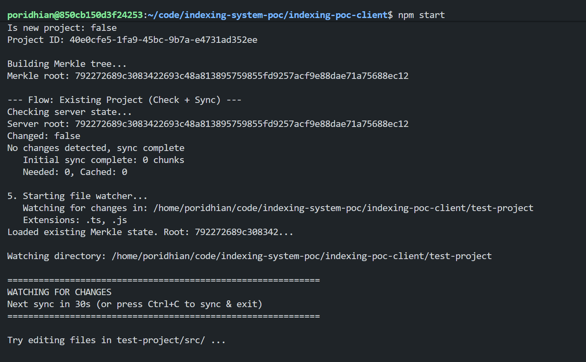

# Complete Indexing Pipeline (Phase 1)

After building the client-side components (file watcher, Merkle tree, semantic chunking, chunk hashing), this lab brings everything together. You'll deploy a Cloudflare Worker for the server-side, then integrate it with a complete client that handles all sync scenarios: new projects, reopens, and live editing.

This is exactly how production AI code editors like Cursor and PUKU Editor implement their indexing pipeline.

## Project Overview

On the **server side**, you'll deploy a Cloudflare Worker using the Hono framework. The worker exposes four endpoints—health check, init, check, and sync—and uses Cloudflare KV to store merkle roots and chunk hashes. It implements the two-phase sync protocol where hashes are checked first, and code is transferred only on demand.

On the **client side**, you'll build a TypeScript application that integrates the file watcher, Merkle tree builder, and chunk hasher from previous labs. The SyncClient class orchestrates all components, handling different sync scenarios (new project, reopen, live editing) and running periodic syncs with dirty queue optimization.

For **testing**, you'll start the worker locally, test the APIs with curl commands, then run the client application and edit files in the test-project folder to observe the complete sync behavior in action.

## Prerequisites

- Completed Labs on File Watcher, Merkle Tree, Semantic Chunking, Chunk Hashing
- Cloudflare account (free tier works)
- Wrangler CLI installed (`npm install -g wrangler`)
- Node.js 18+ installed

## What You'll Learn

1. Deploying a Cloudflare Worker with Hono framework
2. Implementing the two-phase sync protocol (server + client)
3. Using Cloudflare KV for hash storage with TTL
4. Integrating file watcher, Merkle tree, and chunk hasher
5. Testing the complete end-to-end flow with live file editing

## Quick Recap: Previous Labs

This lab builds on concepts from previous labs. Here's a quick visual reminder:

### Merkle Tree


Files are hashed into leaf nodes, then combined pairwise up to a single root hash. If any file changes, the root changes—enabling O(1) change detection.

### Change Propagation


When `auth.ts` changes, only the affected path (red nodes) needs recalculation. The new root hash indicates something changed.

### Semantic Chunking


Tree-sitter parses source code into an AST, then extracts semantic chunks (functions, classes, methods) instead of arbitrary line splits.

## Part 1: System Architecture

### The Complete Pipeline


On the **client side**, the File Watcher monitors the project folder for changes, feeding updates to the Merkle Tree Builder which computes file hashes and enables O(1) change detection. Changed files are tracked in a Dirty Queue, then processed by the Chunk Hasher which parses files with Tree-sitter to create semantic chunks. The Sync Client orchestrates all API communication with the server.

On the **server side**, a Cloudflare Worker running a Hono API handles HTTP requests. It uses two KV stores: one for merkle roots (per-project state) and one for chunk hashes (with 30-day TTL for automatic cleanup).

### Hash-Only Storage


We use **hash-based caching** where data is stored by chunk hash only—not tied to any specific project. This enables cross-project cache sharing: if two projects have identical `login()` functions, they share the same cache entry.

**Benefits:**
- Cross-project cache sharing (same code = same hash = shared cache)
- Simpler sync logic (no per-project chunk tracking)
- Cloudflare KV TTL handles cleanup automatically (30-day expiration)

### API Endpoints

| Endpoint | Method | Purpose |
|----------|--------|---------|
| `/v1/health` | GET | Health check |
| `/v1/index/init` | POST | First-time full indexing |
| `/v1/index/check` | POST | O(1) change detection via Merkle root |
| `/v1/index/sync` | POST | Two-phase sync (Phase 1: hashes, Phase 2: code) |

## Part 2: Server Implementation

### Project Setup

Clone the repository and navigate to the worker project:

```bash
git clone https://github.com/poridhioss/indexing-system-poc.git
cd indexing-system-poc/indexing-poc-worker
npm install
```

### Project Structure

```
indexing-poc-worker/
├── src/
│   ├── index.ts              # Main Hono app entry point
│   ├── types.ts              # Request/response interfaces
│   ├── lib/
│   │   └── kv-store.ts       # KV helper functions
│   ├── middleware/
│   │   └── auth.ts           # Auth middleware
│   └── routes/
│       ├── health.ts         # GET /v1/health
│       ├── index-init.ts     # POST /v1/index/init
│       ├── index-check.ts    # POST /v1/index/check
│       └── index-sync.ts     # POST /v1/index/sync
├── wrangler.toml             # Cloudflare configuration
├── package.json
└── tsconfig.json
```

### Dependencies

| Package | Version | Purpose |
|---------|---------|---------|
| `hono` | ^4.0.0 | Lightweight web framework for Cloudflare Workers |
| `wrangler` | ^3.0.0 | Cloudflare CLI for development and deployment |
| `typescript` | ^5.0.0 | TypeScript compiler |

### Step 1: Type Definitions

[src/types.ts](../../indexing-poc-worker/src/types.ts)

```typescript
export type ChunkType =
    | 'function'
    | 'class'
    | 'method'
    | 'interface'
    | 'type'
    | 'enum'
    | 'struct'
    | 'impl'
    | 'trait'
    | 'block';

export interface InitChunk {
    hash: string;
    code: string;
    type: ChunkType;
    name: string | null;
    languageId: string;
    lines: [number, number];
    charCount: number;
}

export interface IndexInitRequest {
    projectId: string;
    merkleRoot: string;
    chunks: InitChunk[];
}

export interface IndexCheckRequest {
    projectId: string;
    merkleRoot: string;
}

export interface SyncChunkMeta {
    hash: string;
    type: ChunkType;
    name: string | null;
    lines: [number, number];
    charCount: number;
}

export interface IndexSyncPhase1Request {
    phase: 1;
    projectId: string;
    merkleRoot: string;
    chunks: SyncChunkMeta[];
}

export interface Env {
    INDEX_KV: KVNamespace;
    DEV_TOKEN: string;
    CHUNK_HASH_TTL: string;
}

export interface Variables {
    userId: string;
}
```

These types define the contract between client and server. The `InitChunk` includes actual code (for first-time indexing), while `SyncChunkMeta` contains only metadata (for the two-phase sync protocol). The `Env` interface defines Cloudflare bindings, and `Variables` stores context values set by middleware.

### Step 2: KV Helper Functions

[src/lib/kv-store.ts](../../indexing-poc-worker/src/lib/kv-store.ts)

```typescript
const MERKLE_ROOT_PREFIX = 'merkleRoot';
const CHUNK_HASH_PREFIX = 'chunkHash';

function getMerkleRootKey(userId: string, projectId: string): string {
    return `${MERKLE_ROOT_PREFIX}:${userId}:${projectId}`;
}

function getChunkHashKey(hash: string): string {
    return `${CHUNK_HASH_PREFIX}:${hash}`;
}

export async function getMerkleRoot(
    kv: KVNamespace,
    userId: string,
    projectId: string
): Promise<string | null> {
    const key = getMerkleRootKey(userId, projectId);
    return await kv.get(key);
}

export async function setMerkleRoot(
    kv: KVNamespace,
    userId: string,
    projectId: string,
    merkleRoot: string
): Promise<void> {
    const key = getMerkleRootKey(userId, projectId);
    await kv.put(key, merkleRoot);
}

export async function setChunkHashes(
    kv: KVNamespace,
    hashes: string[],
    ttlSeconds: number
): Promise<void> {
    await Promise.all(
        hashes.map((hash) => {
            const key = getChunkHashKey(hash);
            return kv.put(key, '1', { expirationTtl: ttlSeconds });
        })
    );
}

export async function categorizeChunkHashes(
    kv: KVNamespace,
    hashes: string[],
    ttlSeconds: number
): Promise<{ needed: string[]; cached: string[] }> {
    const needed: string[] = [];
    const cached: string[] = [];

    const results = await Promise.all(
        hashes.map(async (hash) => {
            const key = getChunkHashKey(hash);
            const exists = (await kv.get(key)) !== null;
            return { hash, exists };
        })
    );

    for (const { hash, exists } of results) {
        if (exists) {
            cached.push(hash);
            // Refresh TTL in background
            kv.put(getChunkHashKey(hash), '1', { expirationTtl: ttlSeconds });
        } else {
            needed.push(hash);
        }
    }

    return { needed, cached };
}
```

The KV helper functions encapsulate all Cloudflare KV operations. Key functions:
- `getMerkleRoot` / `setMerkleRoot`: Read/write project merkle roots
- `setChunkHashes`: Store multiple chunk hashes with TTL in parallel
- `categorizeChunkHashes`: Check which hashes exist (for Phase 1 sync)

### Step 3: Main Application Entry

[src/index.ts](../../indexing-poc-worker/src/index.ts)

```typescript
import { Hono } from 'hono';
import { cors } from 'hono/cors';
import { logger } from 'hono/logger';
import type { Env, Variables } from './types';
import { authMiddleware } from './middleware/auth';
import health from './routes/health';
import indexInit from './routes/index-init';
import indexCheck from './routes/index-check';
import indexSync from './routes/index-sync';

const app = new Hono<{ Bindings: Env; Variables: Variables }>();

// Global middleware
app.use('*', logger());
app.use('*', cors());

// Health check - no auth required
app.route('/v1/health', health);

// Protected routes - require auth
app.use('/v1/index/*', authMiddleware);
app.route('/v1/index/init', indexInit);
app.route('/v1/index/check', indexCheck);
app.route('/v1/index/sync', indexSync);

export default app;
```

The main entry point registers all routes and middleware. The `authMiddleware` protects all `/v1/index/*` routes and extracts the `userId` from the Authorization header.

### Step 4: The /init Endpoint (First-Time Indexing)

[src/routes/index-init.ts](../../indexing-poc-worker/src/routes/index-init.ts)

```typescript
import { Hono } from 'hono';
import type { Env, Variables, IndexInitRequest } from '../types';
import { setMerkleRoot, setChunkHashes, hasChunkHash } from '../lib/kv-store';

const indexInit = new Hono<{ Bindings: Env; Variables: Variables }>();

indexInit.post('/', async (c) => {
    const userId = c.get('userId');
    const ttlSeconds = parseInt(c.env.CHUNK_HASH_TTL, 10) || 2592000; // 30 days

    const body = await c.req.json<IndexInitRequest>();
    const { projectId, merkleRoot, chunks } = body;

    // Extract all chunk hashes
    const allHashes = chunks.map((chunk) => chunk.hash);

    // Check which hashes already exist (for chunksSkipped count)
    const existingChecks = await Promise.all(
        allHashes.map(async (hash) => ({
            hash,
            exists: await hasChunkHash(c.env.INDEX_KV, hash),
        }))
    );

    const existingHashes = existingChecks.filter((c) => c.exists).map((c) => c.hash);
    const newHashes = existingChecks.filter((c) => !c.exists).map((c) => c.hash);

    // Store merkle root
    await setMerkleRoot(c.env.INDEX_KV, userId, projectId, merkleRoot);

    // Store all chunk hashes (including existing ones to refresh TTL)
    await setChunkHashes(c.env.INDEX_KV, allHashes, ttlSeconds);

    return c.json({
        status: 'indexed',
        merkleRoot,
        chunksStored: newHashes.length,
        chunksSkipped: existingHashes.length,
    });
});

export default indexInit;
```

**Key implementation details:**

1. **userId from middleware**: The `authMiddleware` extracts the user ID from the Authorization header and stores it in context via `c.set('userId', ...)`.

2. **Parallel hash checking**: Uses `Promise.all` to check existing hashes concurrently for better performance.

3. **TTL from environment**: The TTL is configurable via `CHUNK_HASH_TTL` environment variable (defaults to 30 days).

### Step 5: The /check Endpoint (O(1) Change Detection)

[src/routes/index-check.ts](../../indexing-poc-worker/src/routes/index-check.ts)

```typescript
import { Hono } from 'hono';
import type { Env, Variables, IndexCheckRequest } from '../types';
import { getMerkleRoot } from '../lib/kv-store';

const indexCheck = new Hono<{ Bindings: Env; Variables: Variables }>();

indexCheck.post('/', async (c) => {
    const userId = c.get('userId');
    const body = await c.req.json<IndexCheckRequest>();
    const { projectId, merkleRoot } = body;

    // Get stored merkle root
    const serverRoot = await getMerkleRoot(c.env.INDEX_KV, userId, projectId);

    // Compare roots
    const changed = serverRoot !== merkleRoot;

    return c.json({
        changed,
        serverRoot,
    });
});

export default indexCheck;
```

**This is the power of the Merkle tree**: A single KV read and string comparison tells us if ANY of the thousands of files changed.

**Response scenarios:**
- `{ changed: false, serverRoot: "abc123" }` → Nothing changed, skip sync
- `{ changed: true, serverRoot: "xyz789" }` → Changes detected, proceed to sync
- `{ changed: true, serverRoot: null }` → Server has no data, do full init

### Step 6: The /sync Endpoint (Two-Phase Protocol)

[src/routes/index-sync.ts](../../indexing-poc-worker/src/routes/index-sync.ts)

```typescript
import { Hono } from 'hono';
import type { Env, Variables, IndexSyncPhase1Request, IndexSyncPhase2Request } from '../types';
import { setMerkleRoot, setChunkHashes, categorizeChunkHashes } from '../lib/kv-store';

const indexSync = new Hono<{ Bindings: Env; Variables: Variables }>();

indexSync.post('/', async (c) => {
    const userId = c.get('userId');
    const ttlSeconds = parseInt(c.env.CHUNK_HASH_TTL, 10) || 2592000;
    const body = await c.req.json();

    if (body.phase === 1) {
        return handlePhase1(c, body as IndexSyncPhase1Request, ttlSeconds);
    }
    return handlePhase2(c, body as IndexSyncPhase2Request, userId, ttlSeconds);
});

async function handlePhase1(c, body: IndexSyncPhase1Request, ttlSeconds: number) {
    const hashes = body.chunks.map((chunk) => chunk.hash);

    // Categorize hashes (also refreshes TTL for cached ones)
    const { needed, cached } = await categorizeChunkHashes(
        c.env.INDEX_KV,
        hashes,
        ttlSeconds
    );

    return c.json({ needed, cached });
}

async function handlePhase2(c, body: IndexSyncPhase2Request, userId: string, ttlSeconds: number) {
    const hashes = body.chunks.map((chunk) => chunk.hash);

    // Store all chunk hashes
    await setChunkHashes(c.env.INDEX_KV, hashes, ttlSeconds);

    // Update merkle root
    await setMerkleRoot(c.env.INDEX_KV, userId, body.projectId, body.merkleRoot);

    return c.json({
        status: 'stored',
        received: hashes,
        merkleRoot: body.merkleRoot,
        message: 'Chunks stored. AI processing disabled in Phase 1.',
    });
}

export default indexSync;
```

**Phase 1** receives only hashes and returns which are needed vs cached. The `categorizeChunkHashes` function checks all hashes in parallel and refreshes TTL for existing ones.

**Phase 2** receives actual code for needed chunks, stores the hashes, and updates the merkle root. In this POC, we just store the hash. In future phases, this is where AI summarization and embedding generation would happen.

### KV Storage Schema

```
merkleRoot:{userId}:{projectId}  →  "rootHash"          (no TTL)
chunkHash:{hash}                 →  "1"                 (30-day TTL)
```

**Why this schema?**
- Merkle roots are per-user, per-project
- Chunk hashes are global (cross-project sharing)
- TTL auto-cleans unused chunks
- Minimal storage (just "1" as value)

## Part 3: Running the Worker

### Configure Cloudflare Account

First, get your Cloudflare account ID:

```bash
wrangler whoami
```

Or find it in your Cloudflare dashboard URL: `https://dash.cloudflare.com/<account-id>/...`

Update `account_id` in `wrangler.toml`:

```toml
account_id = "your-account-id-here"
```

### Configure KV Namespace

Create the KV namespace:

```bash
wrangler kv namespace create "INDEX_KV"
wrangler kv namespace create "INDEX_KV" --preview
```

Copy the generated IDs into `wrangler.toml`:

```toml
name = "indexing-poc"
main = "src/index.ts"
compatibility_date = "2024-11-24"
compatibility_flags = ["nodejs_compat"]

# Your Cloudflare account ID
account_id = "your-account-id-here"

[vars]
DEV_TOKEN = "dev-token-12345"
CHUNK_HASH_TTL = "2592000"

[[kv_namespaces]]
binding = "INDEX_KV"
id = "your-kv-namespace-id"
preview_id = "your-preview-kv-namespace-id"
```

### Start the Worker

```bash
npm run dev
```

This starts the worker at `http://localhost:8787`.

### Test with curl

#### Test 1: Health Check

```bash
curl http://localhost:8787/v1/health
```

**Expected:**
```json
{"status":"ok","timestamp":"2026-01-14T10:00:00.000Z","version":"1.0.0"}
```

#### Test 2: Initialize a Project

```bash
curl -X POST http://localhost:8787/v1/index/init \
  -H "Authorization: Bearer dev-token-user123" \
  -H "Content-Type: application/json" \
  -d '{
    "projectId": "my-project",
    "merkleRoot": "abc123",
    "chunks": [
      {"hash":"h1","code":"function add(a,b){return a+b}","type":"function","name":"add","languageId":"javascript","lines":[1,3],"charCount":30}
    ]
  }'
```

**Expected:**
```json
{"status":"indexed","merkleRoot":"abc123","chunksStored":1,"chunksSkipped":0}
```

#### Test 3: Check for Changes (No Changes)

```bash
curl -X POST http://localhost:8787/v1/index/check \
  -H "Authorization: Bearer dev-token-user123" \
  -H "Content-Type: application/json" \
  -d '{"projectId":"my-project","merkleRoot":"abc123"}'
```

**Expected:**
```json
{"changed":false,"serverRoot":"abc123"}
```

#### Test 4: Check for Changes (With Changes)

```bash
curl -X POST http://localhost:8787/v1/index/check \
  -H "Authorization: Bearer dev-token-user123" \
  -H "Content-Type: application/json" \
  -d '{"projectId":"my-project","merkleRoot":"xyz789"}'
```

**Expected:**
```json
{"changed":true,"serverRoot":"abc123"}
```

#### Test 5: Sync Phase 1 (Hash Check)

```bash
curl -X POST http://localhost:8787/v1/index/sync \
  -H "Authorization: Bearer dev-token-user123" \
  -H "Content-Type: application/json" \
  -d '{
    "phase": 1,
    "projectId": "my-project",
    "merkleRoot": "xyz789",
    "chunks": [
      {"hash":"h1","type":"function","name":"add","lines":[1,3],"charCount":30},
      {"hash":"h2","type":"function","name":"subtract","lines":[5,7],"charCount":35}
    ]
  }'
```

**Expected (h1 cached from init, h2 needed):**
```json
{"needed":["h2"],"cached":["h1"]}
```

#### Test 6: Sync Phase 2 (Code Transfer)

```bash
curl -X POST http://localhost:8787/v1/index/sync \
  -H "Authorization: Bearer dev-token-user123" \
  -H "Content-Type: application/json" \
  -d '{
    "phase": 2,
    "projectId": "my-project",
    "merkleRoot": "xyz789",
    "chunks": [
      {"hash":"h2","code":"function subtract(a,b){return a-b}","type":"function","name":"subtract","languageId":"javascript","lines":[5,7],"charCount":35}
    ]
  }'
```

**Expected:**
```json
{"status":"stored","received":["h2"],"merkleRoot":"xyz789","message":"Chunks stored. AI processing disabled in Phase 1."}
```

### Deploy to Cloudflare

Once local testing passes, deploy the worker to Cloudflare:

```bash
wrangler deploy
```

**Expected output:**
```
Your worker has been deployed to https://indexing-poc.<your-subdomain>.workers.dev
```

You can now test the deployed worker by replacing `http://localhost:8787` with your deployed URL in the curl commands above.

## Part 4: Sync Flow Diagrams

Before diving into the client code, let's visualize how the three main sync scenarios work. These diagrams show the interaction between the client components (file watcher, Merkle tree, chunk hasher) and the server endpoints you just deployed.

### Flow 1: First-Time Project Open


When you open a project for the first time:
1. Client scans ALL files and builds Merkle tree
2. Client chunks ALL files with Tree-sitter
3. Client sends all chunks with code to `/v1/index/init`
4. Server stores merkle root and chunk hashes
5. Client saves `.puku/project.json` and `.puku/merkle-state.json`

### Flow 2: Reopen (No Changes)


When you reopen a project with no changes:
1. Client rebuilds Merkle tree
2. Client sends merkle root to `/v1/index/check`
3. Server compares roots → `{changed: false}`
4. Done! No sync needed

### Flow 3: Periodic Sync (With Changes)


During live editing with the watcher running:
1. Client reads dirty files from `dirty-queue.json`
2. Client chunks ONLY dirty files (not all files!)
3. **Phase 1**: Client sends hashes only to server
4. Server returns which hashes are needed vs cached
5. **Phase 2**: Client sends code only for needed chunks
6. Client clears dirty queue

Now that you understand the sync flows, let's implement the client that orchestrates all of this.

## Part 5: Client Implementation

At this point, you've completed the **server side** of the indexing pipeline:

- Deployed a Cloudflare Worker with Hono framework
- Implemented four API endpoints (`/health`, `/init`, `/check`, `/sync`)
- Configured KV storage for merkle roots and chunk hashes
- Tested the two-phase sync protocol with curl commands

Now it's time to build the **client side**—a Node.js application that integrates all the components from previous labs (file watcher, Merkle tree, semantic chunking, chunk hashing) into a unified SyncClient that communicates with the worker.

The client will handle the three scenarios shown in the diagrams above:
1. **New Project**: First-time open → chunk all files → send to `/init`
2. **Reopen**: Project was closed → check merkle root → sync if changed
3. **Live Editing**: Files changed while running → track dirty files → periodic sync

Let's set up the client project.

### Project Setup

```bash
cd indexing-system-poc/indexing-poc-client
npm install
```

### Project Structure

```
indexing-poc-client/
├── src/
│   ├── lib/
│   │   ├── merkle-tree.ts      # Merkle tree builder
│   │   ├── watcher.ts          # File watcher integration
│   │   ├── chunk-hasher.ts     # Tree-sitter chunking
│   │   ├── hashed-chunk.ts     # HashedChunk class
│   │   └── semantic-nodes.ts   # AST node mappings
│   ├── api-client.ts           # HTTP client for worker API
│   ├── code-reader.ts          # Read code from ChunkReference
│   ├── config.ts               # Project config manager
│   ├── sync-client.ts          # Main sync orchestrator
│   ├── types.ts                # Shared type definitions
│   └── watcher-example.ts      # Demo application
├── test-project/
│   └── src/
│       └── example.ts          # Test file for live editing
├── package.json
└── tsconfig.json
```

### Dependencies

| Package | Version | Purpose |
|---------|---------|---------|
| `web-tree-sitter` | ^0.20.8 | AST parsing for semantic chunking |
| `@parcel/watcher` | ^2.4.1 | High-performance file watching |
| `tree-sitter-javascript` | ^0.20.1 | JavaScript grammar |
| `tree-sitter-typescript` | ^0.20.3 | TypeScript grammar |

### Step 1: The SyncClient Class

[src/sync-client.ts](../../indexing-poc-client/src/sync-client.ts)

```typescript
export class SyncClient {
    private projectRoot: string;
    private apiClient: ApiClient;
    private codeReader: CodeReader;
    private configManager: ProjectConfigManager;
    private merkleBuilder: MerkleTreeBuilder;
    private chunkHasher: ChunkHasher;
    private extensions: string[];
    private chunkMap: Map<string, HashedChunk> = new Map();

    constructor(config: SyncClientConfig) {
        this.projectRoot = path.resolve(config.projectRoot);
        this.extensions = config.extensions ?? ['.js', '.ts', '.tsx', '.jsx'];

        this.apiClient = new ApiClient(config.baseUrl, config.authToken);
        this.codeReader = new CodeReader(this.projectRoot);
        this.configManager = new ProjectConfigManager(this.projectRoot);
        this.merkleBuilder = new MerkleTreeBuilder(this.projectRoot);
        this.chunkHasher = new ChunkHasher(this.projectRoot);
    }
}
```

The SyncClient holds references to all components and provides a single `sync()` method that handles all scenarios.

### Step 2: The Main Sync Entry Point

[src/sync-client.ts:67-97](../../indexing-poc-client/src/sync-client.ts#L67-L97)

```typescript
async sync(): Promise<SyncResult> {
    console.log(`\n=== Starting Sync for ${this.projectRoot} ===\n`);

    // Step 1: Check if this is a new project
    const isNew = this.configManager.isNewProject();
    console.log(`Is new project: ${isNew}`);

    // Step 2: Get or create project config
    const projectConfig = this.configManager.getOrCreateConfig();
    console.log(`Project ID: ${projectConfig.projectId}`);

    // Step 3: Build merkle tree (always needed for root comparison)
    console.log('\nBuilding Merkle tree...');
    const tree = this.merkleBuilder.buildFromDirectory(this.extensions);
    const merkleRoot = tree.hash;
    console.log(`Merkle root: ${merkleRoot}`);

    // Step 4: Determine flow based on project status
    if (isNew) {
        return this.handleNewProject(projectConfig.projectId, merkleRoot);
    } else {
        return this.handleExistingProject(projectConfig.projectId, merkleRoot);
    }
}
```

The sync method first determines if this is a new project (no `.puku/` folder) or existing, then delegates to the appropriate handler.

### Step 3: Handling New Projects

[src/sync-client.ts:102-140](../../indexing-poc-client/src/sync-client.ts#L102-L140)

```typescript
private async handleNewProject(
    projectId: string,
    merkleRoot: string
): Promise<SyncResult> {
    console.log('\n--- Flow: New Project (Full Init) ---');

    // Chunk ALL files for new project
    console.log('Chunking all files...');
    const chunks = await this.chunkAllFiles();
    console.log(`Total chunks: ${chunks.length}`);

    // Build init request with all chunks + code
    const initChunks: InitChunk[] = chunks.map((chunk) => ({
        hash: chunk.hash,
        code: this.codeReader.readChunk(chunk.reference),
        type: chunk.type,
        name: chunk.name,
        languageId: chunk.language,
        lines: [chunk.reference.lineStart, chunk.reference.lineEnd],
        charCount: chunk.charCount,
    }));

    console.log(`Sending ${initChunks.length} chunks to /init...`);

    const response = await this.apiClient.init({
        projectId,
        merkleRoot,
        chunks: initChunks,
    });

    this.merkleBuilder.clearDirtyQueue();

    return {
        success: true,
        merkleRoot: response.merkleRoot,
        chunksTotal: chunks.length,
        chunksNeeded: response.chunksStored,
        chunksCached: response.chunksSkipped,
        message: `New project indexed successfully`,
    };
}
```

For new projects, we chunk ALL files and send them to `/init` with full code. This is the only time we send all code upfront.

### Step 4: Handling Existing Projects

[src/sync-client.ts:145-220](../../indexing-poc-client/src/sync-client.ts#L145-L220)

```typescript
private async handleExistingProject(
    projectId: string,
    merkleRoot: string
): Promise<SyncResult> {
    console.log('\n--- Flow: Existing Project (Check + Sync) ---');

    // Step 1: Check if sync is needed
    console.log('Checking server state...');
    const checkResponse = await this.apiClient.check({
        projectId,
        merkleRoot,
    });

    console.log(`Server root: ${checkResponse.serverRoot}`);
    console.log(`Changed: ${checkResponse.changed}`);

    // If no changes, we're done
    if (!checkResponse.changed) {
        console.log('No changes detected, sync complete');
        return {
            success: true,
            merkleRoot,
            chunksTotal: 0,
            chunksNeeded: 0,
            chunksCached: 0,
            message: 'Already in sync',
        };
    }

    // Step 2: Get dirty files and chunk only those
    const dirtyQueue = this.merkleBuilder.getDirtyQueue();
    const dirtyFiles = dirtyQueue?.dirtyFiles ?? [];

    let chunks: HashedChunk[];

    if (dirtyFiles.length === 0) {
        // REOPEN scenario - watcher wasn't running
        console.log('\nReopen detected (no dirty queue), chunking all files...');
        chunks = await this.chunkAllFiles();
    } else {
        // LIVE EDITING scenario - chunk only dirty files
        console.log('\nChunking dirty files only...');
        chunks = await this.chunkDirtyFiles(dirtyFiles);
    }

    // Step 3: Two-phase sync
    return this.twoPhaseSync(projectId, merkleRoot, chunks);
}
```

**Key optimization**: We distinguish between reopen (empty dirty queue) and live editing (dirty queue has files). This prevents unnecessary chunking of unchanged files during active editing sessions.

### Step 5: Two-Phase Sync Protocol

[src/sync-client.ts:280-350](../../indexing-poc-client/src/sync-client.ts#L280-L350)

```typescript
private async twoPhaseSync(
    projectId: string,
    merkleRoot: string,
    chunks: HashedChunk[]
): Promise<SyncResult> {
    console.log('\n--- Phase 1: Hash Check ---');

    // Phase 1: Send hashes only
    const syncChunks = chunks.map((chunk) => chunk.toSyncPayload());

    const phase1Response = await this.apiClient.syncPhase1({
        phase: 1,
        projectId,
        merkleRoot,
        chunks: syncChunks,
    });

    console.log(`Needed: ${phase1Response.needed.length}`);
    console.log(`Cached: ${phase1Response.cached.length}`);

    // If nothing needed, done
    if (phase1Response.needed.length === 0) {
        console.log('All chunks cached, no code transfer needed');
        this.merkleBuilder.clearDirtyQueue();
        return { /* ... */ };
    }

    console.log('\n--- Phase 2: Code Transfer ---');

    // Phase 2: Send code for needed chunks only
    const neededHashes = new Set(phase1Response.needed);
    const neededChunks = chunks
        .filter(chunk => neededHashes.has(chunk.hash))
        .map(chunk => ({
            hash: chunk.hash,
            code: this.codeReader.readChunk(chunk.reference),
            type: chunk.type,
            name: chunk.name,
            languageId: chunk.language,
            lines: [chunk.reference.lineStart, chunk.reference.lineEnd],
            charCount: chunk.charCount,
        }));

    console.log(`Sending ${neededChunks.length} chunks with code...`);

    await this.apiClient.syncPhase2({
        phase: 2,
        projectId,
        merkleRoot,
        chunks: neededChunks,
    });

    this.merkleBuilder.clearDirtyQueue();

    return {
        success: true,
        merkleRoot,
        chunksTotal: chunks.length,
        chunksNeeded: phase1Response.needed.length,
        chunksCached: phase1Response.cached.length,
        message: `Synced ${phase1Response.needed.length} new chunks`,
    };
}
```

The `twoPhaseSync` method implements the core bandwidth optimization. In **Phase 1**, it sends only chunk metadata (hashes, types, names, line numbers) to the server—no actual code. The server checks its KV cache and returns which hashes are `needed` (not in cache) vs `cached` (already stored). In **Phase 2**, the client reads code from disk only for the needed chunks and sends them to the server. This way, if 95 out of 100 chunks are unchanged, we only transfer code for 5 chunks instead of all 100.

## Part 6: Running the Complete Demo

### Step 1: Ensure Worker is Running

If you already deployed the worker, then just update the `BASE_URL` in the `watcher-example.ts` file to the URL of the worker. If you prefere to test with local worker, then run the following commands:

In terminal 1:
```bash
cd indexing-poc-worker
npm run dev
```

### Step 2: Start the Client

In terminal 2:
```bash
cd indexing-poc-client
npm start
```

### Expected Output (Initial Sync)



## Part 7: Test Live File Editing

### Step 1: Edit a Test File

While the client is running, open `test-project/src/example.ts` and make a change:

```typescript
// Add a new function
export function newFeature() {
    return 'Hello from new feature!';
}
```

Save the file.

### Expected Output

```
[FILE CHANGED] src/example.ts
  New merkle root: 789xyz...
  (queued for next sync)
  Next sync in ~25s
```

### Step 2: Wait for Periodic Sync

After 30 seconds (or press Ctrl+C to trigger immediate sync). Notice:
- Only 1 file was chunked (not all files)
- Only 1 chunk was sent (the other was already cached)
- 50% bandwidth savings on this sync

## Part 8: Key Concepts


### The Sync Decision Tree

The client handles four scenarios:

1. **New Project**: No `.puku/` folder → Full init (chunk ALL files)
2. **Reopen (no changes)**: Merkle roots match → Skip sync
3. **Reopen (with changes)**: Dirty queue empty → Chunk ALL files
4. **Live Editing**: Dirty queue has files → Chunk ONLY dirty files

### TTL Refresh Strategy

Every time a chunk hash is checked (Phase 1) or stored (Phase 2), its TTL is refreshed to 30 days. This keeps frequently-used chunks alive while letting unused chunks expire naturally.

## Conclusion

You've built a complete indexing pipeline that:

1. **Detects changes efficiently**: O(1) Merkle root comparison
2. **Minimizes chunking**: Only dirty files during live editing
3. **Minimizes bandwidth**: Two-phase sync sends hashes first
4. **Handles all scenarios**: New project, reopen, live editing
5. **Auto-cleans storage**: 30-day TTL with refresh on access

**Phase 1 Complete!**

The foundation is now in place for Phase 2:
- AI summarization of chunks
- Embedding generation
- Vector storage for semantic search

The same sync infrastructure will be used—only the server-side processing changes from "store hash" to "generate embedding."
