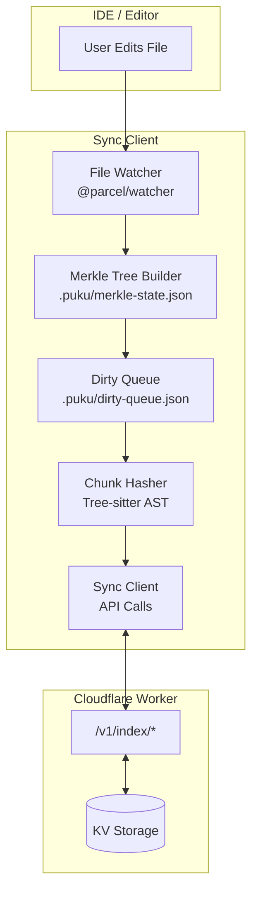
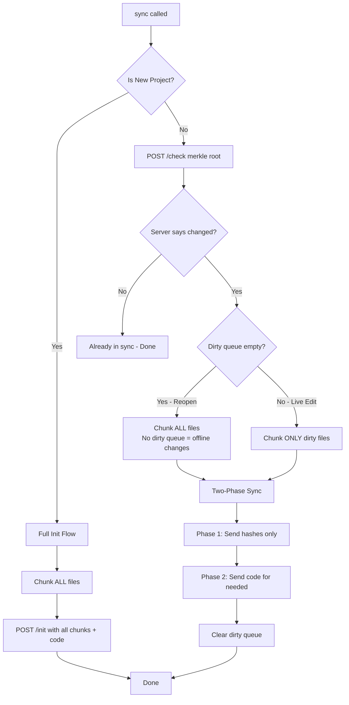
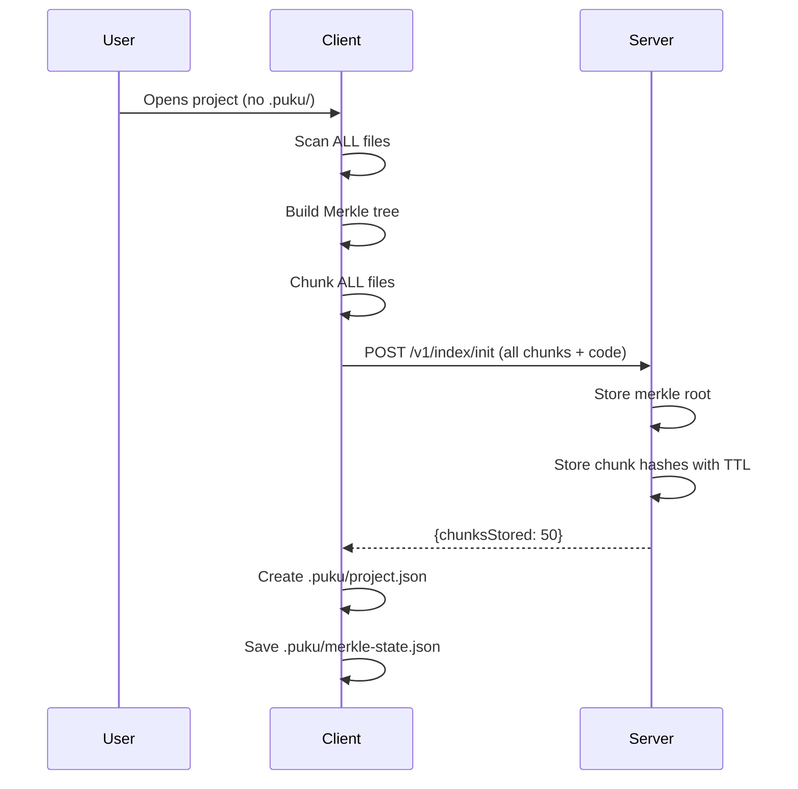
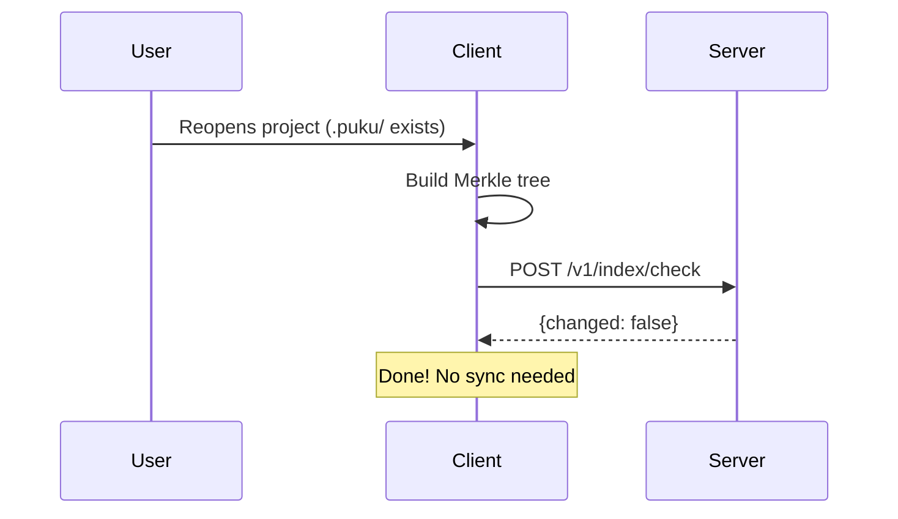
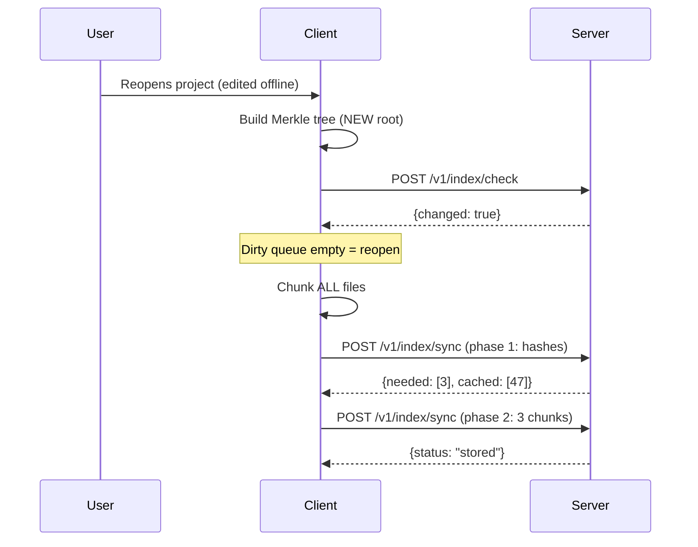
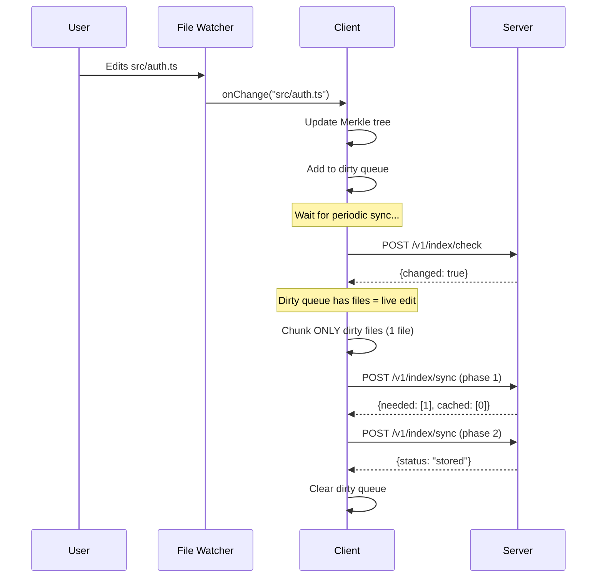

# Complete Client-Side Integration

After building the Cloudflare Worker (Lab-08), you need a client that orchestrates the complete sync flow. This lab teaches you how to integrate the file watcher, Merkle tree, chunk hasher, and API client into a unified sync system that handles all scenarios: new projects, reopens, and live editing.

This is the final piece of the Phase 1 POC—a production-ready client that demonstrates the complete indexing pipeline.

## Prerequisites

- Completed **Cloudflare Worker Lab (Lab-08)**
- Worker running locally (`npm run dev` in indexing-poc-worker)
- Node.js 18+ installed

## What You'll Learn

1. Integrating all client-side components into a unified sync client
2. Handling different sync scenarios (new project, reopen, live editing)
3. Implementing the periodic sync pattern with dirty queue
4. Optimizing bandwidth with dirty-only chunking
5. Testing the complete end-to-end flow

## Part 1: System Architecture

### Complete Client-Side Pipeline



The client integrates four components built in previous labs:
1. **File Watcher** (Lab-04): Detects file changes in real-time
2. **Merkle Tree** (Lab-05): Enables O(1) change detection
3. **Chunk Hasher** (Lab-07): Creates semantic chunks with hashes
4. **Sync Client** (new): Orchestrates API communication

### Sync Decision Tree



This flowchart shows the complete decision logic in the sync client. The key insight is distinguishing between:
- **Reopen scenario**: Dirty queue is empty (watcher wasn't running), must chunk all files
- **Live editing scenario**: Dirty queue has files, chunk only those

## Part 2: Project Setup

### Create the Client Project

```bash
cd indexing-system-poc
mkdir indexing-poc-client
cd indexing-poc-client
npm init -y
```

### Install Dependencies

```bash
npm install web-tree-sitter @parcel/watcher tree-sitter-typescript tree-sitter-javascript
npm install -D typescript tsx @types/node
```

### Project Structure

```
indexing-poc-client/
├── src/
│   ├── lib/
│   │   ├── merkle-tree.ts      # Merkle tree builder
│   │   ├── watcher.ts          # File watcher integration
│   │   ├── chunk-hasher.ts     # Tree-sitter chunking
│   │   ├── hashed-chunk.ts     # HashedChunk class
│   │   └── semantic-nodes.ts   # AST node mappings
│   ├── api-client.ts           # HTTP client for worker API
│   ├── code-reader.ts          # Read code from ChunkReference
│   ├── config.ts               # Project config manager
│   ├── sync-client.ts          # Main sync orchestrator
│   ├── types.ts                # Shared type definitions
│   └── watcher-example.ts      # Demo application
├── test-project/
│   └── src/
│       └── example.ts          # Test file
├── package.json
└── tsconfig.json
```

## Part 3: Implementation Walkthrough

### Step 1: The SyncClient Class

[src/sync-client.ts](../../indexing-poc-client/src/sync-client.ts)

The `SyncClient` is the orchestrator that ties everything together:

```typescript
export class SyncClient {
    private projectRoot: string;
    private apiClient: ApiClient;
    private codeReader: CodeReader;
    private configManager: ProjectConfigManager;
    private merkleBuilder: MerkleTreeBuilder;
    private chunkHasher: ChunkHasher;
    private extensions: string[];

    // Map of hash -> HashedChunk for looking up chunk details
    private chunkMap: Map<string, HashedChunk> = new Map();

    constructor(config: SyncClientConfig) {
        this.projectRoot = path.resolve(config.projectRoot);
        this.extensions = config.extensions ?? ['.js', '.ts', '.tsx', '.jsx'];

        this.apiClient = new ApiClient(config.baseUrl, config.authToken);
        this.codeReader = new CodeReader(this.projectRoot);
        this.configManager = new ProjectConfigManager(this.projectRoot);
        this.merkleBuilder = new MerkleTreeBuilder(this.projectRoot);
        this.chunkHasher = new ChunkHasher(this.projectRoot);
    }
}
```

The SyncClient holds references to all the components and provides a single `sync()` method that handles all scenarios.

### Step 2: The Main Sync Entry Point

```typescript
async sync(): Promise<SyncResult> {
    console.log(`\n=== Starting Sync for ${this.projectRoot} ===\n`);

    // Step 1: Check if this is a new project
    const isNew = this.configManager.isNewProject();
    console.log(`Is new project: ${isNew}`);

    // Step 2: Get or create project config
    const projectConfig = this.configManager.getOrCreateConfig();
    console.log(`Project ID: ${projectConfig.projectId}`);

    // Step 3: Build merkle tree (always needed for root comparison)
    console.log('\nBuilding Merkle tree...');
    const tree = this.merkleBuilder.buildFromDirectory(this.extensions);
    const merkleRoot = tree.hash;
    console.log(`Merkle root: ${merkleRoot}`);

    // Step 4: Determine flow based on project status
    if (isNew) {
        return this.handleNewProject(projectConfig.projectId, merkleRoot);
    } else {
        return this.handleExistingProject(projectConfig.projectId, merkleRoot);
    }
}
```

The sync method first determines if this is a new project (no `.puku/` folder) or existing, then delegates to the appropriate handler.

### Step 3: Handling New Projects

```typescript
private async handleNewProject(
    projectId: string,
    merkleRoot: string
): Promise<SyncResult> {
    console.log('\n--- Flow: New Project (Full Init) ---');

    // Chunk ALL files for new project
    console.log('Chunking all files...');
    const chunks = await this.chunkAllFiles();
    console.log(`Total chunks: ${chunks.length}`);

    // Build init request with all chunks + code
    const initChunks: InitChunk[] = chunks.map((chunk) => ({
        hash: chunk.hash,
        code: this.codeReader.readChunk(chunk.reference),
        type: chunk.type,
        name: chunk.name,
        languageId: chunk.language,
        lines: [chunk.reference.lineStart, chunk.reference.lineEnd],
        charCount: chunk.charCount,
    }));

    console.log(`Sending ${initChunks.length} chunks to /init...`);

    const response = await this.apiClient.init({
        projectId,
        merkleRoot,
        chunks: initChunks,
    });

    // Clear dirty queue after successful init
    this.merkleBuilder.clearDirtyQueue();

    return {
        success: true,
        merkleRoot: response.merkleRoot,
        chunksTotal: chunks.length,
        chunksNeeded: response.chunksStored,
        chunksCached: response.chunksSkipped,
        message: `New project indexed successfully`,
    };
}
```

For new projects, we chunk ALL files and send them to `/init` with full code. This is the only time we send all code upfront.

### Step 4: Handling Existing Projects

This is where the optimization happens:

```typescript
private async handleExistingProject(
    projectId: string,
    merkleRoot: string
): Promise<SyncResult> {
    console.log('\n--- Flow: Existing Project (Check + Sync) ---');

    // Step 1: Check if sync is needed (compare merkle roots)
    console.log('Checking server state...');
    const checkResponse = await this.apiClient.check({
        projectId,
        merkleRoot,
    });

    console.log(`Server root: ${checkResponse.serverRoot}`);
    console.log(`Changed: ${checkResponse.changed}`);

    // If server has no data, do full init
    if (checkResponse.serverRoot === null) {
        console.log('Server has no data for this project, doing full init...');
        return this.handleNewProject(projectId, merkleRoot);
    }

    // If no changes, we're done
    if (!checkResponse.changed) {
        console.log('No changes detected, sync complete');
        return {
            success: true,
            merkleRoot,
            chunksTotal: 0,
            chunksNeeded: 0,
            chunksCached: 0,
            message: 'Already in sync',
        };
    }

    // Step 2: Determine what to chunk
    const dirtyQueue = this.merkleBuilder.getDirtyQueue();
    const dirtyFiles = dirtyQueue?.dirtyFiles ?? [];

    let chunks: HashedChunk[];

    if (dirtyFiles.length === 0) {
        // REOPEN scenario - watcher wasn't running
        console.log('\nReopen detected (no dirty queue), chunking all files...');
        chunks = await this.chunkAllFiles();
    } else {
        // LIVE EDITING scenario - chunk only dirty files
        console.log('\nChunking dirty files only...');
        chunks = await this.chunkDirtyFiles(dirtyFiles);
    }

    // Step 3: Two-phase sync
    return this.twoPhaseSync(projectId, merkleRoot, chunks);
}
```

**Key optimization**: We distinguish between reopen (empty dirty queue) and live editing (dirty queue has files). This prevents unnecessary chunking of unchanged files during active editing sessions.

### Step 5: Chunking Strategies

#### Chunk All Files (Init / Reopen)

```typescript
private async chunkAllFiles(): Promise<HashedChunk[]> {
    const merkleState = this.merkleBuilder.loadMerkleState()!;
    const allChunks: HashedChunk[] = [];

    for (const leaf of merkleState.leaves) {
        const code = this.codeReader.readFile(leaf.relativePath);
        const language = this.getLanguageFromPath(leaf.relativePath);
        const chunks = this.chunkHasher.hashFile(code, language, leaf.relativePath);
        allChunks.push(...chunks);
    }

    return allChunks;
}
```

#### Chunk Dirty Files Only (Live Editing)

```typescript
private async chunkDirtyFiles(dirtyFiles: string[]): Promise<HashedChunk[]> {
    const dirtyChunks: HashedChunk[] = [];

    for (const relativePath of dirtyFiles) {
        try {
            const code = this.codeReader.readFile(relativePath);
            const language = this.getLanguageFromPath(relativePath);
            const chunks = this.chunkHasher.hashFile(code, language, relativePath);
            dirtyChunks.push(...chunks);
        } catch (err) {
            // File might have been deleted
            console.log(`  Skipping ${relativePath} (might be deleted)`);
        }
    }

    return dirtyChunks;
}
```

**The dirty queue optimization**: If you have 100 files and edit 2, only those 2 files get parsed with Tree-sitter. The unchanged 98 files are never touched.

### Step 6: Two-Phase Sync Protocol

```typescript
private async twoPhaseSync(
    projectId: string,
    merkleRoot: string,
    chunks: HashedChunk[]
): Promise<SyncResult> {
    console.log('\n--- Phase 1: Hash Check ---');

    // Phase 1: Send hashes only
    const syncChunks = chunks.map((chunk) => chunk.toSyncPayload());

    const phase1Response = await this.apiClient.syncPhase1({
        phase: 1,
        projectId,
        merkleRoot,
        chunks: syncChunks,
    });

    console.log(`Needed: ${phase1Response.needed.length}`);
    console.log(`Cached: ${phase1Response.cached.length}`);

    // If nothing needed, just update merkle root
    if (phase1Response.needed.length === 0) {
        console.log('All chunks cached, no code transfer needed');
        await this.apiClient.syncPhase2({
            phase: 2,
            projectId,
            merkleRoot,
            chunks: [],
        });
        this.merkleBuilder.clearDirtyQueue();
        return { /* ... */ };
    }

    console.log('\n--- Phase 2: Code Transfer ---');

    // Phase 2: Send code for needed chunks only
    const neededHashes = new Set(phase1Response.needed);
    const neededChunks = chunks
        .filter(chunk => neededHashes.has(chunk.hash))
        .map(chunk => ({
            hash: chunk.hash,
            code: this.codeReader.readChunk(chunk.reference),
            type: chunk.type,
            name: chunk.name,
            languageId: chunk.language,
            lines: [chunk.reference.lineStart, chunk.reference.lineEnd],
            charCount: chunk.charCount,
        }));

    console.log(`Sending ${neededChunks.length} chunks with code...`);

    const phase2Response = await this.apiClient.syncPhase2({
        phase: 2,
        projectId,
        merkleRoot,
        chunks: neededChunks,
    });

    // Clear dirty queue
    this.merkleBuilder.clearDirtyQueue();

    return {
        success: true,
        merkleRoot: phase2Response.merkleRoot,
        chunksTotal: chunks.length,
        chunksNeeded: phase1Response.needed.length,
        chunksCached: phase1Response.cached.length,
        message: `Synced ${phase1Response.needed.length} new chunks`,
    };
}
```

**Bandwidth savings visualization**:

```
Scenario: 100 chunks, 5 are new/changed

Without Two-Phase:
├── Send all 100 chunks with code = ~500 KB

With Two-Phase:
├── Phase 1: Send 100 hashes = ~6.4 KB
├── Server: "Need 5, cached 95"
├── Phase 2: Send 5 chunks with code = ~25 KB
└── Total: ~31.4 KB (94% savings!)
```

### Step 7: Periodic Sync with File Watcher

[src/watcher-example.ts](../../indexing-poc-client/src/watcher-example.ts)

```typescript
// Configuration
const SYNC_INTERVAL_MS = 30 * 1000; // 30 seconds for demo

async function main() {
    // Initialize sync client
    syncClient = new SyncClient({
        baseUrl: BASE_URL,
        authToken: AUTH_TOKEN,
        projectRoot: PROJECT_ROOT,
        extensions: EXTENSIONS,
    });

    await syncClient.initialize(LANGUAGE_CONFIGS);

    // Run initial sync
    const initialResult = await syncClient.sync();
    console.log(`Initial sync: ${initialResult.chunksTotal} chunks`);

    // Start file watcher
    merkleWatcher = new MerkleWatcher({
        projectRoot: PROJECT_ROOT,
        extensions: EXTENSIONS,
        onFileChanged: handleFileChange,
    });

    await merkleWatcher.start();

    // Start periodic sync timer
    syncInterval = setInterval(async () => {
        await performPeriodicSync();
    }, SYNC_INTERVAL_MS);
}

function handleFileChange(relativePath: string, newRoot: string) {
    console.log(`[FILE CHANGED] ${relativePath}`);
    console.log(`  New merkle root: ${newRoot.substring(0, 16)}...`);
    console.log(`  (queued for next sync)`);
}

async function performPeriodicSync() {
    const dirtyFiles = merkleWatcher.getDirtyFiles();
    console.log(`\nPERIODIC SYNC (${dirtyFiles.length} files in dirty queue)`);

    const result = await syncClient.sync();
    console.log(`  Needed: ${result.chunksNeeded}, Cached: ${result.chunksCached}`);
}
```

**The periodic sync pattern**:
1. File changes → update Merkle tree locally → add to dirty queue
2. No immediate server communication
3. Every N minutes (configurable) → sync with server
4. Ctrl+C → final sync before exit

This batches changes for efficiency while still ensuring changes eventually sync.

## Part 4: Running the Complete Demo

### Start the Worker

```bash
cd indexing-poc-worker
npm run dev
```

### Start the Client

```bash
cd indexing-poc-client
npm start
```

### Expected Output (Initial Sync)

```
============================================================
File Watcher + Periodic Sync
============================================================

Project: C:\path\to\test-project
Worker: http://127.0.0.1:8787
Sync interval: 30s

1. Checking worker health...
   Worker status: ok

2. Creating sync client...

3. Initializing tree-sitter...
   Tree-sitter initialized

4. Running initial sync...

=== Starting Sync for C:\path\to\test-project ===

Is new project: true
Project ID: 550e8400-e29b-41d4-a716-446655440000

Building Merkle tree...
Merkle root: abc123def456...

--- Flow: New Project (Full Init) ---
Chunking all files...
Total chunks: 5
Sending 5 chunks to /init...
Init response: 5 stored, 0 skipped

   Initial sync complete: 5 chunks
   Needed: 5, Cached: 0

5. Starting file watcher...
   Watching for changes in: C:\path\to\test-project
   Extensions: .ts, .js

============================================================
WATCHING FOR CHANGES
Next sync in 30s (or press Ctrl+C to sync & exit)
============================================================

Try editing files in test-project/src/ ...
```

### Test File Change

Edit a file in `test-project/src/`:

```
[FILE CHANGED] src/example.ts
  New merkle root: 789xyz...
  (queued for next sync)
  Next sync in ~25s
```

### Periodic Sync Output

```
----------------------------------------
PERIODIC SYNC (1 files in dirty queue)
----------------------------------------

=== Starting Sync for C:\path\to\test-project ===

Is new project: false
Project ID: 550e8400-e29b-41d4-a716-446655440000

Building Merkle tree...
Merkle root: 789xyz...

--- Flow: Existing Project (Check + Sync) ---
Checking server state...
Server root: abc123def456...
Changed: true

Dirty files: 1
  - src/example.ts

Chunking dirty files only...
Dirty chunks: 2

--- Phase 1: Hash Check ---
Needed: 1
Cached: 1

--- Phase 2: Code Transfer ---
Sending 1 chunks with code...
Received: 1
Message: Chunks stored.

Sync Result:
  Total chunks: 2
  Needed (new): 1
  Cached: 1
  Bandwidth savings: 50.0%

============================================================
WATCHING FOR CHANGES
Next sync in 30s
============================================================
```

## Part 5: Complete Sync Scenarios

### Scenario 1: New Project (First Open)



### Scenario 2: Reopen (No Changes)



### Scenario 3: Reopen (Offline Changes)



### Scenario 4: Live Editing (Watcher Running)



## Part 6: Optimization Summary

### Bandwidth Savings by Scenario

| Scenario | Files | Changed | Chunks Sent | Code Sent | Savings |
|----------|-------|---------|-------------|-----------|---------|
| New Project | 100 | 100 | 500 | ALL | 0% (baseline) |
| Reopen (no changes) | 100 | 0 | 0 | NONE | 100% |
| Reopen (5 changed) | 100 | 5 | 500 hashes + 25 code | 5% | 95% |
| Live edit (1 file) | 100 | 1 | 5 hashes + 1 code | 0.2% | 99.8% |

### Processing Savings

| Scenario | Files Chunked | Tree-sitter Calls |
|----------|---------------|-------------------|
| New Project | 100 | 100 |
| Reopen (no changes) | 0 | 0 |
| Reopen (changes) | 100 | 100 |
| Live edit (1 file) | 1 | 1 |

The dirty queue optimization means during active editing, we only parse the files that actually changed.

## Conclusion

You've built a complete client-side sync system that:

1. **Detects changes efficiently**: O(1) Merkle root comparison
2. **Minimizes chunking**: Only dirty files during live editing
3. **Minimizes bandwidth**: Two-phase sync sends hashes first
4. **Handles all scenarios**: New project, reopen, live editing
5. **Batches changes**: Periodic sync instead of per-save

**Phase 1 POC Complete!**

The foundation is now in place for Phase 2:
- AI summarization of chunks
- Embedding generation
- Vector storage for semantic search

The same sync infrastructure will be used—only the server-side processing changes from "store hash" to "generate embedding."
