# AI-Powered Code Indexing Pipeline (Phase 2)

Building on the Phase 1 indexing pipeline from Lab-08, this lab extends the Cloudflare Worker with AI capabilities. You'll add code summarization using Workers AI, generate embeddings for semantic search, and store vectors in Cloudflare Vectorize with **multi-tenant isolation** and **global embedding cache** for 70-90% AI cost savings.

This is exactly how production AI code editors like Cursor and PUKU Editor implement their semantic search capabilities.

## What's New in This Design

### Improvements Over Previous Design

#### 1. Global Embedding Cache for Efficiency

Previously, each user's chunk data was stored separately in KV with simple TTL-based expiration. The new design introduces a **global embedding cache** keyed by content hash (`embedding:{hash}`). This means when User A indexes a function like `add(a, b)`, the AI-generated summary and 1024-dimensional embedding are cached globally. When User B later indexes the exact same code, they get an instant cache hit—no AI processing required. This shared cache delivers **70-90% cost savings** across users indexing common libraries, utilities, or boilerplate code.

#### 2. Multi-Tenant Isolation for Security

The previous design assumed a single user, storing vectors with simple hash IDs. The new design implements **complete tenant isolation** using composite vector IDs in the format `{userId}_{projectId}_{hash}`. This ensures:
- User A cannot see or search User B's code, even if they share the same content hash
- The same user can have identical code in different projects without collision
- Search queries filter by both `userId` AND `projectId` in metadata for double verification

#### 3. Zero Vector Filtering for Reliability

AI services can fail due to timeouts, rate limits, or cold starts. Previously, these failures resulted in corrupted data. The new design uses **zero vectors** as fallback markers and filters them at multiple points:
- Never cache zero vectors (prevents poisoning the global cache)
- Never store zero vectors in Vectorize (prevents `-1` similarity scores)
- Retry logic for query embeddings with 500ms backoff

#### 4. Enhanced Metadata with File Tracking

The previous design lacked file path information, making it impossible to navigate to code locations. The new design stores complete `filePath` in vector metadata, enabling IDE integrations to jump directly to the source file and line number when users click on search results.

## Prerequisites

- Complete Indexing Pipeline Phase 1
- Cloudflare account with Workers AI access (free tier works)
- Wrangler CLI installed (`npm install -g wrangler`)
- Node.js 18+ installed
- `curl` and `jq` for API testing

## What You'll Learn

1. Implementing multi-tenant vector storage with user isolation
2. Building a global embedding cache for AI cost optimization
3. Using Cloudflare Workers AI for code summarization
4. Generating embeddings and storing in Cloudflare Vectorize
5. Handling AI failures gracefully with zero vector filtering
6. Building semantic search with proper tenant isolation

## Architecture Overview

### High-Level System Architecture

```mermaid
flowchart TB
    subgraph Clients
        UA[User A Client]
        UB[User B Client]
        UC[User C Client]
    end

    subgraph "Cloudflare Worker"
        API[Hono API Router]
        AUTH[Auth Middleware]

        subgraph "Route Handlers"
            INIT["/index/init"]
            CHECK["/index/check"]
            SYNC["/index/sync"]
            SEARCH["/search"]
        end

        subgraph "Core Libraries"
            subgraph "AI Processing (ai.ts)"
                SUMMARIZE[generateSummaries<br/>Qwen 2.5 Coder 32B]
                EMBED[generateEmbeddings<br/>BGE Large 1024d]
                QUERY_EMBED[generateQueryEmbedding<br/>with retry logic]
            end
            VEC[Vectorize Ops<br/>upsertChunks / searchChunks]
            CACHE[Embedding Cache<br/>getMany / setMany]
            KV_LIB[KV Store<br/>merkle roots]
        end
    end

    subgraph "Cloudflare Services"
        KV[(KV Namespace<br/>Global Cache + Merkle)]
        VECTORIZE[(Vectorize Index<br/>Multi-tenant Vectors)]
        WORKERS_AI[Workers AI<br/>Free 10K neurons/day]
    end

    UA & UB & UC -->|"1. HTTP Request"| API
    API -->|"2. Validate Token"| AUTH
    AUTH -->|"3. Route"| INIT & CHECK & SYNC & SEARCH

    INIT & SYNC -->|"4. Check cache"| CACHE
    CACHE -->|"5. Get/Set"| KV
    INIT & SYNC -->|"6. For misses"| SUMMARIZE
    SUMMARIZE -->|"7. Code → Summary"| WORKERS_AI
    SUMMARIZE -->|"8. Summaries"| EMBED
    EMBED -->|"9. Summary → Vector"| WORKERS_AI
    INIT & SYNC -->|"10. Store vectors"| VEC
    VEC -->|"11. Upsert"| VECTORIZE

    CHECK -->|"4. Get merkle"| KV_LIB
    KV_LIB --> KV

    SEARCH -->|"4. Query text"| QUERY_EMBED
    QUERY_EMBED -->|"5. Text → Vector"| WORKERS_AI
    SEARCH -->|"6. Search vectors"| VEC
    VEC -->|"7. Query + Filter"| VECTORIZE
```



### Request Flow Sequences

**Indexing Flow (`/index/init` or `/index/sync`):**
1. Client sends chunks with code → API Router
2. Auth middleware validates Bearer token, extracts userId
3. Route handler checks embedding cache for all chunk hashes
4. Cache HITs: Reuse existing summary + embedding (no AI cost)
5. Cache MISSes: Send code to `generateSummaries()` → Workers AI (Qwen 2.5)
6. Summaries sent to `generateEmbeddings()` → Workers AI (BGE Large)
7. Valid embeddings (non-zero) stored in global cache
8. All embeddings upserted to Vectorize with composite ID `{userId}_{projectId}_{hash}`

**Search Flow (`/search`):**
1. Client sends natural language query → API Router
2. Auth middleware validates token, extracts userId
3. Query sent to `generateQueryEmbedding()` → Workers AI (BGE Large)
4. Embedding used to query Vectorize (topK × 3 to allow filtering)
5. Results filtered by userId AND projectId for tenant isolation
6. Top K results returned with scores, summaries, and file paths

### Multi-Tenant Data Isolation


**Key Insight**: Users A and B both have `hash001` (same code content). The embedding is computed once and cached globally. Each user gets their own vector in Vectorize with isolated metadata (different file paths, project IDs).

### Two-Phase Sync Protocol with Embedding Cache


### AI Processing Pipeline


### Search Flow with Multi-Tenant Filtering


## API Endpoints

| Endpoint | Method | Auth | Purpose |
|----------|--------|------|---------|
| `/` | GET | No | API info and version |
| `/v1/health` | GET | No | Health check |
| `/v1/index/init` | POST | Yes | First-time project indexing with AI |
| `/v1/index/check` | POST | Yes | O(1) change detection via Merkle root |
| `/v1/index/sync` | POST | Yes | Two-phase sync with embedding cache |
| `/v1/search` | POST | Yes | Semantic code search |
| `/v1/summarize/batch` | POST | Yes | Standalone summarization |
| `/v1/embeddings` | POST | Yes | OpenAI-compatible embeddings |

## Part 1: Project Setup

### Clone and Navigate

```bash
cd indexing-system-poc/indexing-pipeline/indexing-poc-worker-phase-2
npm install
```

### Project Structure

```
indexing-poc-worker-phase-2/
├── src/
│   ├── index.ts                 # Main Hono app entry point
│   ├── types.ts                 # Type definitions
│   ├── lib/
│   │   ├── kv-store.ts          # KV helpers (merkle roots)
│   │   ├── embedding-cache.ts   # Global embedding cache
│   │   ├── ai.ts                # AI processing (summarize + embed)
│   │   └── vectorize.ts         # Vectorize operations
│   ├── middleware/
│   │   └── auth.ts              # Auth middleware
│   └── routes/
│       ├── health.ts            # GET /v1/health
│       ├── index-init.ts        # POST /v1/index/init
│       ├── index-check.ts       # POST /v1/index/check
│       ├── index-sync.ts        # POST /v1/index/sync
│       ├── search.ts            # POST /v1/search
│       ├── summarize.ts         # POST /v1/summarize/batch
│       └── embeddings.ts        # POST /v1/embeddings
├── wrangler.toml                # Cloudflare configuration
├── api-tests.http               # REST Client test file
├── package.json
└── tsconfig.json
```

### Dependencies

| Package | Version | Purpose |
|---------|---------|---------|
| `hono` | ^4.0.0 | Lightweight web framework |
| `wrangler` | ^3.0.0 | Cloudflare CLI |
| `typescript` | ^5.0.0 | TypeScript compiler |

### Cloudflare Services Used

| Service | Purpose | Free Tier |
|---------|---------|-----------|
| **Workers** | Serverless compute | 100K requests/day |
| **KV** | Merkle roots + embedding cache | 100K reads/day, 1K writes/day |
| **Workers AI** | Summarization + embeddings | 10K neurons/day |
| **Vectorize** | Vector database | 5M vectors, 30M queried dims/month |

## Part 2: Deploy Cloudflare Resources

### Step 1: Login to Cloudflare

```bash
npx wrangler login
```

This opens a browser for authentication. After login, verify with:

```bash
npx wrangler whoami
```

### Step 2: Create KV Namespace

```bash
# Create production namespace
npx wrangler kv:namespace create INDEX_KV
```

**Expected output:**
```
🌀 Creating namespace with title "indexing-poc-phase-2-INDEX_KV"
✨ Success!
Add the following to your wrangler.toml:
[[kv_namespaces]]
binding = "INDEX_KV"
id = "c682d9b69609426584b8bb43e8efad26"
```

Copy the `id` value for your `wrangler.toml`.

```bash
# Create preview namespace (for local dev)
npx wrangler kv:namespace create INDEX_KV --preview
```

Copy the preview `id` as well.

### Step 3: Create Vectorize Index

```bash
npx wrangler vectorize create vectorize-poc --dimensions=1024 --metric=cosine
```

**Expected output:**
```
🚧 Creating index: 'vectorize-poc'
✅ Successfully created a new Vectorize index: 'vectorize-poc'
```

**Important**: BGE Large produces 1024-dimensional vectors. The metric must be `cosine` for semantic similarity.

### Step 4: Configure wrangler.toml

Update your `wrangler.toml` with the created resources:

```toml
name = "indexing-poc-phase-2"
main = "src/index.ts"
compatibility_date = "2024-11-24"
compatibility_flags = ["nodejs_compat"]

# Your Cloudflare account ID (from wrangler whoami)
account_id = "your-account-id-here"

[vars]
# Static JWT token for POC (replace with proper auth in production)
DEV_TOKEN = "dev-token-12345"

# Workers AI binding (FREE - 10K neurons/day)
[ai]
binding = "AI"

# KV namespace for merkle roots and embedding cache
[[kv_namespaces]]
binding = "INDEX_KV"
id = "your-kv-namespace-id"           # From step 2
preview_id = "your-preview-kv-id"     # From step 2

# Vectorize for embeddings storage (FREE - 5M vectors)
[[vectorize]]
binding = "VECTORIZE"
index_name = "vectorize-poc"
```

### Step 5: Deploy the Worker

```bash
npx wrangler deploy
```

**Expected output:**
```
Total Upload: 125.43 KiB / gzip: 27.84 KiB
Your worker has access to the following bindings:
- KV Namespaces:
  - INDEX_KV: c682d9b69609426584b8bb43e8efad26
- Vectorize Indexes:
  - VECTORIZE: vectorize-poc
- AI:
  - Name: AI
- Vars:
  - DEV_TOKEN: "dev-token-12345"
Uploaded indexing-poc-phase-2
Deployed indexing-poc-phase-2 triggers
  https://indexing-poc-phase-2.your-subdomain.workers.dev
```

Save your worker URL for testing.

## Part 3: Core Implementation

### Type Definitions

The type system defines the contract between client and server:

```typescript
// Chunk metadata stored in Vectorize
export interface ChunkMetadata {
    projectId: string;
    userId: string;
    summary: string;
    type: ChunkType;
    name: string | null;
    languageId: string;
    lines: [number, number];
    charCount: number;
    filePath: string;  // NEW: Track file location
}

// Init response with detailed metrics
export interface IndexInitResponse {
    status: 'indexed' | 'partial';
    merkleRoot: string;
    chunksReceived: number;
    aiProcessed: number;      // Chunks sent to AI
    cacheHits: number;        // Chunks found in cache
    vectorsStored: number;    // Actual vectors stored (excludes failures)
    aiErrors?: string[];
}
```

### Global Embedding Cache

The embedding cache stores AI results by content hash, enabling cross-user sharing:

```typescript
// Key format: embedding:{hash}
// Value: { summary: string, embedding: number[] }

export async function getManyCachedEmbeddings(
    kv: KVNamespace,
    hashes: string[]
): Promise<Map<string, { summary: string; embedding: number[] }>> {
    const results = new Map();

    // Batch fetch all hashes
    const promises = hashes.map(async (hash) => {
        const key = `embedding:${hash}`;
        const value = await kv.get(key, 'json');
        if (value) {
            results.set(hash, value);
        }
    });

    await Promise.all(promises);
    return results;
}

export async function setManyCachedEmbeddings(
    kv: KVNamespace,
    items: Array<{ hash: string; summary: string; embedding: number[] }>
): Promise<void> {
    // Store with 30-day TTL
    const promises = items.map((item) =>
        kv.put(
            `embedding:${item.hash}`,
            JSON.stringify({ summary: item.summary, embedding: item.embedding }),
            { expirationTtl: 30 * 24 * 60 * 60 }
        )
    );

    await Promise.all(promises);
}
```

### Multi-Tenant Vector Storage

Vectors use composite IDs for complete user isolation:

```typescript
export async function upsertChunks(
    vectorize: VectorizeIndex,
    chunks: Array<{ hash: string; embedding: number[]; metadata: ChunkMetadata }>
): Promise<number> {
    // Filter out zero vectors (failed AI)
    const validChunks = chunks.filter((chunk) => {
        if (chunk.embedding.every((v) => v === 0)) {
            console.warn(`Skipping zero vector for ${chunk.hash}`);
            return false;
        }
        return true;
    });

    const vectors = validChunks.map((chunk) => ({
        // Composite ID: userId_projectId_hash
        id: `${chunk.metadata.userId}_${chunk.metadata.projectId}_${chunk.hash}`,
        values: chunk.embedding,
        metadata: {
            projectId: chunk.metadata.projectId,
            userId: chunk.metadata.userId,
            summary: chunk.metadata.summary,
            type: chunk.metadata.type,
            name: chunk.metadata.name || '',
            languageId: chunk.metadata.languageId,
            lineStart: chunk.metadata.lines[0],
            lineEnd: chunk.metadata.lines[1],
            charCount: chunk.metadata.charCount,
            filePath: chunk.metadata.filePath,
        },
    }));

    // Batch upsert
    for (let i = 0; i < vectors.length; i += 100) {
        const batch = vectors.slice(i, i + 100);
        await vectorize.upsert(batch);
    }

    return validChunks.length;
}
```

### Search with Tenant Filtering

```typescript
export async function searchChunks(
    vectorize: VectorizeIndex,
    embedding: number[],
    userId: string,
    projectId: string,
    topK: number = 10
): Promise<SearchResult[]> {
    const response = await vectorize.query(embedding, {
        topK: Math.min(topK * 3, 20),  // Fetch more to filter
        returnMetadata: 'all',
        returnValues: true,
    });

    const results: SearchResult[] = [];

    for (const match of response.matches) {
        const metadata = match.metadata as Record<string, unknown>;

        // CRITICAL: Filter by BOTH userId AND projectId
        if (metadata?.userId === userId && metadata?.projectId === projectId) {
            results.push({
                hash: match.id.split('_')[2],  // Extract hash from composite ID
                score: match.score ?? 0,
                summary: metadata.summary as string,
                type: metadata.type as ChunkType,
                name: (metadata.name as string) || null,
                languageId: metadata.languageId as string,
                lines: [metadata.lineStart as number, metadata.lineEnd as number],
                filePath: metadata.filePath as string,
            });
        }

        if (results.length >= topK) break;
    }

    return results;
}
```

### AI Processing with Error Handling

```typescript
const AI_TIMEOUT_MS = 25000;  // 25s for reliability
const QUERY_TIMEOUT_MS = 15000;  // 15s for search queries

export async function generateQueryEmbedding(
    ai: Ai,
    query: string
): Promise<number[]> {
    const MAX_RETRIES = 2;

    for (let attempt = 1; attempt <= MAX_RETRIES; attempt++) {
        const response = await withTimeout(
            ai.run(EMBEDDING_MODEL, { text: [query] }),
            QUERY_TIMEOUT_MS
        );

        if (response?.data?.[0]) {
            return response.data[0];
        }

        if (attempt < MAX_RETRIES) {
            await new Promise(resolve => setTimeout(resolve, 500));
        }
    }

    // Return zero vector on failure (will return empty results)
    return new Array(1024).fill(0);
}
```

## Part 4: Testing with curl and jq

Set your worker URL:

```bash
export WORKER_URL="https://indexing-poc-phase-2.your-subdomain.workers.dev"
```

### Test 1: Health Check

```bash
curl -s "$WORKER_URL/v1/health" | jq .
```

**Expected:**
```json
{
  "status": "ok",
  "timestamp": "2026-01-19T10:00:00.000Z",
  "version": "1.0.0"
}
```

### Test 2: API Info

```bash
curl -s "$WORKER_URL/" | jq .
```

**Expected:**
```json
{
  "name": "indexing-poc-worker-phase-2",
  "version": "2.0.0",
  "description": "AI-powered code indexing with multi-tenant isolation",
  "endpoints": {
    "health": "GET /v1/health",
    "init": "POST /v1/index/init",
    "check": "POST /v1/index/check",
    "sync": "POST /v1/index/sync",
    "search": "POST /v1/search",
    "summarize": "POST /v1/summarize/batch",
    "embeddings": "POST /v1/embeddings"
  }
}
```

### Test 3: Initialize Project (User A)

```bash
curl -s -X POST "$WORKER_URL/v1/index/init" \
  -H "Authorization: Bearer dev-token-12345" \
  -H "Content-Type: application/json" \
  -d '{
    "projectId": "alice-project",
    "merkleRoot": "merkle-alice-001",
    "chunks": [
      {
        "hash": "hash001",
        "code": "function add(a, b) { return a + b; }",
        "type": "function",
        "name": "add",
        "languageId": "javascript",
        "lines": [1, 1],
        "charCount": 38,
        "filePath": "src/math/add.ts"
      },
      {
        "hash": "hash002",
        "code": "function multiply(x, y) { return x * y; }",
        "type": "function",
        "name": "multiply",
        "languageId": "javascript",
        "lines": [3, 3],
        "charCount": 42,
        "filePath": "src/math/multiply.ts"
      }
    ]
  }' | jq .
```

**Expected (first time - AI processing):**
```json
{
  "status": "indexed",
  "merkleRoot": "merkle-alice-001",
  "chunksReceived": 2,
  "aiProcessed": 2,
  "cacheHits": 0,
  "vectorsStored": 2
}
```

### Test 4: Initialize Same Code (User B) - Cache Hit!

```bash
curl -s -X POST "$WORKER_URL/v1/index/init" \
  -H "Authorization: Bearer dev-token-67890" \
  -H "Content-Type: application/json" \
  -d '{
    "projectId": "bob-project",
    "merkleRoot": "merkle-bob-001",
    "chunks": [
      {
        "hash": "hash001",
        "code": "function add(a, b) { return a + b; }",
        "type": "function",
        "name": "add",
        "languageId": "javascript",
        "lines": [1, 1],
        "charCount": 38,
        "filePath": "lib/utils/add.js"
      },
      {
        "hash": "hash002",
        "code": "function multiply(x, y) { return x * y; }",
        "type": "function",
        "name": "multiply",
        "languageId": "javascript",
        "lines": [5, 5],
        "charCount": 42,
        "filePath": "lib/utils/multiply.js"
      }
    ]
  }' | jq .
```

**Expected (cache hit - NO AI cost!):**
```json
{
  "status": "indexed",
  "merkleRoot": "merkle-bob-001",
  "chunksReceived": 2,
  "aiProcessed": 0,
  "cacheHits": 2,
  "vectorsStored": 2
}
```

### Test 5: Check for Changes

```bash
curl -s -X POST "$WORKER_URL/v1/index/check" \
  -H "Authorization: Bearer dev-token-12345" \
  -H "Content-Type: application/json" \
  -d '{
    "projectId": "alice-project",
    "merkleRoot": "merkle-alice-001"
  }' | jq .
```

**Expected (no change):**
```json
{
  "changed": false,
  "serverRoot": "merkle-alice-001"
}
```

### Test 6: Sync Phase 1 (Metadata Only)

```bash
curl -s -X POST "$WORKER_URL/v1/index/sync" \
  -H "Authorization: Bearer dev-token-12345" \
  -H "Content-Type: application/json" \
  -d '{
    "phase": 1,
    "projectId": "alice-project",
    "merkleRoot": "merkle-alice-002",
    "chunks": [
      {
        "hash": "hash001",
        "type": "function",
        "name": "add",
        "languageId": "javascript",
        "lines": [1, 1],
        "charCount": 38,
        "filePath": "src/math/add.ts"
      },
      {
        "hash": "hash003-new",
        "type": "function",
        "name": "subtract",
        "languageId": "javascript",
        "lines": [5, 5],
        "charCount": 44,
        "filePath": "src/math/subtract.ts"
      }
    ]
  }' | jq .
```

**Expected:**
```json
{
  "needed": ["hash003-new"],
  "vectorized": 1,
  "cacheHits": 1
}
```

### Test 7: Sync Phase 2 (Code for Misses)

```bash
curl -s -X POST "$WORKER_URL/v1/index/sync" \
  -H "Authorization: Bearer dev-token-12345" \
  -H "Content-Type: application/json" \
  -d '{
    "phase": 2,
    "projectId": "alice-project",
    "merkleRoot": "merkle-alice-002",
    "chunks": [
      {
        "hash": "hash003-new",
        "code": "function subtract(a, b) { return a - b; }",
        "type": "function",
        "name": "subtract",
        "languageId": "javascript",
        "lines": [5, 5],
        "charCount": 44,
        "filePath": "src/math/subtract.ts"
      }
    ]
  }' | jq .
```

**Expected:**
```json
{
  "status": "stored",
  "received": ["hash003-new"],
  "merkleRoot": "merkle-alice-002",
  "aiProcessed": 1,
  "cacheHits": 0,
  "vectorsStored": 1,
  "message": "Chunks processed with AI and stored in vector database"
}
```

### Test 8: Semantic Search (User A)

**Wait 10-15 seconds** after indexing for Vectorize to process, then:

```bash
curl -s -X POST "$WORKER_URL/v1/search" \
  -H "Authorization: Bearer dev-token-12345" \
  -H "Content-Type: application/json" \
  -d '{
    "query": "add two numbers together",
    "projectId": "alice-project",
    "topK": 5
  }' | jq .
```

**Expected:**
```json
{
  "results": [
    {
      "hash": "hash001",
      "score": 0.8955451,
      "summary": "adds two numbers together, takes two numbers as input, returns their sum",
      "type": "function",
      "name": "add",
      "languageId": "javascript",
      "lines": [1, 1],
      "filePath": "src/math/add.ts"
    },
    {
      "hash": "hash002",
      "score": 0.8031679,
      "summary": "multiplies two numbers together, takes two numbers as input, returns their product",
      "type": "function",
      "name": "multiply",
      "languageId": "javascript",
      "lines": [3, 3],
      "filePath": "src/math/multiply.ts"
    }
  ],
  "query": "add two numbers together",
  "took": 1245
}
```

### Test 9: Search Isolation (User B sees different paths)

```bash
curl -s -X POST "$WORKER_URL/v1/search" \
  -H "Authorization: Bearer dev-token-67890" \
  -H "Content-Type: application/json" \
  -d '{
    "query": "add two numbers together",
    "projectId": "bob-project",
    "topK": 5
  }' | jq .
```

**Expected (same hash, different filePath):**
```json
{
  "results": [
    {
      "hash": "hash001",
      "score": 0.8955451,
      "summary": "adds two numbers together, takes two numbers as input, returns their sum",
      "type": "function",
      "name": "add",
      "languageId": "javascript",
      "lines": [1, 1],
      "filePath": "lib/utils/add.js"
    }
  ],
  "query": "add two numbers together",
  "took": 987
}
```

### Test 10: Standalone Summarization

```bash
curl -s -X POST "$WORKER_URL/v1/summarize/batch" \
  -H "Authorization: Bearer dev-token-12345" \
  -H "Content-Type: application/json" \
  -d '{
    "chunks": [
      {"text": "function validateEmail(email) { return /^[^\\s@]+@[^\\s@]+\\.[^\\s@]+$/.test(email); }"}
    ],
    "languageId": "javascript"
  }' | jq .
```

**Expected:**
```json
{
  "summaries": [
    "validates email format using regex pattern, takes email string as input, returns boolean indicating validity"
  ]
}
```

### Test 11: Standalone Embeddings (OpenAI-compatible)

```bash
curl -s -X POST "$WORKER_URL/v1/embeddings" \
  -H "Authorization: Bearer dev-token-12345" \
  -H "Content-Type: application/json" \
  -d '{
    "input": ["validates email format", "sends notification to user"]
  }' | jq '.data | length, .model'
```

**Expected:**
```
2
"@cf/baai/bge-large-en-v1.5"
```

## Part 5: Key Concepts

### 1. Zero Vector Filtering

AI can fail (timeout, rate limit, etc.). When it does, we return zero vectors as fallback. These are filtered at multiple points:

```typescript
// Never cache zero vectors
const validEmbeddings = embeddings.filter(
    (item) => !item.embedding.every((v) => v === 0)
);

// Never store zero vectors in Vectorize
const validChunks = chunks.filter(
    (chunk) => !chunk.embedding.every((v) => v === 0)
);
```

### 2. Composite Vector IDs

Format: `{userId}_{projectId}_{hash}`

This ensures:
- Same user can have same hash in different projects
- Different users can have same hash (shared code)
- Search filtering works correctly

### 3. Cache Hit Rate = AI Cost Savings

```
Cache Hit Rate = cacheHits / (cacheHits + aiProcessed)

Example: 3 users index same library code
- User 1: aiProcessed=100, cacheHits=0 (pays for AI)
- User 2: aiProcessed=0, cacheHits=100 (FREE!)
- User 3: aiProcessed=0, cacheHits=100 (FREE!)

Total AI cost: 100 calls instead of 300 = 67% savings
```

### 4. Vectorize V2 API

```typescript
const response = await vectorize.query(embedding, {
    topK: 20,
    returnMetadata: 'all',  // V2: 'all' | 'indexed' | 'none'
    returnValues: true,     // Required for accurate scores
});
```

### 5. Batch Processing Limits

| Operation | Batch Size | Reason |
|-----------|------------|--------|
| Summarization | 50 chunks | LLM context window |
| Embeddings | 100 texts | API efficiency |
| Vectorize Upsert | 100 vectors | API limit |
| KV Operations | Unlimited | But use Promise.all |

## Part 6: Troubleshooting

### Issue: Search returns `-1` scores

**Cause**: Zero vectors stored in Vectorize (AI failed, old cached data)

**Fix**:
```bash
# Delete and recreate Vectorize index
npx wrangler vectorize delete vectorize-poc --force
npx wrangler vectorize create vectorize-poc --dimensions=1024 --metric=cosine

# Clear KV cache
npx wrangler kv:key list --namespace-id=YOUR_KV_ID | jq -r '.[].name' | \
  xargs -I {} npx wrangler kv:key delete {} --namespace-id=YOUR_KV_ID
```

### Issue: `cacheHits > 0` but `vectorsStored = 0`

**Cause**: Cached embeddings are zero vectors from previous failures

**Fix**: Clear embedding cache entries:
```bash
npx wrangler kv:key delete "embedding:hash001" --namespace-id=YOUR_KV_ID
```

### Issue: AI timeout errors

**Cause**: Workers AI rate limiting or cold start

**Fix**: Increase timeout and add retry logic (already implemented)

### Viewing Worker Logs

```bash
npx wrangler tail --format=pretty
```

## Conclusion

You've built a production-ready AI-powered code indexing system with:

1. **Multi-tenant isolation**: Each user's vectors are completely isolated
2. **Global embedding cache**: 70-90% AI cost savings across users
3. **Graceful error handling**: Zero vectors never corrupt the system
4. **Semantic search**: Natural language code discovery
5. **Two-phase sync**: Minimal data transfer, maximum efficiency

### Architecture Summary

```
┌─────────────────────────────────────────────────────────────────┐
│                    Cloudflare Edge Network                       │
├─────────────────────────────────────────────────────────────────┤
│  ┌─────────────┐    ┌─────────────┐    ┌─────────────────────┐  │
│  │   Workers   │───▶│  Workers AI │───▶│     Vectorize       │  │
│  │   (Hono)    │    │  (Qwen+BGE) │    │  (Multi-tenant)     │  │
│  └─────────────┘    └─────────────┘    └─────────────────────┘  │
│         │                                        ▲               │
│         ▼                                        │               │
│  ┌─────────────────────────────────────────────────────────────┐│
│  │                    KV Namespace                              ││
│  │  ┌──────────────────┐  ┌────────────────────────────────┐   ││
│  │  │  Merkle Roots    │  │    Global Embedding Cache      │   ││
│  │  │  (per user/proj) │  │    (shared across users)       │   ││
│  │  └──────────────────┘  └────────────────────────────────┘   ││
│  └─────────────────────────────────────────────────────────────┘│
└─────────────────────────────────────────────────────────────────┘
```

### Next Steps

- Integrate with the Phase 1 client from Lab-08 for end-to-end testing
- Add authentication with proper JWT validation
- Implement vector deletion for removed chunks
- Add monitoring and alerting for AI failures
