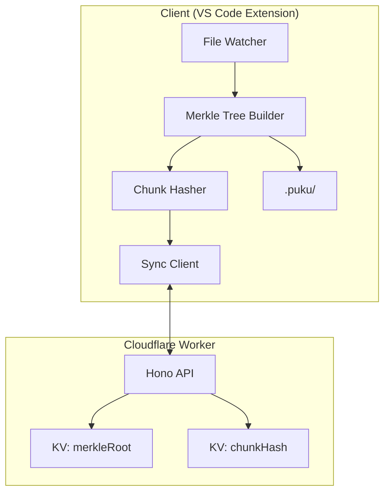
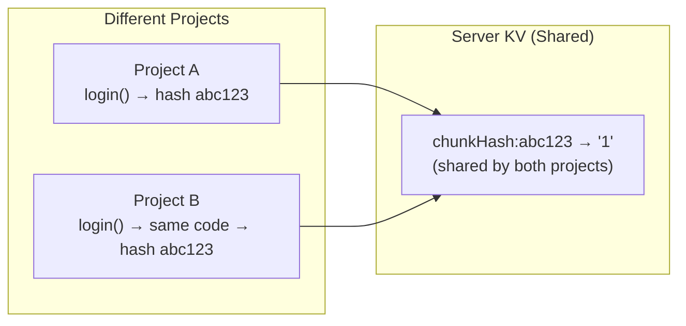
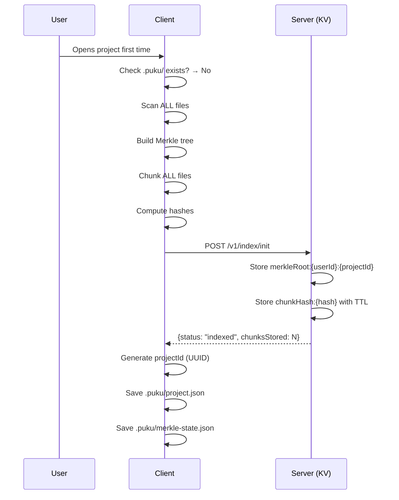
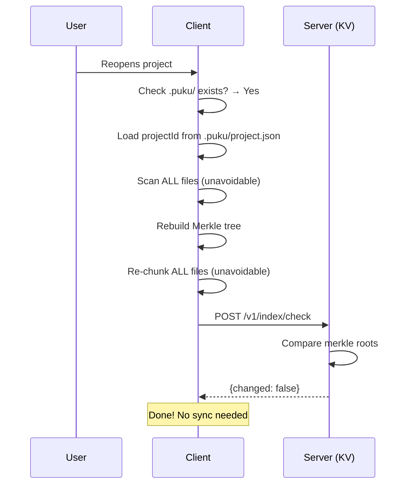
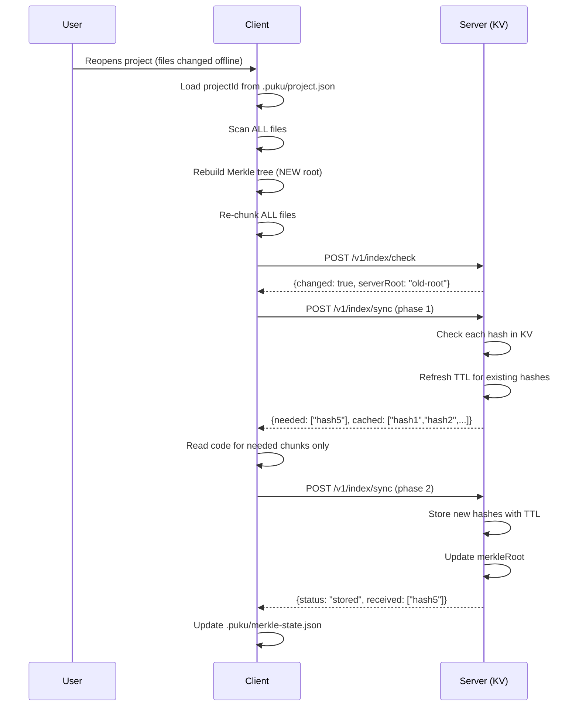
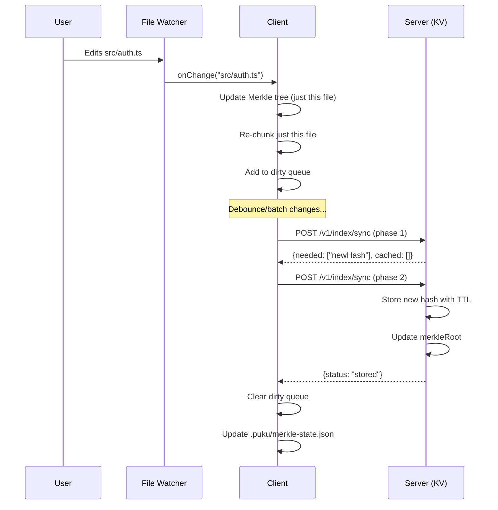

# Phase 1: Core Sync Infrastructure Implementation Plan

## Overview

This document outlines the complete Phase 1 implementation plan for the POC Indexing Worker. Phase 1 focuses on **core sync infrastructure with KV only** (no AI processing). AI summarization and embeddings will be added in Phase 2.

## Architecture Overview



## Cache Strategy

### Hash-Only Storage (Inspired by Cursor)

We use **hash-based caching** where embeddings/data are stored by chunk hash only - not tied to any specific project. This enables cross-project cache sharing.



**Benefits:**
- Cross-project cache sharing (same code = same hash = shared cache)
- Simpler sync logic (no per-project tracking)
- Cloudflare KV TTL handles cleanup automatically

**TTL Strategy:**
- Phase 1: 30-day TTL for chunk hashes (small data)
- Phase 2: 7-14 day TTL for embeddings (larger data)
- TTL refreshed on every access

## Complete Flow Diagrams

### Flow 1: First Time Project Open



### Flow 2: Project Reopen (No Changes)



### Flow 3: Project Reopen (With Changes)



### Flow 4: Live Editing (Watcher Running)



---

## API Reference

### Base URL

```
Development: http://localhost:8787
Production:  https://indexing-poc.{account}.workers.dev
```

### Authentication

All requests require `Authorization` header with user token:

```
Authorization: Bearer {userToken}
```

Server extracts `userId` from token for KV key namespacing.

---

### 1. POST `/v1/index/init`

**Purpose**: First-time full indexing when user opens a new project.

**When to Call**:
- First time user opens project (no `.puku/project.json` exists)
- Server returns `serverRoot: null` on `/check`
- User manually triggers re-index

#### Request

**Headers:**
```
Content-Type: application/json
Authorization: Bearer {userToken}
```

**Body:**
```typescript
interface IndexInitRequest {
  projectId: string;        // UUID generated by client
  merkleRoot: string;       // SHA-256 hash of merkle tree root
  chunks: InitChunk[];      // All chunks with code
}

interface InitChunk {
  hash: string;             // SHA-256 hash of chunk content
  code: string;             // Actual code content
  type: ChunkType;          // "function" | "class" | "method" | "interface" | "type" | "enum" | "block"
  name: string | null;      // Function/class name or null for anonymous
  languageId: string;       // "typescript" | "javascript" | "python" | etc.
  lines: [number, number];  // [startLine, endLine] (1-indexed)
  charCount: number;        // Character count of code
}
```

**Example:**
```json
{
  "projectId": "550e8400-e29b-41d4-a716-446655440000",
  "merkleRoot": "a1b2c3d4e5f6...",
  "chunks": [
    {
      "hash": "abc123def456...",
      "code": "export function login(username: string, password: string): User | null {\n  // auth logic\n  return user;\n}",
      "type": "function",
      "name": "login",
      "languageId": "typescript",
      "lines": [10, 25],
      "charCount": 245
    },
    {
      "hash": "789xyz012...",
      "code": "export class AuthService {\n  private users: Map<string, User>;\n  // ...\n}",
      "type": "class",
      "name": "AuthService",
      "languageId": "typescript",
      "lines": [30, 85],
      "charCount": 1250
    }
  ]
}
```

#### Response

**Success (200 OK):**
```typescript
interface IndexInitResponse {
  status: "indexed";
  merkleRoot: string;       // Echo back the stored root
  chunksStored: number;     // Number of chunks stored
  chunksSkipped: number;    // Already existed (TTL refreshed)
}
```

**Example:**
```json
{
  "status": "indexed",
  "merkleRoot": "a1b2c3d4e5f6...",
  "chunksStored": 2,
  "chunksSkipped": 0
}
```

**Error (400 Bad Request):**
```json
{
  "error": "Invalid request",
  "message": "merkleRoot is required"
}
```

**Error (401 Unauthorized):**
```json
{
  "error": "Unauthorized",
  "message": "Invalid or missing token"
}
```

#### Server Actions

1. Validate request body
2. Extract `userId` from auth token
3. Store merkle root:
   ```
   KV.put(`merkleRoot:{userId}:{projectId}`, merkleRoot)
   ```
4. For each chunk:
   ```
   KV.put(`chunkHash:{hash}`, "1", { expirationTtl: 2592000 }) // 30 days
   ```
5. Return success response

---

### 2. POST `/v1/index/check`

**Purpose**: Quick O(1) check if project needs sync.

**When to Call**:
- On project open (after rebuilding local Merkle tree)
- Periodically during active session (every 3-5 minutes)

#### Request

**Headers:**
```
Content-Type: application/json
Authorization: Bearer {userToken}
```

**Body:**
```typescript
interface IndexCheckRequest {
  projectId: string;        // Project UUID
  merkleRoot: string;       // Current local merkle root
}
```

**Example:**
```json
{
  "projectId": "550e8400-e29b-41d4-a716-446655440000",
  "merkleRoot": "a1b2c3d4e5f6..."
}
```

#### Response

**No Change (200 OK):**
```typescript
interface IndexCheckResponse {
  changed: boolean;         // false = in sync
  serverRoot: string;       // Server's stored root
}
```

**Example:**
```json
{
  "changed": false,
  "serverRoot": "a1b2c3d4e5f6..."
}
```

**Change Detected (200 OK):**
```json
{
  "changed": true,
  "serverRoot": "xyz789abc..."
}
```

**No Server Data (200 OK):**
```json
{
  "changed": true,
  "serverRoot": null
}
```

When `serverRoot` is `null`, client should call `/init` instead of `/sync`.

#### Server Actions

1. Extract `userId` from auth token
2. Get stored root:
   ```
   storedRoot = KV.get(`merkleRoot:{userId}:{projectId}`)
   ```
3. Compare with request `merkleRoot`
4. Return comparison result

---

### 3. POST `/v1/index/sync`

**Purpose**: Two-phase sync protocol for efficient updates.

#### Phase 1: Hash Check

**Purpose**: Server tells client which chunks are new vs cached.

**Request:**
```typescript
interface IndexSyncPhase1Request {
  phase: 1;
  projectId: string;
  merkleRoot: string;           // New merkle root after changes
  chunks: SyncChunkMeta[];      // Metadata only, NO code
}

interface SyncChunkMeta {
  hash: string;                 // Chunk content hash
  type: ChunkType;
  name: string | null;
  lines: [number, number];
  charCount: number;
}
```

**Example:**
```json
{
  "phase": 1,
  "projectId": "550e8400-e29b-41d4-a716-446655440000",
  "merkleRoot": "newroot123...",
  "chunks": [
    {
      "hash": "abc123...",
      "type": "function",
      "name": "login",
      "lines": [10, 25],
      "charCount": 245
    },
    {
      "hash": "def456...",
      "type": "function",
      "name": "logout",
      "lines": [30, 40],
      "charCount": 180
    },
    {
      "hash": "newxyz...",
      "type": "class",
      "name": "AuthService",
      "lines": [45, 120],
      "charCount": 1500
    }
  ]
}
```

**Response:**
```typescript
interface IndexSyncPhase1Response {
  needed: string[];     // Hashes that need code (not in cache)
  cached: string[];     // Hashes already in cache (TTL refreshed)
}
```

**Example:**
```json
{
  "needed": ["newxyz..."],
  "cached": ["abc123...", "def456..."]
}
```

**Server Actions (Phase 1):**
1. For each chunk hash:
   - Check if `chunkHash:{hash}` exists in KV
   - If exists: add to `cached`, refresh TTL
   - If not exists: add to `needed`
2. Return categorized lists

---

#### Phase 2: Code Transfer

**Purpose**: Client sends code only for chunks server doesn't have.

**Request:**
```typescript
interface IndexSyncPhase2Request {
  phase: 2;
  projectId: string;
  merkleRoot: string;           // Same as phase 1
  chunks: SyncChunkWithCode[];  // Only the needed chunks
}

interface SyncChunkWithCode {
  hash: string;
  code: string;                 // Actual code content
  type: ChunkType;
  name: string | null;
  languageId: string;
  lines: [number, number];
  charCount: number;
}
```

**Example:**
```json
{
  "phase": 2,
  "projectId": "550e8400-e29b-41d4-a716-446655440000",
  "merkleRoot": "newroot123...",
  "chunks": [
    {
      "hash": "newxyz...",
      "code": "export class AuthService {\n  // updated implementation\n}",
      "type": "class",
      "name": "AuthService",
      "languageId": "typescript",
      "lines": [45, 120],
      "charCount": 1500
    }
  ]
}
```

**Response (Phase 1 POC - No AI):**
```typescript
interface IndexSyncPhase2Response {
  status: "stored";
  received: string[];           // Hashes successfully stored
  merkleRoot: string;           // Confirmed new root
  message: string;              // Status message
}
```

**Example:**
```json
{
  "status": "stored",
  "received": ["newxyz..."],
  "merkleRoot": "newroot123...",
  "message": "Chunks stored. AI processing disabled in Phase 1."
}
```

**Response (Phase 2 POC - With AI):**
```json
{
  "status": "processed",
  "received": ["newxyz..."],
  "merkleRoot": "newroot123...",
  "summaries": {
    "newxyz...": "AuthService class handles user authentication with login/logout methods..."
  },
  "message": "Chunks processed with AI summarization."
}
```

**Server Actions (Phase 2):**
1. Store each chunk hash with TTL:
   ```
   KV.put(`chunkHash:{hash}`, "1", { expirationTtl: 2592000 })
   ```
2. Update merkle root:
   ```
   KV.put(`merkleRoot:{userId}:{projectId}`, merkleRoot)
   ```
3. (Phase 2 POC) Generate summaries and embeddings
4. Return success response

---

### 4. GET `/v1/health`

**Purpose**: Health check endpoint.

#### Request

No body required.

#### Response

```json
{
  "status": "ok",
  "timestamp": "2026-01-11T12:00:00Z",
  "version": "1.0.0"
}
```

---

## Error Responses

All endpoints return consistent error format:

```typescript
interface ErrorResponse {
  error: string;        // Error type
  message: string;      // Human-readable message
  details?: unknown;    // Optional additional details
}
```

### Common Errors

| Status | Error | When |
|--------|-------|------|
| 400 | Bad Request | Invalid JSON, missing required fields |
| 401 | Unauthorized | Missing or invalid auth token |
| 404 | Not Found | Project not found (for /check) |
| 413 | Payload Too Large | Request body exceeds limit |
| 429 | Too Many Requests | Rate limit exceeded |
| 500 | Internal Server Error | Server-side error |

---

## Data Storage

### KV Structure

```
merkleRoot:{userId}:{projectId}  →  "rootHash"          (no TTL)
chunkHash:{hash}                 →  "1"                 (30-day TTL)
```

### Client-Side Storage (.puku/)

**project.json:**
```json
{
  "projectId": "550e8400-e29b-41d4-a716-446655440000",
  "createdAt": "2026-01-11T12:00:00Z"
}
```

**merkle-state.json:**
```json
{
  "root": "a1b2c3d4e5f6...",
  "leaves": [
    { "relativePath": "src/auth.ts", "hash": "..." },
    { "relativePath": "src/api.ts", "hash": "..." }
  ],
  "timestamp": "2026-01-11T12:00:00Z"
}
```

**dirty-queue.json:**
```json
{
  "lastSync": "2026-01-11T12:00:00Z",
  "dirtyFiles": ["src/auth.ts"]
}
```

---

## TypeScript Types (Shared)

```typescript
// Chunk types
type ChunkType =
  | "function"
  | "class"
  | "method"
  | "interface"
  | "type"
  | "enum"
  | "struct"
  | "impl"
  | "trait"
  | "block";

// Client-side only (not sent to server)
interface ChunkReference {
  relativePath: string;
  lineStart: number;
  lineEnd: number;
  charStart: number;
  charEnd: number;
}

// Sync payload (sent to server)
interface ChunkSyncPayload {
  hash: string;
  type: ChunkType;
  name: string | null;
  lines: [number, number];
  charCount: number;
}

// Full chunk with code (for /init and /sync phase 2)
interface ChunkWithCode extends ChunkSyncPayload {
  code: string;
  languageId: string;
}
```

---

## What Gets Sent to Server

| Data | Sent? | When | Purpose |
|------|-------|------|---------|
| `projectId` | ✅ | Always | Identify project |
| `merkleRoot` | ✅ | Always | Change detection |
| `hash` | ✅ | Always | Identify chunk |
| `type` | ✅ | Always | Chunk classification |
| `name` | ✅ | Always | Function/class name |
| `lines` | ✅ | Always | Line range metadata |
| `charCount` | ✅ | Always | Size info |
| `languageId` | ✅ | /init, /sync phase 2 | Language for AI processing |
| `code` | ✅ | /init, /sync phase 2 | Only for new chunks |
| `relativePath` | ❌ | Never | Privacy - stays on client |
| `charStart/End` | ❌ | Never | Client use only |

---

## Rate Limits

| Endpoint | Limit | Window |
|----------|-------|--------|
| `/v1/index/init` | 10 | per minute |
| `/v1/index/check` | 60 | per minute |
| `/v1/index/sync` | 30 | per minute |

---

## Project Structure

```
indexing-system-poc/
├── Client/                          # Client-side library (NEW)
│   ├── src/
│   │   ├── index.ts                 # Main exports
│   │   ├── types.ts                 # Shared types
│   │   ├── sync-client.ts           # HTTP client for worker API
│   │   └── code-reader.ts           # Read code by ChunkReference
│   └── package.json
│
├── indexing-poc-worker/             # Cloudflare Worker (NEW)
│   ├── src/
│   │   ├── index.ts                 # Hono app entry point
│   │   ├── types.ts                 # Request/response interfaces
│   │   ├── middleware/
│   │   │   ├── auth.ts              # Token validation
│   │   │   └── error-handler.ts     # Error handling
│   │   ├── routes/
│   │   │   ├── health.ts            # GET /v1/health
│   │   │   ├── index-init.ts        # POST /v1/index/init
│   │   │   ├── index-check.ts       # POST /v1/index/check
│   │   │   └── index-sync.ts        # POST /v1/index/sync
│   │   └── lib/
│   │       └── kv-store.ts          # KV operations with TTL
│   └── wrangler.toml
│
├── Merkle-Tree-Builder/             # Existing (updated for relative paths)
├── Chunk-Hashing/                   # Existing (updated for relative paths)
├── File-Watcher/                    # Existing
└── Documentation/
```

---

## Implementation Steps

### Step 1: Create Worker Package
```bash
mkdir indexing-poc-worker
cd indexing-poc-worker
npm init -y
npm install hono
npm install -D wrangler typescript @cloudflare/workers-types
```

### Step 2: Configure wrangler.toml
```toml
name = "indexing-poc"
main = "src/index.ts"
compatibility_date = "2024-11-24"
compatibility_flags = ["nodejs_compat"]

[[kv_namespaces]]
binding = "INDEX_KV"
id = "your-kv-namespace-id"
```

### Step 3: Implement Endpoints
1. `/v1/health` - Health check
2. `/v1/index/init` - First-time indexing
3. `/v1/index/check` - Change detection
4. `/v1/index/sync` - Two-phase sync

### Step 4: Create Client Package
1. `types.ts` - Shared TypeScript interfaces
2. `sync-client.ts` - HTTP client for worker API
3. `code-reader.ts` - Read code using ChunkReference

### Step 5: Integration Test
- Test full flow: init → check → sync

---

## Success Criteria

| Criteria | Description |
|----------|-------------|
| ✅ Relative paths | All local storage uses relative paths |
| ✅ Worker deploys | `wrangler dev` runs without errors |
| ✅ /health works | Returns status: ok |
| ✅ /init works | Stores merkle root and chunk hashes with TTL |
| ✅ /check works | Returns changed: true/false correctly |
| ✅ /sync phase 1 | Returns needed vs cached, refreshes TTL |
| ✅ /sync phase 2 | Stores new chunk hashes with TTL |
| ✅ TTL works | Hashes expire after 30 days |
| ✅ Integration test | Full flow works end-to-end |

---

## Phase 2 Preview (Not This Phase)

After Phase 1 is complete:

1. **OpenRouter Integration** - Summarization with Qwen Coder
2. **Embeddings** - Codestral via OpenRouter
3. **Vectorize Storage** - Store embeddings for semantic search
4. **Enhanced /sync response** - Return summaries + embeddings

---

## Cost Estimate

| Phase | Architecture | Monthly Cost (500 users) |
|-------|--------------|--------------------------|
| Phase 1 | KV Only | ~$5 |
| Phase 2 | KV + Vectorize | ~$34-75 |

---

*Document updated: 2026-01-11*
*Status: Ready for implementation*
