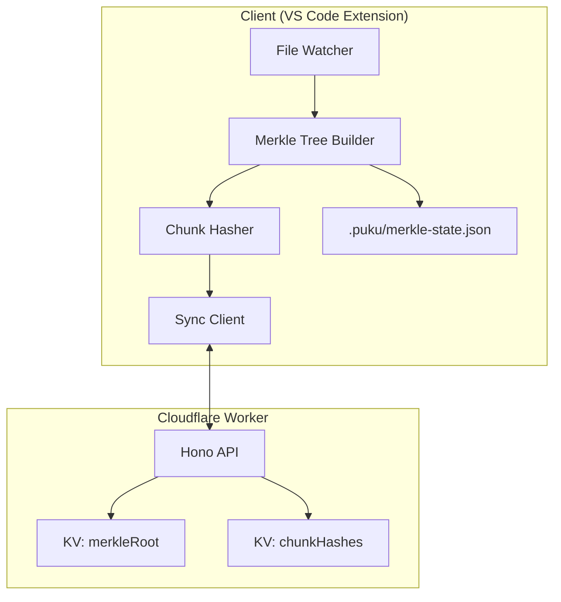
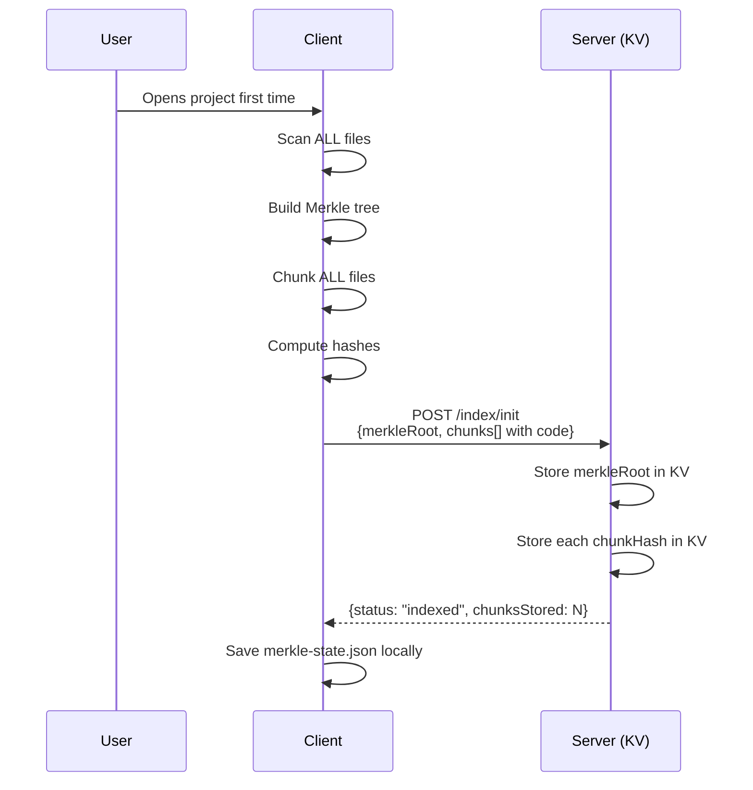
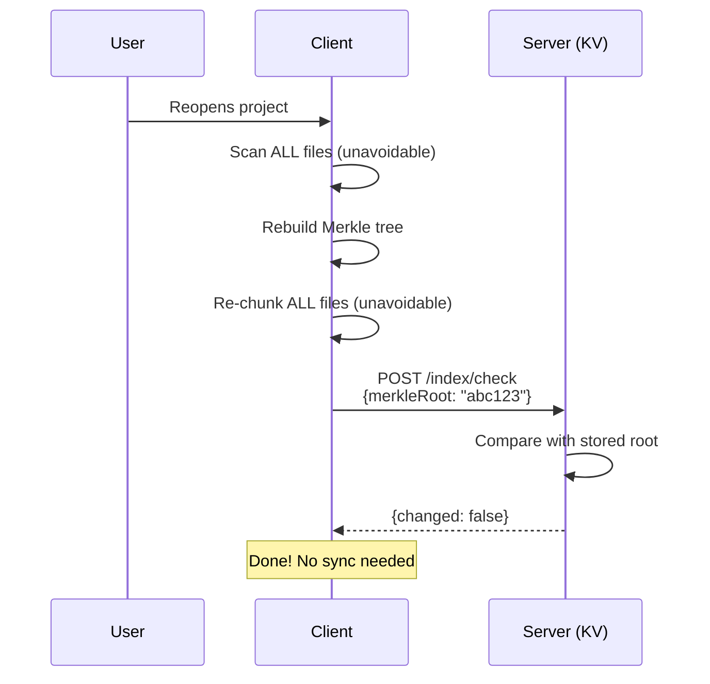
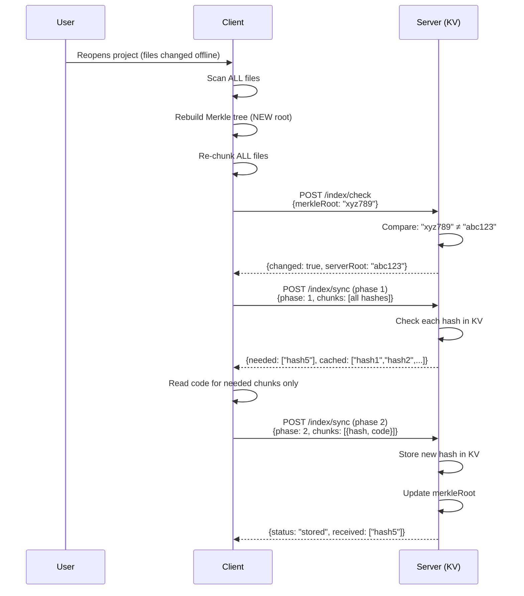
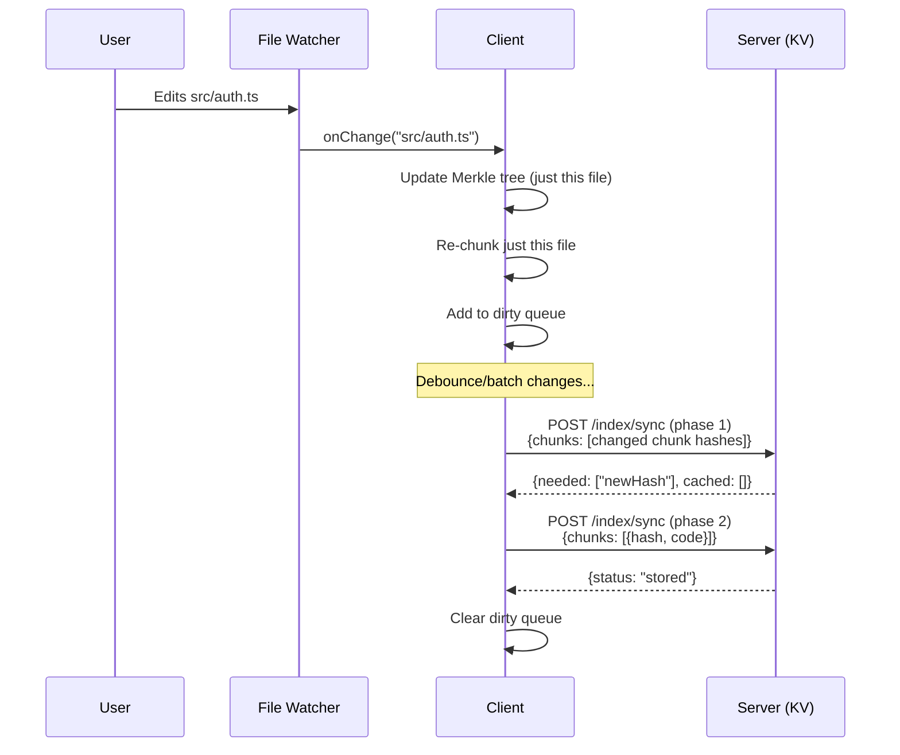
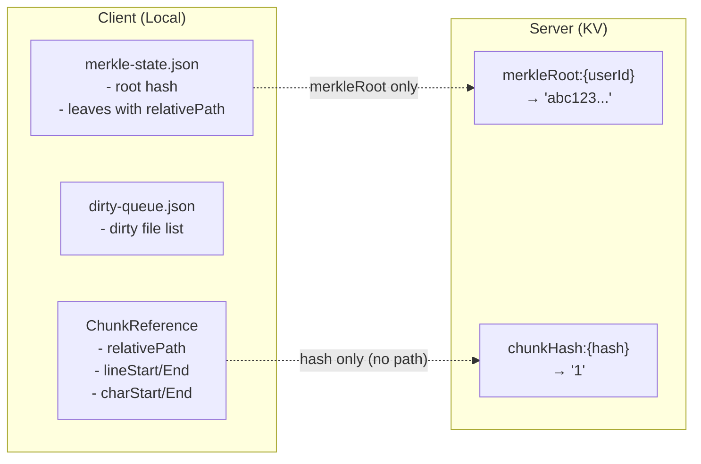
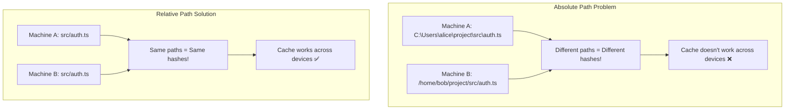

# Phase 1: Core Sync Infrastructure Implementation Plan

## Overview

This document outlines the complete Phase 1 implementation plan for the POC Indexing Worker. Phase 1 focuses on **core sync infrastructure with KV only** (no AI processing). AI summarization and embeddings will be added in Phase 2.

---

## Architecture Overview



---

## Complete Flow Diagrams

### Flow 1: First Time Project Open



### Flow 2: Project Reopen (No Changes)



### Flow 3: Project Reopen (With Changes)



### Flow 4: Live Editing (Watcher Running)



---

## API Endpoints

### 1. POST `/v1/index/init` - First Time Indexing

**When Called**:
- First time user opens project
- Server has no data (`/check` returns `serverRoot: null`)
- User manually triggers re-index

**Request:**
```json
{
  "merkleRoot": "abc123...",
  "chunks": [
    {
      "hash": "chunk-hash-1",
      "type": "function",
      "name": "login",
      "lines": [10, 25],
      "charCount": 500,
      "code": "function login() { ... }",
      "languageId": "typescript"
    }
  ]
}
```

**Response:**
```json
{
  "status": "indexed",
  "merkleRoot": "abc123...",
  "chunksStored": 1
}
```

**Server Actions:**
- Store `merkleRoot:{userId}` → `"abc123..."`
- Store `chunkHash:{hash}` → `"1"` for each chunk

---

### 2. POST `/v1/index/check` - Change Detection

**When Called**:
- On project open (after rebuilding local Merkle tree)
- Periodically during session

**Request:**
```json
{
  "merkleRoot": "abc123..."
}
```

**Response (no change):**
```json
{
  "changed": false,
  "serverRoot": "abc123..."
}
```

**Response (change detected):**
```json
{
  "changed": true,
  "serverRoot": "xyz789..."
}
```

**Response (no server data):**
```json
{
  "changed": true,
  "serverRoot": null
}
```

---

### 3. POST `/v1/index/sync` - Two-Phase Sync

#### Phase 1: Hash Check

**Purpose**: Server tells client which chunks need code

**Request:**
```json
{
  "phase": 1,
  "merkleRoot": "abc123...",
  "chunks": [
    {
      "hash": "chunk-hash-1",
      "type": "function",
      "name": "login",
      "lines": [10, 25],
      "charCount": 500
    },
    {
      "hash": "chunk-hash-2",
      "type": "class",
      "name": "AuthService",
      "lines": [30, 80],
      "charCount": 1200
    }
  ]
}
```

**Response:**
```json
{
  "needed": ["chunk-hash-2"],
  "cached": ["chunk-hash-1"]
}
```

#### Phase 2: Code Transfer

**Purpose**: Client sends code only for needed chunks

**Request:**
```json
{
  "phase": 2,
  "merkleRoot": "abc123...",
  "chunks": [
    {
      "hash": "chunk-hash-2",
      "code": "class AuthService { ... }",
      "type": "class",
      "name": "AuthService",
      "languageId": "typescript"
    }
  ]
}
```

**Response (Phase 1 POC - no AI):**
```json
{
  "status": "stored",
  "received": ["chunk-hash-2"],
  "message": "Chunks stored. AI processing disabled in Phase 1."
}
```

---

## Data Storage

### What Goes Where



### Client-Side Storage

**merkle-state.json:**
```json
{
  "root": "abc123...",
  "leaves": [
    { "relativePath": "src/auth.ts", "hash": "..." },
    { "relativePath": "src/api.ts", "hash": "..." }
  ],
  "timestamp": "2026-01-11T12:00:00Z"
}
```

**dirty-queue.json:**
```json
{
  "lastSync": "2026-01-11T12:00:00Z",
  "dirtyFiles": ["src/auth.ts"]
}
```

**ChunkReference (in memory):**
```typescript
{
  relativePath: "src/auth.ts",  // NOT sent to server
  lineStart: 10,
  lineEnd: 25,
  charStart: 234,
  charEnd: 567
}
```

### Server-Side Storage (KV)

| Key Pattern | Value | Purpose |
|-------------|-------|---------|
| `merkleRoot:{userId}` | `"abc123..."` | Quick change detection |
| `chunkHash:{hash}` | `"1"` | Cache check for chunks |

---

## What Gets Sent to Server vs Stays Local

| Data | Sent to Server? | Purpose |
|------|-----------------|---------|
| `merkleRoot` | ✅ Yes | O(1) change detection |
| `hash` | ✅ Yes | Identify chunk uniquely |
| `type` | ✅ Yes | "function", "class", etc. |
| `name` | ✅ Yes | Function/class name |
| `lines` | ✅ Yes | Line range metadata |
| `charCount` | ✅ Yes | Size info |
| `code` | ✅ Phase 2 only | Actual content (only for new chunks) |
| `relativePath` | ❌ No | Privacy - client only |
| `charStart/End` | ❌ No | Client uses to read code |

---

## Why Relative Paths?



---

## Optimization Summary

### Where Two-Phase Saves

| Step | Without Two-Phase | With Two-Phase | Savings |
|------|-------------------|----------------|---------|
| Client scanning | Scan all files | Scan all files | None |
| Client chunking | Chunk all files | Chunk all files | None |
| Network (check) | - | 64 bytes | - |
| Network (sync) | 400KB (all code) | 4KB hashes + changed code | ~96% |
| Server storage | Store all | Store only new | Depends |
| AI processing | Process all (Phase 2) | Process only new (Phase 2) | ~96% |

### Timeline Example

```
Project: 100 files, 100 chunks
User edited 1 file offline, reopens project:

Client work (unavoidable):
├── Scan 100 files
├── Build Merkle tree
└── Chunk 100 files

Network transfer:
├── /check: 64 bytes
├── /sync phase 1: ~4KB (100 hashes)
└── /sync phase 2: ~4KB (1 chunk code)

Server work:
├── Compare 100 hashes with KV
└── Store 1 new hash
```

---

## Project Structure

```
indexing-system-poc/
├── Client/                          # Client-side library (NEW)
│   ├── src/
│   │   ├── index.ts                 # Main exports
│   │   ├── types.ts                 # Shared types
│   │   ├── sync-client.ts           # HTTP client for worker API
│   │   └── code-reader.ts           # Read code by ChunkReference
│   └── package.json
│
├── indexing-poc-worker/             # Cloudflare Worker (NEW)
│   ├── src/
│   │   ├── index.ts                 # Hono app entry point
│   │   ├── types.ts                 # Request/response interfaces
│   │   ├── routes/
│   │   │   ├── index-init.ts        # POST /v1/index/init
│   │   │   ├── index-check.ts       # POST /v1/index/check
│   │   │   └── index-sync.ts        # POST /v1/index/sync
│   │   └── lib/
│   │       └── kv-store.ts          # KV operations
│   └── wrangler.toml
│
├── Merkle-Tree-Builder/             # Existing (updated for relative paths)
├── Chunk-Hashing/                   # Existing (updated for relative paths)
├── File-Watcher/                    # Existing
└── Documentation/
```

---

## Implementation Steps

### Step 1: Create Worker Package
```bash
mkdir indexing-poc-worker
cd indexing-poc-worker
npm init -y
npm install hono
npm install -D wrangler typescript @cloudflare/workers-types
```

### Step 2: Configure wrangler.toml
```toml
name = "indexing-poc"
main = "src/index.ts"
compatibility_date = "2024-11-24"
compatibility_flags = ["nodejs_compat"]

[[kv_namespaces]]
binding = "INDEX_KV"
id = "create-with-wrangler"
```

### Step 3: Implement Endpoints
1. `/v1/index/init` - Store merkle root + all chunk hashes
2. `/v1/index/check` - Compare merkle roots
3. `/v1/index/sync` - Two-phase hash check + code storage

### Step 4: Create Client Package
1. `sync-client.ts` - HTTP calls to worker
2. `code-reader.ts` - Read code using ChunkReference

### Step 5: Integration Test
- Test full flow: init → check → sync

---

## Success Criteria

| Criteria | Description |
|----------|-------------|
| ✅ Relative paths | All local storage uses relative paths |
| ✅ Worker deploys | `wrangler dev` runs without errors |
| ✅ /init works | Stores merkle root and chunk hashes |
| ✅ /check works | Returns changed: true/false correctly |
| ✅ /sync phase 1 | Returns needed vs cached hashes |
| ✅ /sync phase 2 | Stores new chunk hashes |
| ✅ Integration test | Full flow works end-to-end |

---

## Phase 2 Preview (Not This Phase)

After Phase 1 is complete:

1. **OpenRouter Integration** - Summarization with Qwen Coder
2. **Embeddings** - Codestral via OpenRouter
3. **Vectorize Storage** - Store embeddings for semantic search
4. **Enhanced /sync response** - Return summaries + embeddings

---

## Cost Estimate

| Phase | Architecture | Monthly Cost (500 users) |
|-------|--------------|--------------------------|
| Phase 1 | KV Only | ~$5 |
| Phase 2 | KV + Vectorize | ~$34-75 |

---

*Document updated: 2026-01-11*
*Status: Ready for implementation*
