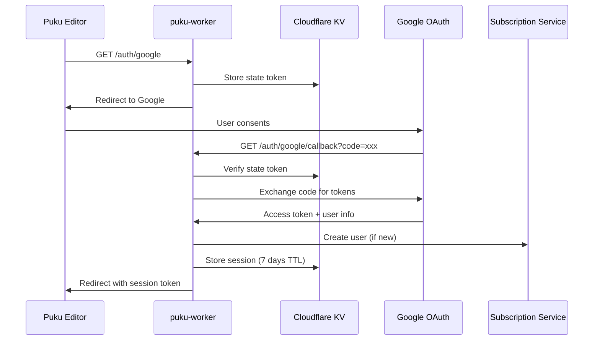
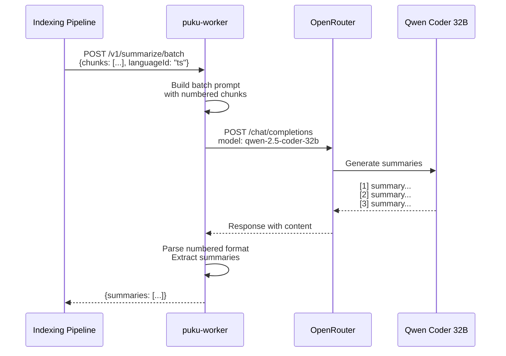
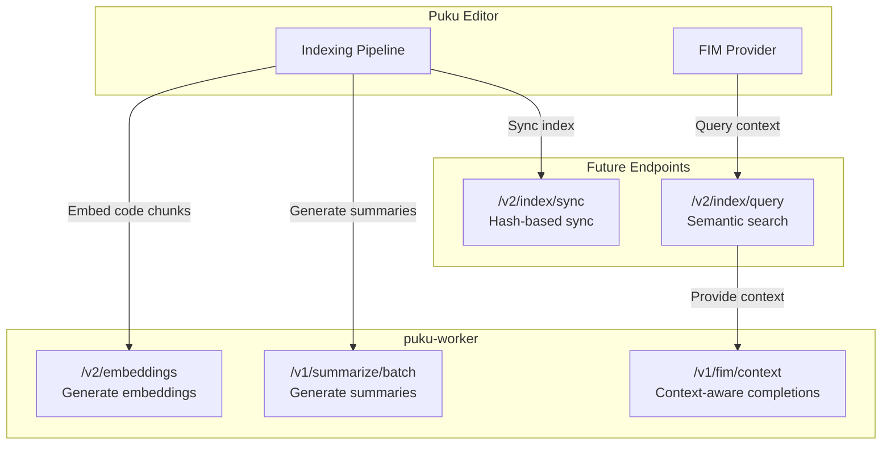

# Puku Worker - Backend API Server

This document provides a comprehensive overview of the `puku-worker` backend, a Cloudflare Worker that powers the Puku Editor. Understanding this architecture is essential before integrating the indexing pipeline.

## Project Overview

The puku-worker is a serverless backend running on Cloudflare's edge network. It provides AI-powered code completion, embeddings generation, authentication, and user management. The worker acts as a gateway between the Puku Editor (VS Code extension) and various AI providers.



## Technology Stack

The worker is built using Hono.js, a lightweight and fast web framework designed for edge computing. It runs on Cloudflare Workers with the following infrastructure:

- **Runtime**: Cloudflare Workers (Node.js compatible)
- **Framework**: Hono.js
- **Database**: Cloudflare D1 (SQLite) for usage tracking
- **Key-Value Store**: Cloudflare KV for session management
- **Monitoring**: Sentry for error tracking and LLM observability

## Project Structure

```
puku-worker/
├── src/
│   ├── index.ts              # Main entry point, route setup
│   ├── types.ts              # TypeScript interfaces
│   ├── middleware/
│   │   └── auth.ts           # Authentication middleware
│   ├── routes/
│   │   ├── auth.ts           # Google OAuth flow
│   │   ├── completions.ts    # FIM and chat completions
│   │   ├── embeddings.ts     # Text embeddings (v1)
│   │   ├── config.ts         # Configuration endpoints
│   │   ├── cursor-jump.ts    # Cursor navigation
│   │   ├── diagnostics.ts    # Diagnostic endpoints
│   │   ├── comment-completion.ts
│   │   ├── puku-api.ts       # Puku-specific APIs
│   │   └── v2/
│   │       ├── completions.ts  # v2 with usage tracking
│   │       └── embeddings.ts   # v2 with quota management
│   ├── lib/
│   │   ├── subscription-client.ts  # Subscription service client
│   │   ├── usage-tracker.ts        # D1 usage tracking
│   │   ├── metadata-generator.ts   # Completion metadata
│   │   ├── metadata-validator.ts   # Metadata validation
│   │   ├── voyage-reranker.ts      # Voyage AI reranking
│   │   └── sentry.ts               # Sentry integration
│   ├── schemas/
│   │   ├── v2.ts             # Zod schemas for v2 API
│   │   └── config.ts         # Configuration schemas
│   └── cron/
│       └── sync-usage.ts     # Cron job for usage sync
└── wrangler.toml             # Cloudflare configuration
```

---

## Part 1: Entry Point and Configuration

### Main Application Setup

The entry point ([index.ts](../../puku-worker/src/index.ts)) initializes the Hono application, configures middleware, and sets up all route handlers.

```typescript
// src/index.ts - Main entry point

import { Hono } from 'hono';
import { cors } from 'hono/cors';
import { logger } from 'hono/logger';
import * as Sentry from '@sentry/cloudflare';
import { completions } from './routes/completions';
import { embeddings } from './routes/embeddings';
import { auth } from './routes/auth';
import { authMiddleware } from './middleware/auth';
import { v2Completions } from './routes/v2/completions';
import { v2Embeddings } from './routes/v2/embeddings';
import { syncUsage } from './cron/sync-usage';

export type Env = {
    // Secrets
    ZAI_API_KEY: string;
    OPENROUTER_API_KEY: string;
    GOOGLE_CLIENT_ID: string;
    GOOGLE_CLIENT_SECRET: string;
    CODESTRAL_API_KEY: string;
    VOYAGE_API_KEY: string;
    SENTRY_DSN: string;

    // Environment variables
    ZAI_API_URL: string;
    OPENROUTER_API_URL: string;
    FIM_MODEL: string;
    EMBEDDING_MODEL: string;
    CODESTRAL_FIM_URL: string;
    SUBSCRIPTION_SERVICE_URL: string;
    VOYAGE_API_URL: string;

    // Storage bindings
    SESSIONS: KVNamespace;
    USAGE_DB: D1Database;
};

const app = new Hono<{
    Bindings: Env;
    Variables: { user?: SessionUser; sessionToken?: string }
}>();

// Global middleware
app.use('*', cors());
app.use('*', logger());

// Public routes
app.get('/health', (c) => c.json({ status: 'ok' }));
app.route('/auth', auth);

// Protected routes - require authentication
app.use('/v1/*', authMiddleware);
app.use('/v2/*', authMiddleware);

// Route handlers
app.route('/', completions);
app.route('/', embeddings);
app.route('/v2', v2Completions);
app.route('/v2', v2Embeddings);
```

The application is wrapped with Sentry for error monitoring and LLM observability, tracking every API call and measuring latency and token usage.

### Cloudflare Configuration

The worker configuration lives in [wrangler.toml](../../puku-worker/wrangler.toml). This file defines environment variables, KV bindings, and D1 database connections.

```toml
# wrangler.toml - Cloudflare Worker configuration

name = "puku-api"
main = "src/index.ts"
compatibility_date = "2024-11-24"
compatibility_flags = ["nodejs_compat"]

routes = [
  { pattern = "api.puku.sh/*", zone_name = "puku.sh" }
]

# Cron job runs every 5 minutes
[triggers]
crons = ["*/5 * * * *"]

[vars]
ZAI_API_URL = "https://api.z.ai/api/coding/paas/v4"
OPENROUTER_API_URL = "https://openrouter.ai/api/v1"
CODESTRAL_FIM_URL = "https://codestral.mistral.ai/v1/fim/completions"
FIM_MODEL = "codestral-latest"
EMBEDDING_MODEL = "mistralai/codestral-embed-2505"
SUBSCRIPTION_SERVICE_URL = "https://puku-subscription.poridhiaccess.workers.dev"
VOYAGE_API_URL = "https://api.voyageai.com/v1"

# KV for session storage
[[kv_namespaces]]
binding = "SESSIONS"
id = "8b4ed98fe2724001981a0bf6903064ab"

# D1 for usage tracking
[[d1_databases]]
binding = "USAGE_DB"
database_name = "puku-worker-usage"
database_id = "ac954226-bf61-448a-8027-bed56ccbcb25"
```

---

## Part 2: Authentication System

### Authentication Flow

The authentication system uses Google OAuth 2.0 for user login. Sessions are stored in Cloudflare KV with a 7-day expiration. The flow works as follows: the user clicks login in the editor, which redirects to Google's OAuth consent screen. After authentication, Google redirects back to our callback URL with an authorization code. We exchange this code for tokens, fetch the user's profile, create a session in KV, and redirect back to the editor with a session token.



### Auth Middleware

The authentication middleware ([middleware/auth.ts](../../puku-worker/src/middleware/auth.ts)) validates Bearer tokens against the KV session store. Every protected endpoint passes through this middleware.

```typescript
// src/middleware/auth.ts - Session validation

interface SessionData {
    id: string;
    email: string;
    name: string;
    picture?: string;
    createdAt: number;
}

export async function authMiddleware(c: Context<{ Bindings: Env }>, next: Next) {
    const authHeader = c.req.header('Authorization');

    if (!authHeader || !authHeader.startsWith('Bearer ')) {
        return c.json({
            error: {
                message: 'Authentication required',
                type: 'authentication_error',
                code: 'missing_token',
            },
        }, 401);
    }

    const token = authHeader.substring(7);

    if (!token || token.length < 32) {
        return c.json({
            error: {
                message: 'Invalid authentication token',
                type: 'authentication_error',
                code: 'invalid_token',
            },
        }, 401);
    }

    // Validate token against KV store
    const sessionData = await c.env.SESSIONS.get(
        `session:${token}`,
        'json'
    ) as SessionData | null;

    if (!sessionData) {
        return c.json({
            error: {
                message: 'Session expired or invalid',
                type: 'authentication_error',
                code: 'session_expired',
            },
        }, 401);
    }

    // Add user info to context for use in routes
    c.set('user', sessionData);
    c.set('sessionToken', token);

    await next();
}
```

### OAuth Route Implementation

The OAuth routes ([routes/auth.ts](../../puku-worker/src/routes/auth.ts)) handle the complete authentication flow including state verification, token exchange, and session creation.

```typescript
// src/routes/auth.ts - Google OAuth implementation

export const auth = new Hono<{ Bindings: Env }>();

const GOOGLE_AUTH_URL = 'https://accounts.google.com/o/oauth2/v2/auth';
const GOOGLE_TOKEN_URL = 'https://oauth2.googleapis.com/token';
const GOOGLE_USERINFO_URL = 'https://www.googleapis.com/oauth2/v2/userinfo';

// GET /auth/google - Initiate OAuth flow
auth.get('/google', async (c) => {
    const env = c.env;
    const url = new URL(c.req.url);
    const redirectUri = `${url.protocol}//${url.host}/auth/google/callback`;

    const state = generateState();

    // Store state in KV for CSRF protection (10 min TTL)
    await env.SESSIONS.put(`state:${state}`, 'valid', { expirationTtl: 600 });

    const params = new URLSearchParams({
        client_id: env.GOOGLE_CLIENT_ID,
        redirect_uri: redirectUri,
        response_type: 'code',
        scope: 'openid email profile',
        state: state,
        access_type: 'offline',
        prompt: 'consent',
    });

    return c.redirect(`${GOOGLE_AUTH_URL}?${params.toString()}`);
});

// GET /auth/google/callback - Handle OAuth callback
auth.get('/google/callback', async (c) => {
    const env = c.env;
    const url = new URL(c.req.url);

    const code = url.searchParams.get('code');
    const state = url.searchParams.get('state');

    // Verify state to prevent CSRF
    const storedState = await env.SESSIONS.get(`state:${state}`);
    if (!storedState) {
        return c.json({ error: 'Invalid state parameter' }, 400);
    }
    await env.SESSIONS.delete(`state:${state}`);

    // Exchange code for tokens
    const tokenResponse = await fetch(GOOGLE_TOKEN_URL, {
        method: 'POST',
        headers: { 'Content-Type': 'application/x-www-form-urlencoded' },
        body: new URLSearchParams({
            client_id: env.GOOGLE_CLIENT_ID,
            client_secret: env.GOOGLE_CLIENT_SECRET,
            code: code,
            grant_type: 'authorization_code',
            redirect_uri: redirectUri,
        }),
    });

    const tokens = await tokenResponse.json();

    // Get user info
    const userResponse = await fetch(GOOGLE_USERINFO_URL, {
        headers: { Authorization: `Bearer ${tokens.access_token}` },
    });

    const userInfo = await userResponse.json();

    // Create session
    const sessionId = generateSessionId();
    const sessionData = {
        id: userInfo.id,
        email: userInfo.email,
        name: userInfo.name,
        picture: userInfo.picture,
        createdAt: Date.now(),
    };

    // Store session in KV (7 days TTL)
    await env.SESSIONS.put(
        `session:${sessionId}`,
        JSON.stringify(sessionData),
        { expirationTtl: 7 * 24 * 60 * 60 }
    );

    // Redirect back to editor with session token
    const pukuUri = `puku://GitHub.puku-editor/auth/callback?token=${sessionId}`;
    return c.html(successPage(userInfo.name, sessionId, pukuUri));
});
```

---

## Part 3: Embeddings API

### Overview

The embeddings API generates vector representations of text, which is critical for semantic search in the indexing pipeline. The v1 endpoint is a simple proxy to OpenRouter, while v2 adds quota management and usage tracking.

### V1 Embeddings Endpoint

The basic embeddings endpoint ([routes/embeddings.ts](../../puku-worker/src/routes/embeddings.ts)) proxies requests to OpenRouter using the Codestral Embed model.

```typescript
// src/routes/embeddings.ts - V1 embeddings (simple proxy)

import { Hono } from 'hono';
import type { EmbeddingRequest } from '../types';
import type { Env } from '../index';

export const embeddings = new Hono<{ Bindings: Env }>();

embeddings.post('/v1/embeddings', async (c) => {
    const request: EmbeddingRequest = await c.req.json();
    const env = c.env;

    // Validate request
    if (!request.input) {
        return c.json({
            error: {
                message: 'input is required',
                type: 'invalid_request_error',
            },
        }, 400);
    }

    // Use Codestral Embed as default for code embeddings
    const model = request.model || env.EMBEDDING_MODEL;

    console.log(`[Embeddings] Model: ${model}`);

    const response = await fetch(`${env.OPENROUTER_API_URL}/embeddings`, {
        method: 'POST',
        headers: {
            'Content-Type': 'application/json',
            Authorization: `Bearer ${env.OPENROUTER_API_KEY}`,
            'HTTP-Referer': 'https://puku.sh',
            'X-Title': 'Puku Editor',
        },
        body: JSON.stringify({
            ...request,
            model,
        }),
    });

    if (!response.ok) {
        const error = await response.text();
        return c.json({ error: { message: error, type: 'api_error' } }, 500);
    }

    return c.json(await response.json());
});
```

### V2 Embeddings with Quota Management

The v2 endpoint ([routes/v2/embeddings.ts](../../puku-worker/src/routes/v2/embeddings.ts)) adds subscription checking and usage tracking. This is the endpoint the indexing pipeline should use.

```typescript
// src/routes/v2/embeddings.ts - V2 with quota and usage tracking

import { Hono } from 'hono';
import type { Env } from '../../index';
import { embeddingsRequestSchema } from '../../schemas/v2';
import { createSubscriptionClient } from '../../lib/subscription-client';
import { createUsageTracker } from '../../lib/usage-tracker';

export const v2Embeddings = new Hono<{ Bindings: Env; Variables: { user?: any } }>();

v2Embeddings.post('/embeddings', async (c) => {
    try {
        const body = await c.req.json();
        const request = embeddingsRequestSchema.parse(body);
        const env = c.env;
        const user = c.get('user');

        if (!user) {
            return c.json({ error: { message: 'Unauthorized' } }, 401);
        }

        // 1. Check quota from subscription service
        const subscriptionClient = createSubscriptionClient(env);
        const subscription = await subscriptionClient.getSubscriptionInfo(user.id);

        if (subscription.quotas.embedding.remaining <= 0) {
            return c.json({
                error: {
                    message: `Monthly embedding quota exceeded`,
                    type: 'quota_exceeded',
                    code: 'embedding_quota_exceeded',
                },
            }, 429);
        }

        // 2. Determine model
        const model = request.model || env.EMBEDDING_MODEL;

        // 3. Call OpenRouter embeddings API
        const response = await fetch(`${env.OPENROUTER_API_URL}/embeddings`, {
            method: 'POST',
            headers: {
                'Content-Type': 'application/json',
                Authorization: `Bearer ${env.OPENROUTER_API_KEY}`,
                'HTTP-Referer': 'https://puku.sh',
                'X-Title': 'Puku Editor',
            },
            body: JSON.stringify({
                input: request.input,
                model,
                encoding_format: request.encoding_format,
                dimensions: request.dimensions,
            }),
        });

        if (!response.ok) {
            const error = await response.text();
            return c.json({ error: { message: error } }, 500);
        }

        const data = await response.json();

        // 4. Track usage in D1 (fire-and-forget)
        if (data.usage) {
            const usageTracker = createUsageTracker(env.USAGE_DB);
            const inputCount = Array.isArray(request.input)
                ? request.input.length
                : 1;

            c.executionCtx.waitUntil(
                usageTracker.track({
                    userId: user.id,
                    type: 'embedding',
                    count: inputCount,
                    inputTokens: data.usage.prompt_tokens || 0,
                    outputTokens: 0,
                })
            );
        }

        // 5. Return response immediately
        return c.json(data);
    } catch (error) {
        // Error handling...
    }
});
```

### Embeddings Data Flow

```mermaid
flowchart LR
    subgraph Request["Incoming Request"]
        REQ[POST /v2/embeddings<br/>input: string or string[]]
    end

    subgraph Auth["Authentication"]
        MIDDLEWARE[Auth Middleware]
        KV[(KV: Sessions)]
    end

    subgraph Quota["Quota Check"]
        SUB[Subscription Service]
    end

    subgraph Embedding["Embedding Generation"]
        OR[OpenRouter API]
        MODEL[Codestral Embed]
    end

    subgraph Usage["Usage Tracking"]
        D1[(D1: Usage DB)]
    end

    REQ --> MIDDLEWARE
    MIDDLEWARE --> KV
    MIDDLEWARE --> SUB
    SUB --> OR
    OR --> MODEL
    MODEL --> D1
    D1 --> RES[Response with embeddings]
```

---

## Part 4: Completions API

### FIM (Fill-in-the-Middle) Completions

The FIM endpoint ([routes/completions.ts](../../puku-worker/src/routes/completions.ts)) powers inline code completions. It uses Mistral's Codestral model which is specifically trained for code completion.

```typescript
// src/routes/completions.ts - FIM completion endpoint

completions.post('/v1/completions', async (c) => {
    const request: CompletionRequest = await c.req.json();
    const env = c.env;

    console.log(`[FIM] Using Mistral Codestral with native FIM endpoint`);

    const result = await trackLlmOperation(
        {
            name: 'FIM /v1/completions',
            endpoint: '/v1/completions',
            promptLength: request.prompt?.length || 0,
            suffixLength: request.suffix?.length || 0,
            model: env.FIM_MODEL,
        },
        async () => {
            const response = await fetch(env.CODESTRAL_FIM_URL, {
                method: 'POST',
                headers: {
                    'Content-Type': 'application/json',
                    Authorization: `Bearer ${env.CODESTRAL_API_KEY}`,
                },
                body: JSON.stringify({
                    model: env.FIM_MODEL,
                    prompt: request.prompt,
                    suffix: request.suffix,
                    max_tokens: request.max_tokens ?? 100,
                    temperature: request.temperature ?? 0.1,
                }),
            });

            if (!response.ok) {
                const error = await response.text();
                throw new Error(error);
            }

            const data = await response.json();
            const completionText = data.choices?.[0]?.text || '';

            return {
                id: `fim-${Date.now()}`,
                object: 'text_completion',
                created: Math.floor(Date.now() / 1000),
                model: env.FIM_MODEL,
                choices: [{
                    text: completionText,
                    index: 0,
                    finish_reason: 'stop',
                }],
            };
        }
    );

    return c.json(result);
});
```

### FIM with Context

The context-aware FIM endpoint accepts additional context from open files and recent edits to provide better completions.

```typescript
// POST /v1/fim/context - FIM with semantic context

completions.post('/v1/fim/context', async (c) => {
    const request = await c.req.json<{
        prompt: string;
        suffix?: string;
        language?: string;
        filepath?: string;
        openFiles?: Array<{ filepath: string; content: string }>;
        currentFileContent?: string;
        max_tokens?: number;
        temperature?: number;
        n?: number;  // Number of completions for cycling
    }>();
    const env = c.env;

    // Build enhanced prompt with context
    let enhancedPrompt = '';

    // Add language hint
    if (request.language) {
        enhancedPrompt += `// Language: ${request.language}\n`;
        enhancedPrompt += `// IMPORTANT: Write ONLY code, NO explanatory comments\n`;
    }

    // Add current file context for style matching
    if (request.currentFileContent) {
        enhancedPrompt += `// CURRENT FILE (for coding style reference):\n`;
        enhancedPrompt += request.currentFileContent;
        enhancedPrompt += `\n\n`;
    }

    // Add reference code from semantic search
    if (request.openFiles && request.openFiles.length > 0) {
        enhancedPrompt += `// REFERENCE CODE from other files\n`;
        enhancedPrompt += `// DO NOT duplicate - use for types/imports/patterns ONLY\n\n`;

        for (const file of request.openFiles.slice(0, 2)) {
            const snippet = file.content.slice(0, 300);
            enhancedPrompt += `// Existing code in ${file.filepath}:\n${snippet}\n\n`;
        }
    }

    // Add the actual prompt
    enhancedPrompt += request.prompt;

    // Call Mistral Codestral
    const response = await fetch(env.CODESTRAL_FIM_URL, {
        method: 'POST',
        headers: {
            'Content-Type': 'application/json',
            Authorization: `Bearer ${env.CODESTRAL_API_KEY}`,
        },
        body: JSON.stringify({
            model: env.FIM_MODEL,
            prompt: enhancedPrompt,
            suffix: request.suffix,
            max_tokens: request.max_tokens ?? 500,
            temperature: request.temperature ?? 0.1,
            n: request.n ?? 1,
        }),
    });

    // Process response with metadata generation...
    const data = await response.json();

    return c.json({
        id: `fim-context-${Date.now()}`,
        object: 'text_completion',
        model: env.FIM_MODEL,
        choices: data.choices.map((choice, index) => ({
            text: choice.text || '',
            index,
            finish_reason: choice.finish_reason || 'stop',
        })),
    });
});
```

### Chat Completions

The chat completions endpoint proxies requests to Z.AI for conversational AI features.

```typescript
// POST /v1/chat/completions - Chat completions

completions.post('/v1/chat/completions', async (c) => {
    const request: ChatCompletionRequest = await c.req.json();
    const env = c.env;

    const modelConfig = MODELS.find((m) => m.name === request.model);
    const modelId = modelConfig?.id || MODELS[0].id;

    // Add system message if not present
    let messages = request.messages;
    if (!messages.some((m) => m.role === 'system')) {
        messages = [
            {
                role: 'system',
                content: 'You are a highly capable AI coding assistant.',
            },
            ...messages,
        ];
    }

    const zaiRequest = {
        model: modelId,
        messages,
        temperature: request.temperature,
        max_tokens: request.max_tokens,
        stream: request.stream || false,
    };

    if (request.stream) {
        // Streaming response with SSE
        const response = await fetch(`${env.ZAI_API_URL}/chat/completions`, {
            method: 'POST',
            headers: {
                'Content-Type': 'application/json',
                Authorization: `Bearer ${env.ZAI_API_KEY}`,
            },
            body: JSON.stringify({ ...zaiRequest, stream: true }),
        });

        return streamSSE(c, async (stream) => {
            const reader = response.body.getReader();
            const decoder = new TextDecoder();
            // Stream processing...
        });
    }

    // Non-streaming response
    const response = await fetch(`${env.ZAI_API_URL}/chat/completions`, {
        method: 'POST',
        headers: {
            'Content-Type': 'application/json',
            Authorization: `Bearer ${env.ZAI_API_KEY}`,
        },
        body: JSON.stringify(zaiRequest),
    });

    return c.json(await response.json());
});
```

---

## Part 5: Code Summarization API

### Why Code Summaries?

The summarization endpoint is critical for the indexing pipeline. While embeddings capture semantic similarity between code chunks, natural language summaries enable a different kind of search—users can search using plain English descriptions like "function that validates email" or "error handling for API requests" and find relevant code even when the code itself doesn't contain those exact words.

```mermaid
flowchart LR
    subgraph "Without Summaries"
        A1[User Query:<br/>"validates email"] --> B1[Embedding Search]
        B1 --> C1[Matches code with<br/>"email" or "validate"]
    end

    subgraph "With Summaries"
        A2[User Query:<br/>"validates email"] --> B2[Embedding Search]
        B2 --> C2[Summary: "validates email<br/>format and domain"]
        C2 --> D2[Finds isValidEmail<br/>function]
    end
```

### Batch Summarization Endpoint

The batch summarization endpoint ([routes/completions.ts:458-626](../../puku-worker/src/routes/completions.ts#L458-L626)) generates natural language summaries for multiple code chunks in a single request. This is essential for efficient indexing of large codebases.

```typescript
// POST /v1/summarize/batch - Generate code summaries for semantic search

completions.post('/v1/summarize/batch', async (c) => {
    const request = await c.req.json<{
        chunks: Array<{ text: string }>;
        languageId: string;
    }>();
    const env = c.env;

    console.log(`[SummaryGenerator] Generating summaries for ${request.chunks.length} ${request.languageId} chunks`);

    // Create batch prompt with all chunks
    const chunksText = request.chunks.map((chunk, i) =>
        `[CHUNK ${i + 1}]\n${chunk.text}\n`
    ).join('\n');

    const prompt = `Summarize each ${request.languageId} code chunk in natural language for semantic search.

IMPORTANT: Output summaries directly. Do NOT use <think>, <thinking>, or any XML tags.

Rules:
- Use plain English verbs (sends, calculates, stores, retrieves, validates, etc)
- Focus on WHAT it does, not HOW (avoid technical jargon)
- Include inputs and outputs in natural language
- Format: [N] summary text (numbered list starting from 1)
- NO code syntax, NO thinking process, NO XML tags
- Output EXACTLY ${request.chunks.length} summaries, one per chunk

Good examples:
[1] sends email notification to user with message, takes userId and message, returns success status
[2] calculates total price from shopping cart items by summing individual item prices
[3] stores user preferences in database, validates input format before saving

${chunksText}

Output ${request.chunks.length} numbered summaries (format: [1] summary, [2] summary, etc):`;

    try {
        console.log(`[SummaryGenerator] Calling OpenRouter with ${request.chunks.length} chunks`);

        // Use Qwen Coder for fast, reliable summarization
        const controller = new AbortController();
        const timeoutId = setTimeout(() => controller.abort(), 25000); // 25 second timeout

        const startTime = Date.now();
        const response = await fetch(`${env.OPENROUTER_API_URL}/chat/completions`, {
            method: 'POST',
            headers: {
                'Content-Type': 'application/json',
                Authorization: `Bearer ${env.OPENROUTER_API_KEY}`,
                'HTTP-Referer': 'https://puku.sh',
                'X-Title': 'Puku Editor - Code Summarization',
            },
            body: JSON.stringify({
                model: 'qwen/qwen-2.5-coder-32b-instruct',
                messages: [{ role: 'user', content: prompt }],
                max_tokens: request.chunks.length * 100,
                temperature: 0.3,
            }),
            signal: controller.signal,
        });

        clearTimeout(timeoutId);
        const duration = Date.now() - startTime;
        console.log(`[SummaryGenerator] OpenRouter responded in ${duration}ms`);

        if (!response.ok) {
            const error = await response.text();

            // Handle OpenRouter quota errors
            if (response.status === 402) {
                return c.json({
                    error: {
                        message: 'OpenRouter credits depleted',
                        type: 'quota_exceeded'
                    }
                }, 402);
            }

            return c.json({ error: { message: error, type: 'api_error' } }, response.status);
        }

        const data = await response.json();
        let summariesText = data.choices?.[0]?.message?.content;

        // Handle empty response - use fallback
        if (!summariesText) {
            console.warn('[SummaryGenerator] No content in response, using fallback');
            return c.json({
                summaries: request.chunks.map(() => 'Code chunk')
            });
        }

        // Remove thinking tags if present (safety measure for some models)
        summariesText = summariesText.replace(/<think>[\s\S]*?<\/think>/gi, '').trim();

        // Parse summaries from numbered format [1], [2], etc.
        const lines = summariesText.split('\n').map(l => l.trim()).filter(l => l && !l.startsWith('<'));
        const summaries: string[] = [];

        for (let i = 0; i < request.chunks.length; i++) {
            const pattern = new RegExp(`^\\[${i + 1}\\]\\s*(.+)$`);
            let found = false;

            for (const line of lines) {
                const match = line.match(pattern);
                if (match) {
                    summaries.push(match[1].trim());
                    found = true;
                    break;
                }
            }

            if (!found) {
                summaries.push('Code chunk'); // Fallback for missing summaries
            }
        }

        console.log(`[SummaryGenerator] Generated ${summaries.length}/${request.chunks.length} summaries`);

        return c.json({ summaries });
    } catch (error: any) {
        // Handle timeout
        if (error?.name === 'AbortError') {
            return c.json({
                error: {
                    message: 'Request timed out after 25 seconds',
                    type: 'timeout_error'
                }
            }, 504);
        }

        return c.json({
            error: {
                message: error?.message || 'Summary generation failed',
                type: 'server_error'
            }
        }, 500);
    }
});
```

### Request Format

The summarization endpoint accepts a batch of code chunks with their language identifier:

```json
{
  "chunks": [
    { "text": "function validateEmail(email) {\n  const regex = /^[^\\s@]+@[^\\s@]+\\.[^\\s@]+$/;\n  return regex.test(email);\n}" },
    { "text": "async function fetchUserData(userId) {\n  const response = await fetch(`/api/users/${userId}`);\n  return response.json();\n}" },
    { "text": "class ShoppingCart {\n  constructor() { this.items = []; }\n  addItem(item) { this.items.push(item); }\n  getTotal() { return this.items.reduce((sum, i) => sum + i.price, 0); }\n}" }
  ],
  "languageId": "javascript"
}
```

### Response Format

The endpoint returns an array of natural language summaries, one for each input chunk:

```json
{
  "summaries": [
    "validates email address format using regex pattern, takes email string, returns boolean indicating if valid",
    "fetches user data from API by user ID, takes userId parameter, returns user object as JSON",
    "shopping cart class that manages items array, provides methods to add items and calculate total price"
  ]
}
```

### Summarization Flow



### Integration with Indexing Pipeline

The summarization endpoint is designed to work with the indexing pipeline's semantic chunks:

```mermaid
flowchart TB
    subgraph "Indexing Pipeline"
        A[Semantic Chunker] -->|SemanticChunk[]| B[Chunk Hasher]
        B -->|HashedChunk[]| C[Batch Collector]
    end

    subgraph "Server Calls"
        C -->|chunks + languageId| D["/v1/summarize/batch"]
        D -->|summaries[]| E[Summary Store]

        C -->|chunk texts| F["/v2/embeddings"]
        F -->|embeddings[]| G[Vector Store]
    end

    subgraph "Search"
        H[User Query] --> I[Query Embedding]
        I --> G
        G -->|Similar chunks| J[Results]
        E -->|Summaries for display| J
    end
```

The typical workflow is:
1. Semantic chunker extracts functions, classes, and methods from source files
2. Chunks are batched (10-20 per request) for efficient API calls
3. Summarization endpoint generates natural language descriptions
4. Embeddings endpoint generates vector representations
5. Both summaries and embeddings are stored for search
6. At search time, embeddings find similar chunks, summaries help users understand results

### Error Handling

The endpoint includes robust error handling for production use:

| Error | Status | Description |
|-------|--------|-------------|
| `quota_exceeded` | 402 | OpenRouter credits depleted |
| `timeout_error` | 504 | Request exceeded 25 second timeout |
| `api_error` | 500 | OpenRouter API error |
| `server_error` | 500 | Internal processing error |

When errors occur or summaries cannot be parsed, the endpoint falls back to generic "Code chunk" summaries rather than failing completely. This ensures the indexing pipeline can continue even when summarization partially fails.

---

## Part 6: Type Definitions

### Core Request/Response Types

The type definitions ([types.ts](../../puku-worker/src/types.ts)) define the interfaces for all API requests and responses.

```typescript
// src/types.ts - Core type definitions

export interface ChatMessage {
    role: 'system' | 'user' | 'assistant';
    content: string;
}

export interface ChatCompletionRequest {
    model: string;
    messages: ChatMessage[];
    temperature?: number;
    top_p?: number;
    max_tokens?: number;
    stream?: boolean;
    tools?: any[];
}

export interface CompletionRequest {
    model?: string;
    prompt: string;
    suffix?: string;
    max_tokens?: number;
    temperature?: number;
    top_p?: number;
    stream?: boolean;
    recentEdits?: Array<{ filepath: string; content: string }>;
}

export interface EmbeddingRequest {
    model: string;
    input: string | string[];
    encoding_format?: 'float' | 'base64';
    dimensions?: number;
    user?: string;
}

export interface EmbeddingResponse {
    object: string;
    data: Array<{
        object: string;
        embedding: number[];
        index: number;
    }>;
    model: string;
    usage: {
        prompt_tokens: number;
        total_tokens: number;
    };
}

// FIM Completion Metadata (for multi-document inline completions)
export interface CompletionMetadata {
    targetDocument?: string;       // URI of target file
    targetLine?: number;           // 0-indexed line number
    targetColumn?: number;         // 0-indexed column number
    displayType?: 'code' | 'label';
}

// Model configuration
export const MODELS = [
    {
        name: 'puku-ai',
        id: 'GLM-4.6',
        capabilities: { tools: true, vision: true, contextLength: 128000 },
    },
    {
        name: 'puku-ai-air',
        id: 'GLM-4.5-Air',
        capabilities: { tools: true, vision: false, contextLength: 128000 },
    },
];
```

---

## Part 7: Integration Points for Indexing Pipeline

### Where Indexing Will Connect

The indexing pipeline will integrate with the puku-worker at several key points. Understanding these integration points is essential for designing the indexing system.



### Current Endpoints for Indexing

The indexing pipeline should use these existing endpoints:

1. **POST /v2/embeddings** - Generate embeddings for code chunks. The v2 endpoint includes quota management and usage tracking, which is essential for production use.

2. **POST /v1/summarize/batch** - Generate natural language summaries for code chunks. These summaries improve semantic search quality by allowing users to search using natural language queries.

3. **POST /v1/fim/context** - Provide semantic context to FIM completions. The `openFiles` parameter accepts context from the indexing pipeline's semantic search results.

### Future Endpoints Needed

The following endpoints will need to be added for the full indexing pipeline:

1. **POST /v2/index/sync** - Two-phase sync endpoint for efficient chunk synchronization (as designed in Lab-07)

2. **GET /v2/index/query** - Semantic search endpoint for retrieving relevant chunks

3. **POST /v2/index/rerank** - Reranking endpoint using Voyage AI for improving search relevance

---

## API Reference Summary

| Endpoint | Method | Auth | Description |
|----------|--------|------|-------------|
| `/health` | GET | No | Health check |
| `/auth/google` | GET | No | Initiate OAuth flow |
| `/auth/google/callback` | GET | No | OAuth callback |
| `/auth/session` | GET | Yes | Get session info |
| `/auth/logout` | POST | Yes | Invalidate session |
| `/v1/embeddings` | POST | Yes | Generate embeddings (v1) |
| `/v2/embeddings` | POST | Yes | Generate embeddings with quota |
| `/v1/completions` | POST | Yes | FIM completions |
| `/v1/fim/context` | POST | Yes | FIM with semantic context |
| `/v1/chat/completions` | POST | Yes | Chat completions |
| `/v1/summarize/batch` | POST | Yes | Batch code summarization (for indexing) |
| `/v1/detect-edit-range` | POST | Yes | Detect refactoring ranges |
| `/v1/nes/edits` | POST | Yes | Next edit suggestions |

---

## Environment Variables Reference

| Variable | Description |
|----------|-------------|
| `ZAI_API_KEY` | Z.AI API key for chat completions |
| `ZAI_API_URL` | Z.AI API base URL |
| `OPENROUTER_API_KEY` | OpenRouter API key for embeddings |
| `OPENROUTER_API_URL` | OpenRouter API base URL |
| `CODESTRAL_API_KEY` | Mistral Codestral API key |
| `CODESTRAL_FIM_URL` | Codestral FIM endpoint URL |
| `FIM_MODEL` | FIM model name (codestral-latest) |
| `EMBEDDING_MODEL` | Embedding model (codestral-embed-2505) |
| `GOOGLE_CLIENT_ID` | Google OAuth client ID |
| `GOOGLE_CLIENT_SECRET` | Google OAuth client secret |
| `SUBSCRIPTION_SERVICE_URL` | Subscription service URL |
| `VOYAGE_API_KEY` | Voyage AI API key for reranking |
| `VOYAGE_API_URL` | Voyage AI API base URL |
| `SENTRY_DSN` | Sentry DSN for monitoring |

---

## Next Steps

With this understanding of the puku-worker backend, the indexing pipeline integration can proceed with:

1. **Phase 1**: Use existing `/v2/embeddings` and `/v1/summarize/batch` endpoints for local indexing
2. **Phase 2**: Add hash-based sync endpoints (`/v2/index/sync`) for efficient cloud synchronization
3. **Phase 3**: Add semantic search endpoints (`/v2/index/query`) for context retrieval
4. **Phase 4**: Integrate Voyage AI reranking for improved search relevance

The two-phase sync protocol designed in Lab-07 will be implemented as new endpoints in this worker.
