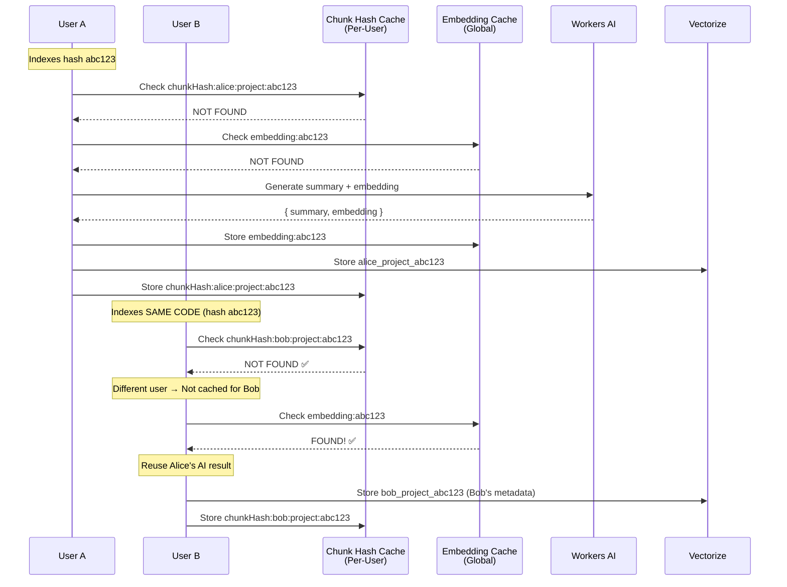

# Multi-Tenant Two-Phase Sync Fix

**Problem:** Global chunk hash cache breaks two-phase sync with composite vector IDs

**Solution:** Per-user chunk hashes + Global embedding cache

---

## The Problem

### Current Architecture (Broken)

```
User A indexes hash abc123:
├─ Stores: chunkHash:abc123 (global KV)
└─ Stores: alice@example.com_alice-project_abc123 (Vectorize)

User B sync Phase 1 for hash abc123:
├─ Checks: chunkHash:abc123 → FOUND ✅
├─ Returns: { "cached": ["abc123"], "needed": [] }
└─ User B doesn't send Phase 2

User B sync Phase 2:
└─ Nothing to send (Phase 1 said "cached")

User B vector status:
└─ bob@company.com_bob-project_abc123 → MISSING ❌

User B searches:
└─ No results (vector doesn't exist) ❌
```

### Root Cause

**Chunk hashes are GLOBAL** but **vectors are PER-USER** (composite IDs).

- Global chunk hash: `chunkHash:abc123`
- User A vector: `alice@example.com_alice-project_abc123`
- User B vector: `bob@company.com_bob-project_abc123` (never created!)

---

## The Solution: Two-Level Caching

### Cache Architecture

```
┌────────────────────────────────────────────────────────────┐
│ Level 1: Per-User Chunk Hash Cache                        │
│ Purpose: Track what THIS user has indexed                 │
│ Key: chunkHash:{userId}:{projectId}:{hash}                │
│ Use: Two-phase sync - skip chunks this user already sent  │
└────────────────────────────────────────────────────────────┘
                              ↓
┌────────────────────────────────────────────────────────────┐
│ Level 2: Global Embedding Cache                           │
│ Purpose: Share AI results across ALL users                │
│ Key: embedding:{hash}                                      │
│ Value: { summary: "...", embedding: [...] }               │
│ Use: Avoid duplicate AI calls for same code               │
└────────────────────────────────────────────────────────────┘
```

### How It Works Together



---

## Implementation Steps

### Step 1: Update Chunk Hash Key Function

**File:** `src/lib/kv-store.ts` (Line 18-21)

**Before:**
```typescript
function getChunkHashKey(hash: string): string {
    return `${CHUNK_HASH_PREFIX}:${hash}`;
}
```

**After:**
```typescript
function getChunkHashKey(
    hash: string,
    userId: string,
    projectId: string
): string {
    return `${CHUNK_HASH_PREFIX}:${userId}:${projectId}:${hash}`;
}
```

### Step 2: Update All Function Signatures

**File:** `src/lib/kv-store.ts`

Update these functions to accept `userId` and `projectId`:

```typescript
// Line 51-58
export async function hasChunkHash(
    kv: KVNamespace,
    hash: string,
    userId: string,    // ADD
    projectId: string   // ADD
): Promise<boolean> {
    const key = getChunkHashKey(hash, userId, projectId);
    const value = await kv.get(key);
    return value !== null;
}

// Line 63-70
export async function setChunkHash(
    kv: KVNamespace,
    hash: string,
    userId: string,    // ADD
    projectId: string,  // ADD
    ttlSeconds: number
): Promise<void> {
    const key = getChunkHashKey(hash, userId, projectId);
    await kv.put(key, '1', { expirationTtl: ttlSeconds });
}

// Line 76-82
export async function refreshChunkHash(
    kv: KVNamespace,
    hash: string,
    userId: string,    // ADD
    projectId: string,  // ADD
    ttlSeconds: number
): Promise<void> {
    await setChunkHash(kv, hash, userId, projectId, ttlSeconds);
}

// Line 88-120
export async function categorizeChunkHashes(
    kv: KVNamespace,
    hashes: string[],
    userId: string,    // ADD
    projectId: string,  // ADD
    ttlSeconds: number
): Promise<{ needed: string[]; cached: string[] }> {
    const needed: string[] = [];
    const cached: string[] = [];

    const results = await Promise.all(
        hashes.map(async (hash) => {
            const exists = await hasChunkHash(kv, hash, userId, projectId);
            return { hash, exists };
        })
    );

    for (const { hash, exists } of results) {
        if (exists) {
            cached.push(hash);
            refreshChunkHash(kv, hash, userId, projectId, ttlSeconds).catch(() => {});
        } else {
            needed.push(hash);
        }
    }

    return { needed, cached };
}

// Line 127-135
export async function setChunkHashes(
    kv: KVNamespace,
    hashes: string[],
    userId: string,    // ADD
    projectId: string,  // ADD
    ttlSeconds: number
): Promise<void> {
    const promises = hashes.map((hash) =>
        setChunkHash(kv, hash, userId, projectId, ttlSeconds)
    );
    await Promise.all(promises);
}
```

### Step 3: Update index-init.ts

**File:** `src/routes/index-init.ts`

**Line 70-75:**
```typescript
// Before
const existingChecks = await Promise.all(
    allHashes.map(async (hash) => ({
        hash,
        exists: await hasChunkHash(c.env.INDEX_KV, hash),
    }))
);

// After
const existingChecks = await Promise.all(
    allHashes.map(async (hash) => ({
        hash,
        exists: await hasChunkHash(c.env.INDEX_KV, hash, userId, projectId),
    }))
);
```

**Line 113-114:**
```typescript
// Before
await setChunkHashes(c.env.INDEX_KV, allHashes, ttlSeconds);

// After
await setChunkHashes(c.env.INDEX_KV, allHashes, userId, projectId, ttlSeconds);
```

### Step 4: Update index-sync.ts

**File:** `src/routes/index-sync.ts`

**Line 112-116:**
```typescript
// Before
const { needed, cached } = await categorizeChunkHashes(
    c.env.INDEX_KV,
    hashes,
    ttlSeconds
);

// After
const { needed, cached } = await categorizeChunkHashes(
    c.env.INDEX_KV,
    hashes,
    body.projectId,  // Need to extract from body
    getUserId(c),    // Need to extract userId
    ttlSeconds
);
```

**Note:** You'll need to extract `userId` in `handlePhase1`. Update signature:

```typescript
async function handlePhase1(
    c: AppContext,
    body: IndexSyncPhase1Request,
    userId: string,      // ADD
    ttlSeconds: number
)
```

**Line 141-142:**
```typescript
// Before
await setChunkHashes(c.env.INDEX_KV, hashes, ttlSeconds);

// After
await setChunkHashes(c.env.INDEX_KV, hashes, userId, projectId, ttlSeconds);
```

### Step 5: Update Main Handler

**File:** `src/routes/index-sync.ts` (Line 86-98)

```typescript
// Before
if (body.phase === 1) {
    return handlePhase1(c, body as IndexSyncPhase1Request, ttlSeconds);
}

// After
if (body.phase === 1) {
    return handlePhase1(
        c,
        body as IndexSyncPhase1Request,
        userId,        // Pass userId
        ttlSeconds
    );
}
```

---

## Step 6: Add Embedding Cache (Already Created!)

You already have `src/lib/embedding-cache.ts` ready to use!

Now update `index-init.ts` and `index-sync.ts` to use it:

**See:** `PRODUCTION_OPTIMIZATION_GUIDE.md` for complete embedding cache integration

---

## Benefits of This Approach

### ✅ Advantages

1. **Proper Two-Phase Sync:**
   - Each user tracks their own indexed chunks
   - Phase 1 correctly identifies what THIS user needs
   - Phase 2 creates vectors for each user

2. **Cross-User Optimization:**
   - Embedding cache shares AI results globally
   - 90%+ cost savings for common code
   - Users get different metadata with same embeddings

3. **Clean Separation:**
   - Chunk hash = "What did I send?"
   - Embedding cache = "What AI results exist?"
   - Vector = "My specific indexed data"

4. **No Breaking Changes:**
   - Composite vector IDs stay the same
   - Just change chunk hash keys
   - Add embedding cache as optimization

---

## Testing

### Test 1: User A Indexes
```bash
curl -X POST ".../v1/index/init" -d '{
  "userId": "alice@example.com",
  "projectId": "alice-project",
  "chunks": [{ "hash": "abc123", "code": "...", "filePath": "src/a.ts" }]
}'
```

**Expected KV state:**
```
chunkHash:alice@example.com:alice-project:abc123 → "1"
embedding:abc123 → { summary: "...", embedding: [...] }
```

**Expected Vectorize:**
```
alice@example.com_alice-project_abc123 → { filePath: "src/a.ts", ... }
```

### Test 2: User B Indexes Same Code
```bash
curl -X POST ".../v1/index/init" -d '{
  "userId": "bob@company.com",
  "projectId": "bob-project",
  "chunks": [{ "hash": "abc123", "code": "...", "filePath": "lib/b.ts" }]
}'
```

**Expected KV state:**
```
chunkHash:alice@example.com:alice-project:abc123 → "1"
chunkHash:bob@company.com:bob-project:abc123 → "1"  ← NEW
embedding:abc123 → { summary: "...", embedding: [...] }  ← REUSED
```

**Expected Vectorize:**
```
alice@example.com_alice-project_abc123 → { filePath: "src/a.ts", ... }
bob@company.com_bob-project_abc123 → { filePath: "lib/b.ts", ... }  ← NEW
```

**AI Calls:**
- User A: 2 calls (summary + embedding)
- User B: 0 calls (reused from cache) ✅

### Test 3: User B Sync Phase 1
```bash
curl -X POST ".../v1/index/sync" -d '{
  "phase": 1,
  "userId": "bob@company.com",
  "projectId": "bob-project",
  "chunks": [
    { "hash": "abc123", ... },
    { "hash": "def456", ... }
  ]
}'
```

**Expected response:**
```json
{
  "needed": ["def456"],
  "cached": ["abc123"]
}
```

✅ **User B correctly sees abc123 as cached (for Bob)**

### Test 4: User A Sync Phase 1 (Same Hashes)
```bash
curl -X POST ".../v1/index/sync" -d '{
  "phase": 1,
  "userId": "alice@example.com",
  "projectId": "alice-project",
  "chunks": [
    { "hash": "abc123", ... },
    { "hash": "def456", ... }
  ]
}'
```

**Expected response:**
```json
{
  "needed": ["def456"],
  "cached": ["abc123"]
}
```

✅ **User A also sees abc123 as cached (for Alice)**
✅ **Both users need def456 (neither has it yet)**

---

## Migration Checklist

- [ ] Update `getChunkHashKey()` to accept userId + projectId
- [ ] Update `hasChunkHash()` signature
- [ ] Update `setChunkHash()` signature
- [ ] Update `refreshChunkHash()` signature
- [ ] Update `categorizeChunkHashes()` signature
- [ ] Update `setChunkHashes()` signature
- [ ] Update `index-init.ts` calls
- [ ] Update `index-sync.ts` Phase 1 handler
- [ ] Update `index-sync.ts` Phase 2 handler
- [ ] Pass userId to Phase 1 handler
- [ ] Test User A indexes
- [ ] Test User B indexes same code
- [ ] Test two-phase sync for both users
- [ ] Verify vectors created for both users
- [ ] Verify embedding cache reuse

---

## Summary

**Problem:** Global chunk hashes + Composite vector IDs = Broken two-phase sync

**Solution:**
1. **Per-user chunk hashes** → Track what each user indexed
2. **Global embedding cache** → Share AI results across users

**Result:**
- ✅ Two-phase sync works correctly
- ✅ Each user gets their own vectors
- ✅ 90%+ AI cost savings via embedding cache
- ✅ Complete multi-tenant isolation maintained

**This is the production-ready architecture!** 🚀
