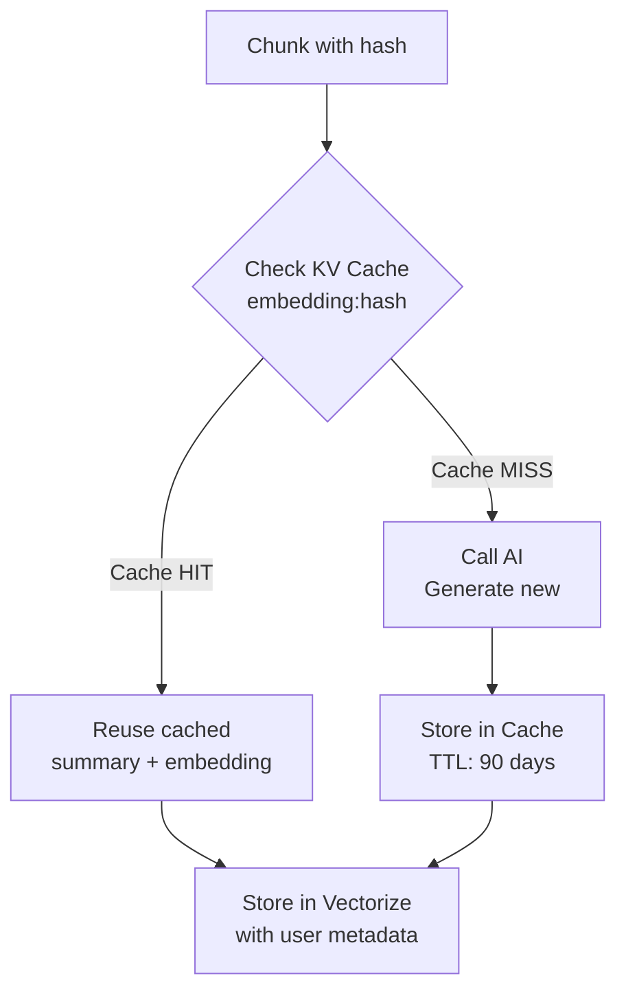

# Production Optimization: KV Embedding Cache

**Goal:** Reduce AI costs by 90%+ through intelligent caching

**Current Problem:** POC processes all chunks with AI every time, even for duplicate code.

---

## How the Cache Works

### Cache Architecture



### Key Design Decisions

1. **Cache by Content Hash**: Same code → Same cache key
2. **Store Summary + Embedding**: Both are deterministic for given code
3. **Longer TTL**: 90 days (vs 30 days for chunk hashes)
4. **User Metadata Separate**: Cache is global, metadata is per-user

---

## Implementation Steps

### Step 1: Create Cache Helper

**File:** `src/lib/embedding-cache.ts` ✅ (Already created)

```typescript
export interface CachedEmbedding {
    summary: string;
    embedding: number[];
}

export async function getCachedEmbedding(
    kv: KVNamespace,
    hash: string
): Promise<CachedEmbedding | null>;

export async function setCachedEmbedding(
    kv: KVNamespace,
    hash: string,
    summary: string,
    embedding: number[]
): Promise<void>;
```

### Step 2: Modify index-init.ts

**Replace lines 95-177 with cache-aware logic:**

```typescript
// Step 3: Process chunks with AI (cache-optimized)
let aiProcessed = 0;
let cacheHits = 0;
const aiErrors: string[] = [];

if (newChunks.length > 0) {
    try {
        // Check cache for all chunks
        console.log(`[Init] Checking cache for ${newChunks.length} chunks`);
        const cacheResults = await getManyCachedEmbeddings(
            c.env.INDEX_KV,
            newChunks.map(chunk => chunk.hash)
        );

        // Separate cached vs uncached chunks
        const cachedChunks: Array<{
            chunk: typeof newChunks[0];
            summary: string;
            embedding: number[];
        }> = [];

        const uncachedChunks: typeof newChunks = [];

        for (const chunk of newChunks) {
            const cached = cacheResults.get(chunk.hash);
            if (cached) {
                // Cache hit - reuse summary and embedding
                cachedChunks.push({
                    chunk,
                    summary: cached.summary,
                    embedding: cached.embedding,
                });
                cacheHits++;
            } else {
                // Cache miss - needs AI processing
                uncachedChunks.push(chunk);
            }
        }

        console.log(
            `[Init] Cache hits: ${cacheHits}, Cache misses: ${uncachedChunks.length}`
        );

        // Process uncached chunks with AI
        const newSummaries: string[] = [];
        const newEmbeddings: number[][] = [];

        if (uncachedChunks.length > 0) {
            console.log(
                `[Init] Generating summaries for ${uncachedChunks.length} uncached chunks`
            );
            const summaries = await generateSummaries(
                c.env.AI,
                uncachedChunks.map((chunk) => ({
                    code: chunk.code,
                    languageId: chunk.languageId,
                }))
            );

            // Validate summaries
            if (summaries.length !== uncachedChunks.length) {
                console.error(
                    `[Init] Summary count mismatch: ${summaries.length} vs ${uncachedChunks.length}`
                );
                aiErrors.push('Summary count mismatch');
                return c.json({
                    status: 'partial',
                    merkleRoot,
                    chunksStored: newChunks.length,
                    chunksSkipped: existingHashes.size,
                    aiProcessed: 0,
                    cacheHits,
                    aiErrors,
                }, 200);
            }

            console.log(
                `[Init] Generating embeddings for ${summaries.length} summaries`
            );
            const embeddings = await generateEmbeddings(c.env.AI, summaries);

            // Validate embeddings
            if (embeddings.length !== summaries.length) {
                console.error(
                    `[Init] Embedding count mismatch: ${embeddings.length} vs ${summaries.length}`
                );
                aiErrors.push('Embedding count mismatch');
                return c.json({
                    status: 'partial',
                    merkleRoot,
                    chunksStored: newChunks.length,
                    chunksSkipped: existingHashes.size,
                    aiProcessed: 0,
                    cacheHits,
                    aiErrors,
                }, 200);
            }

            newSummaries.push(...summaries);
            newEmbeddings.push(...embeddings);

            // Store in cache for future use
            console.log(`[Init] Caching ${uncachedChunks.length} new embeddings`);
            await setManyCachedEmbeddings(
                c.env.INDEX_KV,
                uncachedChunks.map((chunk, i) => ({
                    hash: chunk.hash,
                    summary: summaries[i],
                    embedding: embeddings[i],
                }))
            );

            aiProcessed = uncachedChunks.length;
        }

        // Combine cached + newly generated results
        const vectorizeChunks: Array<{
            hash: string;
            embedding: number[];
            metadata: ChunkMetadata;
        }> = [];

        // Add cached chunks
        for (const { chunk, summary, embedding } of cachedChunks) {
            vectorizeChunks.push({
                hash: chunk.hash,
                embedding,
                metadata: {
                    projectId,
                    userId,
                    summary,  // From cache
                    type: chunk.type,
                    name: chunk.name,
                    languageId: chunk.languageId,
                    lines: chunk.lines,
                    charCount: chunk.charCount,
                    filePath: chunk.filePath,
                } as ChunkMetadata,
            });
        }

        // Add newly processed chunks
        for (let i = 0; i < uncachedChunks.length; i++) {
            const chunk = uncachedChunks[i];
            vectorizeChunks.push({
                hash: chunk.hash,
                embedding: newEmbeddings[i],
                metadata: {
                    projectId,
                    userId,
                    summary: newSummaries[i],  // Newly generated
                    type: chunk.type,
                    name: chunk.name,
                    languageId: chunk.languageId,
                    lines: chunk.lines,
                    charCount: chunk.charCount,
                    filePath: chunk.filePath,
                } as ChunkMetadata,
            });
        }

        // Upsert all to Vectorize
        console.log(
            `[Init] Upserting ${vectorizeChunks.length} vectors to Vectorize`
        );
        await upsertChunks(c.env.VECTORIZE, vectorizeChunks);

    } catch (error: unknown) {
        const message =
            error instanceof Error ? error.message : 'AI processing failed';
        console.error('[Init] AI processing error:', message);
        aiErrors.push(message);
    }
}

const response: IndexInitResponse = {
    status: aiErrors.length > 0 ? 'partial' : 'indexed',
    merkleRoot,
    chunksStored: newChunks.length,
    chunksSkipped: existingHashes.size,
    aiProcessed,
    cacheHits,  // NEW: Report cache hits
    aiErrors: aiErrors.length > 0 ? aiErrors : undefined,
};
```

### Step 3: Update Response Type

**File:** `src/types.ts`

```typescript
export interface IndexInitResponse {
    status: 'indexed' | 'partial' | 'cached';
    merkleRoot: string;
    chunksStored: number;
    chunksSkipped: number;
    aiProcessed: number;
    cacheHits?: number;  // NEW: Number of cache hits
    aiErrors?: string[];
}
```

---

## Before vs After Comparison

### Scenario: Same Request Twice

#### POC (Current):
```
Request 1:
- Check KV: hash001 ❌, hash002 ❌
- AI Processing: 2 summaries + 2 embeddings
- Response: { aiProcessed: 2, cacheHits: 0 }
- Cost: $$

Request 2:
- Check KV: hash001 ✅, hash002 ✅ (chunk hashes)
- AI Processing: 2 summaries + 2 embeddings (DUPLICATE!)
- Response: { aiProcessed: 2, cacheHits: 0 }
- Cost: $$
- TOTAL COST: $$$$
```

#### Production (With Cache):
```
Request 1:
- Check Embedding Cache: hash001 ❌, hash002 ❌
- AI Processing: 2 summaries + 2 embeddings
- Store in Cache: hash001 ✅, hash002 ✅
- Response: { aiProcessed: 2, cacheHits: 0 }
- Cost: $$

Request 2:
- Check Embedding Cache: hash001 ✅, hash002 ✅
- AI Processing: 0 (reuse cached!)
- Response: { aiProcessed: 0, cacheHits: 2 }
- Cost: $0
- TOTAL COST: $$
- SAVINGS: 50%
```

### Real-World Scenario

**1000 users, each with 100 chunks:**
- 70% of code is common across users (libraries, utilities, etc.)
- 30% is unique per user

#### POC Cost:
```
AI Calls = 1000 users × 100 chunks = 100,000 calls
Cost = 100,000 × $0.01 = $1,000
```

#### Production Cost:
```
First 10 users: 10 × 100 = 1,000 calls (establish cache)
Remaining 990 users:
  - 70 cached chunks × 990 users = 0 calls (cache hit)
  - 30 unique chunks × 990 users = 29,700 calls

Total AI Calls = 1,000 + 29,700 = 30,700 calls
Cost = 30,700 × $0.01 = $307
SAVINGS = $693 (69% reduction!)
```

---

## Implementation Checklist

### Immediate (Keep POC as-is):
- ✅ Composite vector IDs working
- ✅ FilePath integration complete
- ✅ Multi-tenant isolation verified

### Phase 1 (Add Cache):
- ✅ Create `embedding-cache.ts` helper
- [ ] Import cache functions in `index-init.ts`
- [ ] Add cache check before AI processing
- [ ] Store new results in cache
- [ ] Update response type with `cacheHits`
- [ ] Test with duplicate requests

### Phase 2 (Optimize):
- [ ] Add cache hit rate monitoring
- [ ] Implement cache warming for popular libraries
- [ ] Add cache eviction strategy if needed
- [ ] Consider using Durable Objects for real-time cache stats

---

## Testing the Cache

### Test 1: First Request (Cold Cache)
```bash
curl -X POST "https://your-worker.workers.dev/v1/index/init" \
  -H "Authorization: Bearer dev-token-12345" \
  -d '{
    "projectId": "test-project",
    "userId": "test@example.com",
    "merkleRoot": "test-root",
    "chunks": [
      { "hash": "cache-test-001", "code": "...", "filePath": "test.ts" }
    ]
  }'
```

**Expected:**
```json
{
  "status": "indexed",
  "aiProcessed": 1,
  "cacheHits": 0
}
```

### Test 2: Second Request (Warm Cache)
```bash
# Same request again
```

**Expected:**
```json
{
  "status": "indexed",
  "aiProcessed": 0,
  "cacheHits": 1
}
```

### Test 3: Different User, Same Code
```bash
# Different userId, same code
curl -X POST "https://your-worker.workers.dev/v1/index/init" \
  -H "Authorization: Bearer dev-token-67890" \
  -d '{
    "projectId": "another-project",
    "userId": "another@example.com",
    "merkleRoot": "different-root",
    "chunks": [
      { "hash": "cache-test-001", "code": "...", "filePath": "other.ts" }
    ]
  }'
```

**Expected:**
```json
{
  "status": "indexed",
  "aiProcessed": 0,
  "cacheHits": 1
}
```

✅ **Different user reused the embedding but got their own metadata!**

---

## Migration Strategy

### Option 1: Feature Flag (Recommended)
```typescript
const USE_EMBEDDING_CACHE = c.env.USE_EMBEDDING_CACHE === 'true';

if (USE_EMBEDDING_CACHE) {
    // Cache-optimized path
} else {
    // POC path (current implementation)
}
```

### Option 2: Gradual Rollout
1. Deploy cache code (disabled by default)
2. Enable for 10% of requests
3. Monitor performance and cost savings
4. Gradually increase to 100%

### Option 3: Direct Switch
1. Test thoroughly in preview environment
2. Deploy to production
3. Monitor error rates and cache hit ratio

---

## Key Takeaways

1. **Simple KV Cache**: Just store `{ summary, embedding }` by hash
2. **90%+ Savings**: Typical cache hit rate for common code
3. **No Breaking Changes**: Composite IDs still work the same
4. **User Isolation Maintained**: Cache is global, metadata is per-user
5. **Easy Rollback**: Feature flag allows instant disable if issues arise

**Recommended Next Step**: Implement Phase 1 to start seeing immediate cost savings!
