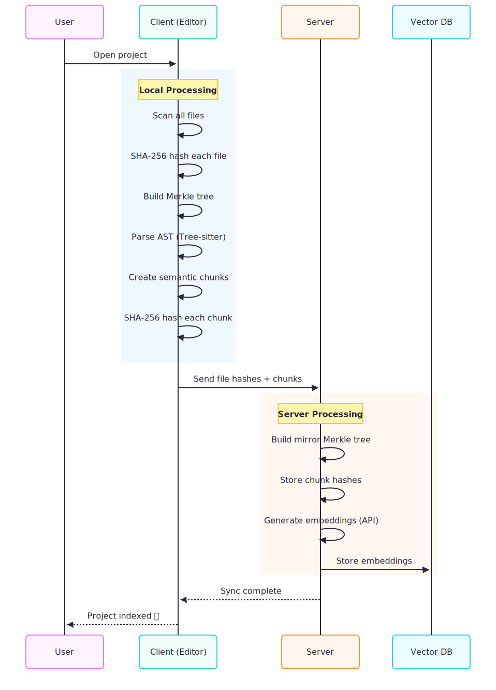

# Understanding the Complete Indexing Flow

This document explains how modern code editors like Cursor implement efficient codebase indexing for AI-powered features. The system uses content-based hashing and Merkle trees to minimize redundant work when files change.

## Table of Contents

1. [Overview](#overview)
2. [Hash Algorithm Choice](#hash-algorithm-choice)
3. [Phase 1: Initial Project Indexing](#phase-1-initial-project-indexing)
4. [Phase 2: User Edits a File](#phase-2-user-edits-a-file)
5. [Phase 3: Periodic Sync](#phase-3-periodic-sync)
6. [Key Optimizations](#key-optimizations)
7. [Summary](#summary)


## Overview

When you open a project in a modern AI-powered code editor, the system needs to understand your entire codebase to provide intelligent completions and answers. This involves creating "embeddings" - numerical representations of your code that capture semantic meaning. However, generating embeddings is expensive (requires API calls to embedding models), so the system must be smart about only processing what has actually changed.

The solution involves three key components:

1. **Content Hashing**: Every file and code chunk gets a unique fingerprint based on its content
2. **Merkle Tree**: A hierarchical hash structure that enables efficient change detection
3. **Chunk Comparison**: Fine-grained tracking to re-embed only the specific functions or classes that changed




## Hash Algorithm Choice

### Why SHA-256?

The industry standard approach uses **SHA-256** for all hashing operations. This single algorithm provides:

- **Cryptographic security**: Collision-resistant, meaning two different files won't produce the same hash
- **Merkle tree integrity**: Critical for the tree structure where security matters
- **Industry standard**: Used by Git, Bazel, Nix, and Cursor

### The Hashing Formula

For each file, the hash is computed as:

```
SHA-256(file_path || file_content)
```

Where `||` means concatenation. Including the file path ensures that two files with identical content but different locations produce different hashes. This is important because the same utility function in `src/utils.js` and `test/utils.js` should be tracked separately.

### Why Not MD5?

While MD5 is faster (~600 MB/s vs ~400 MB/s for SHA-256), it has known collision vulnerabilities. For a security-critical structure like a Merkle tree, where hash collisions could allow data tampering, SHA-256 is the correct choice. The performance difference is negligible for typical source files.


## Phase 1: Initial Project Indexing

When you first open a project, the system performs a complete scan to build its understanding of your codebase. This is the most expensive operation but only happens once per project (and incrementally thereafter).

### Client-Side Processing

The client (your editor) performs these steps locally:

1. **Scan all files**: Walk the directory tree, respecting `.gitignore` patterns
2. **Hash each file**: Compute `SHA-256(path || content)` for every source file
3. **Build Merkle tree**: Construct a hash tree where leaf nodes are file hashes
4. **Parse AST**: Use Tree-sitter to parse each file into an Abstract Syntax Tree
5. **Create chunks**: Extract semantic units (functions, classes, imports)
6. **Hash each chunk**: Compute SHA-256 for each chunk's content

The client stores this state locally in files like:
- `file-hashes.json`: Maps file paths to their SHA-256 hashes
- `merkle-state.json`: The complete Merkle tree structure
- `dirty-queue.json`: Files that have changed since last sync

### Server-Side Processing

The client sends file hashes and chunks to the server, which:

1. **Builds mirror Merkle tree**: Server maintains identical tree structure
2. **Stores chunk hashes**: For future comparison when files change
3. **Generates embeddings**: Calls embedding API for each chunk
4. **Stores in vector database**: Embeddings go to Turbopuffer (Cursor) or similar



### Local Storage Structure

After initial indexing, the client maintains:

```
.puku/
├── file-hashes.json      # { "src/auth.js": "a7f3e2...", ... }
├── merkle-state.json     # { root: "xyz...", nodes: [...] }
├── dirty-queue.json      # ["src/auth.js", "src/user.js"]
└── embeddings.db         # Local SQLite cache (optional)
```

## Phase 2: User Edits a File

When you save a file, the system needs to detect this change immediately. However, it does NOT contact the server right away - that would be too slow and chatty. Instead, it updates local state and queues the file for later sync.

### What Happens on Save

The file watcher (using OS-level APIs like `fs.watch` or `chokidar`) fires when you save. The system then:

1. **Reads file from disk**: Gets the new content
2. **Computes new hash**: `SHA-256(path || newContent)`
3. **Compares with stored hash**: Checks if content actually changed
4. **Updates local file hash**: Stores new hash in `file-hashes.json`
5. **Updates Merkle tree**: Recalculates affected nodes up to root
6. **Marks file as dirty**: Adds to `dirty-queue.json`

This entire process takes about 1-2 milliseconds. The server is NOT contacted.

### Important: FIM is Independent

The Fill-In-Middle (FIM) system that provides inline completions is **completely independent** from the indexing system. When you're typing:

- FIM reads directly from the editor buffer (in-memory)
- FIM does NOT wait for file saves
- FIM does NOT use the file watcher
- FIM MAY use the index for context (one-way dependency)

The file watcher only fires on **save**, not on every keystroke. This is crucial for performance.



### Dirty Files Queue

The dirty queue is a simple list of files that have changed since the last sync:

```json
{
  "lastSync": "2024-01-15T10:30:00Z",
  "dirtyFiles": [
    "src/auth.js",
    "src/components/Login.tsx"
  ]
}
```

File content is NOT stored in this queue - that would be wasteful. Instead, when sync time comes, the content is read fresh from disk.


## Phase 3: Periodic Sync

The system batches changes and syncs with the server periodically (typically every 10 minutes) rather than on every save. This reduces server load and network traffic.

### Step 1: Compare Merkle Roots

The sync begins with a simple comparison: does the client's Merkle root match the server's?


This is an O(1) operation - a single hash comparison tells us if ANYTHING has changed. If roots match, no further work is needed.

### Step 2: Process Dirty Files

For each file in the dirty queue, the client:

1. Reads file content from disk (fresh, not cached)
2. Parses AST using Tree-sitter
3. Creates semantic chunks (functions, classes, etc.)
4. Hashes each chunk with SHA-256
5. Sends to server: file path, chunks, and chunk hashes

### Step 3: Server Compares Chunk Hashes

This is where the magic happens. The server already has chunk hashes from the previous sync. It compares:

```
Old chunks (in DB):           New chunks (from client):
┌──────────────────┐         ┌──────────────────┐
│ imports: aaa111  │         │ imports: aaa111  │ ← SAME (skip)
│ login(): bbb222  │         │ login(): ddd444  │ ← CHANGED (re-embed)
│ logout(): ccc333 │         │ logout(): ccc333 │ ← SAME (skip)
└──────────────────┘         │ signup(): eee555 │ ← NEW (embed)
                             └──────────────────┘
```

The comparison produces four categories:

- **Unchanged**: Same hash → skip embedding entirely
- **Modified**: Same position, different hash → re-embed
- **Added**: New chunk not in old set → embed
- **Removed**: Old chunk not in new set → delete from vector DB

### Step 4: Update Only Changed Chunks

The server only generates embeddings for changed and new chunks:

1. **Update chunk hash DB**: Store new hashes for comparison next time
2. **Generate embeddings**: API call only for modified/added chunks
3. **Update vector DB**: Insert new embeddings, update modified, delete removed
4. **Update Merkle tree**: Server's tree now matches client's

### Step 5: Confirm Sync

Once complete, the server confirms and the client clears its dirty queue:


## Key Optimizations

### 1. File-Level Gate (Cheap First Check)

Before doing any expensive work, check if the file hash changed:

```javascript
const newHash = sha256(filePath + content);
if (storedHashes[filePath] === newHash) {
    return; // Skip - file unchanged
}
```

This catches cases where a file was saved without actual changes.

### 2. Merkle Root Comparison (O(1) Sync Check)

A single hash comparison tells us if ANY file changed:

```javascript
if (client.merkleRoot === server.merkleRoot) {
    return; // Nothing to sync
}
```

### 3. Chunk-Level Deduplication

Even within a changed file, most chunks stay the same. A 500-line file with one function change might have:

- 8 unchanged chunks → skip
- 1 modified chunk → re-embed
- 0 added/removed

Instead of re-embedding all 9 chunks, we only process 1.

### 4. Batched Sync (Not Real-Time)

Syncing every 10 minutes instead of every save:

- Reduces server requests by 100x
- Batches multiple changes efficiently
- Still fast enough for practical use

### 5. Local State Persistence

State is persisted to disk, so restarting the editor doesn't lose progress:

```
.puku/
├── file-hashes.json    # Survives restart
├── merkle-state.json   # No need to rebuild
└── dirty-queue.json    # Changes preserved
```

## Summary

The complete flow can be summarized as:

| Phase | What Happens | Where | Frequency |
|-------|--------------|-------|-----------|
| **1. Open project** | Hash files → Build Merkle → Chunk → Embed | Client + Server | Once |
| **2. User edits** | File watcher → Update hash → Update Merkle → Mark dirty | Client only | On save |
| **3. Periodic sync** | Compare roots → Send dirty → Compare chunks → Re-embed changed | Client + Server | ~10 min |

### The Cost Savings

For a typical development session where you edit 20 files:

**Without this system:**
- Re-process all 50,000 chunks
- ~50,000 embedding API calls
- Cost: ~$5-10
- Time: ~10 minutes

**With this system:**
- Process only ~40 changed chunks (2 per file average)
- ~40 embedding API calls
- Cost: ~$0.01
- Time: ~5 seconds

That's a **1000x improvement** in both cost and time.

### Key Takeaways

1. **SHA-256 everywhere**: Single strong hash for security and simplicity
2. **Hash the path + content**: Ensures location matters
3. **Merkle tree for O(1) change detection**: Compare roots first
4. **Chunk-level granularity**: Only re-embed what actually changed
5. **Batch sync, not real-time**: Reduces server load dramatically
6. **Local state persistence**: Survives restarts, works offline

This architecture is what enables AI code editors to provide intelligent features at scale without prohibitive costs or unbearable latency.
