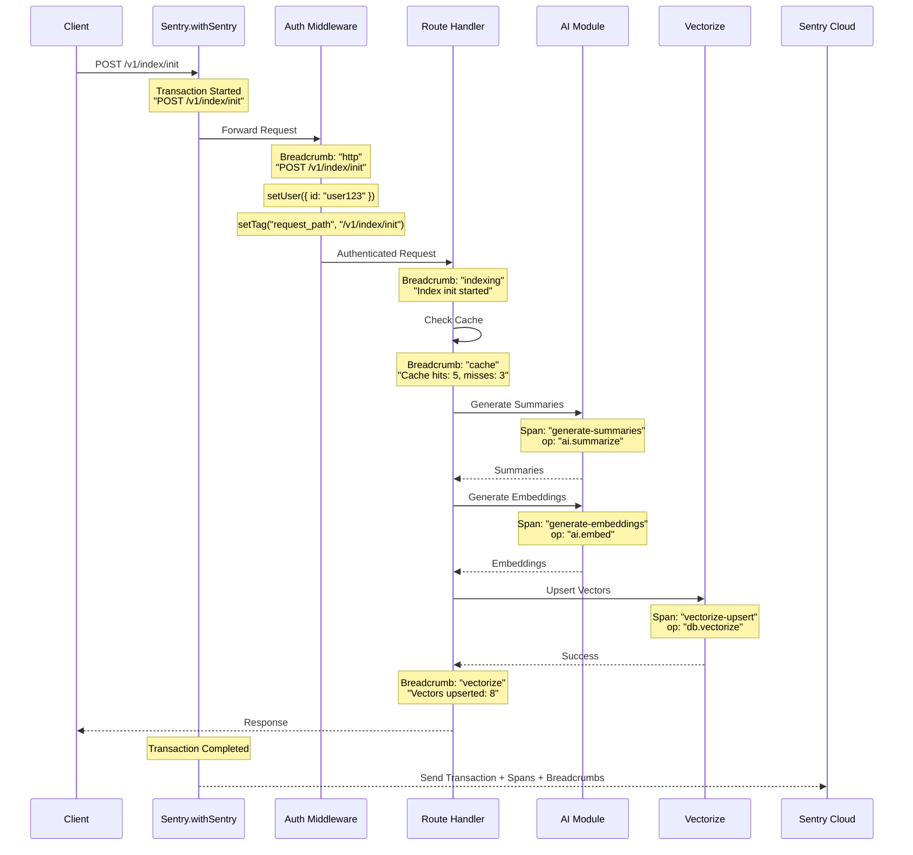
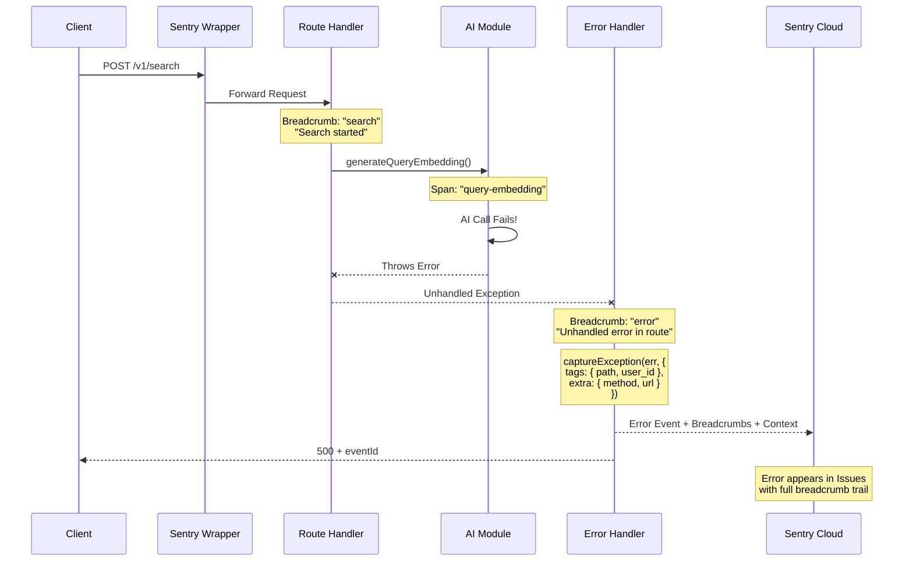
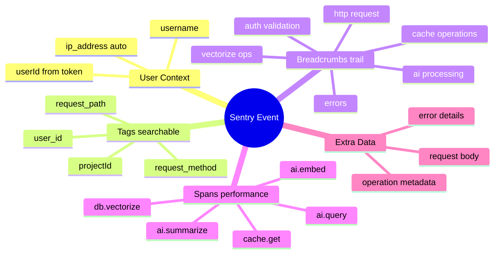

# Sentry Integration Plan

## Executive Summary

This plan integrates Sentry into the Cloudflare Workers-based semantic code search system to achieve:
1. **Error Catching with Breadcrumbs** - Capture errors with full context trail for replay/reproduction
2. **User Activity Tracing** - Monitor all user activities across the entire request lifecycle


## Architecture Overview

### Current System Architecture



### With Sentry Integration



## Data Flow with Sentry Instrumentation

### Request Lifecycle with Breadcrumbs



### Error Capture Flow



---

## Sentry Data Model

### What Gets Captured



### Breadcrumb Categories

| Category | Description | Example Message |
|----------|-------------|-----------------|
| `http` | Incoming HTTP requests | `POST /v1/index/init` |
| `auth` | Authentication events | `User authenticated: user123` |
| `indexing` | Index operations | `Index init started` |
| `sync` | Sync operations | `Sync Phase 1 started` |
| `cache` | Cache operations | `Cache hits: 5, misses: 3` |
| `ai` | AI processing | `Generating summaries for 10 chunks` |
| `vectorize` | Vectorize operations | `Vectors upserted: 8` |
| `search` | Search operations | `Search completed: 5 results` |
| `error` | Error events | `Unhandled error in route` |

### Performance Spans

| Span Name | Operation | Module |
|-----------|-----------|--------|
| `generate-summaries` | `ai.summarize` | ai.ts |
| `generate-embeddings` | `ai.embed` | ai.ts |
| `query-embedding` | `ai.query` | ai.ts |
| `vectorize-upsert` | `db.vectorize` | vectorize.ts |
| `vectorize-search` | `db.query` | vectorize.ts |
| `cache-lookup` | `cache.get` | embedding-cache.ts |
| `cache-store` | `cache.set` | embedding-cache.ts |

---

## Implementation Details

### 1. Install Dependencies

```bash
npm install @sentry/cloudflare --save
```

### 2. Wrangler Configuration Changes

```toml
# wrangler.toml additions

name = "indexing-poc-phase-2"
main = "src/index.ts"
compatibility_date = "2024-11-24"
compatibility_flags = ["nodejs_compat"]  # Already exists, needed for Sentry

# NEW: Version metadata for release tracking
[version_metadata]
binding = "CF_VERSION_METADATA"

[vars]
DEV_TOKEN = "dev-token-12345"
SENTRY_DSN = "https://xxx@xxx.ingest.sentry.io/xxx"  # NEW
```

### 3. Type Definitions Update

```typescript
// src/types.ts - Add to Env interface

export interface Env {
    // Existing bindings
    INDEX_KV: KVNamespace;
    DEV_TOKEN: string;
    AI: Ai;
    VECTORIZE: VectorizeIndex;

    // NEW: Sentry bindings
    SENTRY_DSN: string;
    CF_VERSION_METADATA: { id: string };
}
```

### 4. Entry Point Wrapper

```typescript
// src/index.ts

import { Hono } from 'hono';
import { cors } from 'hono/cors';
import { logger } from 'hono/logger';
import * as Sentry from '@sentry/cloudflare';
import type { Env, Variables } from './types';
// ... other imports

const app = new Hono<{ Bindings: Env; Variables: Variables }>();

// Middleware
app.use('*', logger());
app.use('*', cors());

// Routes (existing)
app.route('/v1/health', health);
app.use('/v1/index/*', authMiddleware);
// ... etc

// Error handler with Sentry
app.onError((err, c) => {
    Sentry.addBreadcrumb({
        category: 'error',
        message: 'Unhandled error caught',
        level: 'error',
        data: { path: c.req.path, error: err.message },
    });

    Sentry.captureException(err, {
        tags: { handler: 'global', path: c.req.path },
        extra: { method: c.req.method, url: c.req.url },
    });

    return c.json({
        error: 'Internal Server Error',
        message: err.message,
        eventId: Sentry.lastEventId(),
    }, 500);
});

// Wrap with Sentry
export default Sentry.withSentry(
    (env: Env) => ({
        dsn: env.SENTRY_DSN,
        release: env.CF_VERSION_METADATA?.id || 'dev',
        environment: env.SENTRY_DSN ? 'production' : 'development',
        tracesSampleRate: 1.0,
        sendDefaultPii: true,
        beforeBreadcrumb(breadcrumb) {
            if (breadcrumb.category === 'console') return null;
            return breadcrumb;
        },
    }),
    app
);
```

### 5. Auth Middleware Enhancement

```typescript
// src/middleware/auth.ts

import { createMiddleware } from 'hono/factory';
import * as Sentry from '@sentry/cloudflare';
import type { Env, Variables, ErrorResponse } from '../types';

export const authMiddleware = createMiddleware<{
    Bindings: Env;
    Variables: Variables;
}>(async (c, next) => {
    // Track request
    Sentry.addBreadcrumb({
        category: 'http',
        message: `${c.req.method} ${c.req.path}`,
        level: 'info',
        data: { url: c.req.url, method: c.req.method },
    });

    const authHeader = c.req.header('Authorization');

    if (!authHeader || !authHeader.startsWith('Bearer ')) {
        Sentry.setUser({ id: 'anonymous' });
        return c.json({ error: 'Unauthorized' }, 401);
    }

    const token = authHeader.slice(7);

    if (!token.startsWith('dev-token-')) {
        Sentry.addBreadcrumb({
            category: 'auth',
            message: 'Invalid token format',
            level: 'warning',
        });
        return c.json({ error: 'Unauthorized' }, 401);
    }

    const userId = token.slice(10);

    // Set user context for all subsequent events
    Sentry.setUser({
        id: userId,
        username: userId,
    });

    // Set searchable tags
    Sentry.setTag('user_id', userId);
    Sentry.setTag('request_path', c.req.path);

    Sentry.addBreadcrumb({
        category: 'auth',
        message: `Authenticated: ${userId}`,
        level: 'info',
    });

    c.set('userId', userId);
    await next();
});
```

### 6. Route Handler Instrumentation Pattern

```typescript
// Example: src/routes/index-init.ts

import * as Sentry from '@sentry/cloudflare';

indexInit.post('/', async (c) => {
    const userId = c.get('userId');
    const body = await c.req.json<IndexInitRequest>();
    const { projectId, merkleRoot, chunks } = body;

    // Track operation start
    Sentry.addBreadcrumb({
        category: 'indexing',
        message: 'Index init started',
        level: 'info',
        data: { projectId, chunksCount: chunks.length, merkleRoot },
    });

    // Set operation context
    Sentry.setContext('indexing_operation', {
        projectId,
        userId,
        chunksCount: chunks.length,
        merkleRoot,
    });

    // ... existing logic with breadcrumbs at key points ...

    // Track cache results
    Sentry.addBreadcrumb({
        category: 'cache',
        message: 'Embedding cache checked',
        level: 'info',
        data: { hits: cacheHits, misses: uncachedChunks.length },
    });

    // Track AI processing
    if (uncachedChunks.length > 0) {
        Sentry.addBreadcrumb({
            category: 'ai',
            message: 'AI processing started',
            level: 'info',
            data: { count: uncachedChunks.length },
        });
    }

    // Track completion
    Sentry.addBreadcrumb({
        category: 'indexing',
        message: 'Index init completed',
        level: 'info',
        data: { aiProcessed, cacheHits, vectorsStored },
    });

    return c.json(response);
});
```

### 7. Library Module Instrumentation

```typescript
// src/lib/ai.ts - Wrap with performance spans

import * as Sentry from '@sentry/cloudflare';

export async function generateSummaries(
    ai: Ai,
    chunks: Array<{ code: string; languageId: string }>
): Promise<string[]> {
    if (chunks.length === 0) return [];

    return await Sentry.startSpan(
        {
            name: 'generate-summaries',
            op: 'ai.summarize',
            attributes: {
                'ai.model': '@cf/qwen/qwen2.5-coder-32b-instruct',
                'ai.chunks_count': chunks.length,
            },
        },
        async () => {
            // ... existing implementation ...
        }
    );
}

export async function generateEmbeddings(
    ai: Ai,
    texts: string[]
): Promise<number[][]> {
    if (texts.length === 0) return [];

    return await Sentry.startSpan(
        {
            name: 'generate-embeddings',
            op: 'ai.embed',
            attributes: {
                'ai.model': '@cf/baai/bge-large-en-v1.5',
                'ai.texts_count': texts.length,
            },
        },
        async () => {
            // ... existing implementation ...
        }
    );
}

export async function generateQueryEmbedding(
    ai: Ai,
    query: string
): Promise<number[]> {
    return await Sentry.startSpan(
        {
            name: 'query-embedding',
            op: 'ai.query',
            attributes: { 'ai.query_length': query.length },
        },
        async () => {
            // ... existing implementation ...
        }
    );
}
```

```typescript
// src/lib/vectorize.ts

import * as Sentry from '@sentry/cloudflare';

export async function upsertChunks(
    vectorize: VectorizeIndex,
    chunks: Array<{ hash: string; embedding: number[]; metadata: ChunkMetadata }>
): Promise<number> {
    return await Sentry.startSpan(
        {
            name: 'vectorize-upsert',
            op: 'db.vectorize',
            attributes: { 'db.chunks_count': chunks.length },
        },
        async () => {
            // ... existing implementation ...
        }
    );
}

export async function searchChunks(
    vectorize: VectorizeIndex,
    embedding: number[],
    userId: string,
    projectId: string,
    topK: number
): Promise<SearchResult[]> {
    return await Sentry.startSpan(
        {
            name: 'vectorize-search',
            op: 'db.query',
            attributes: {
                'db.user_id': userId,
                'db.project_id': projectId,
                'db.top_k': topK,
            },
        },
        async () => {
            // ... existing implementation ...
        }
    );
}
```

```typescript
// src/lib/embedding-cache.ts

import * as Sentry from '@sentry/cloudflare';

export async function getManyCachedEmbeddings(
    kv: KVNamespace,
    hashes: string[]
): Promise<Map<string, CachedEmbedding>> {
    return await Sentry.startSpan(
        {
            name: 'cache-lookup',
            op: 'cache.get',
            attributes: { 'cache.keys_count': hashes.length },
        },
        async () => {
            // ... existing implementation ...
        }
    );
}

export async function setManyCachedEmbeddings(
    kv: KVNamespace,
    embeddings: Array<{ hash: string; summary: string; embedding: number[] }>
): Promise<void> {
    return await Sentry.startSpan(
        {
            name: 'cache-store',
            op: 'cache.set',
            attributes: { 'cache.keys_count': embeddings.length },
        },
        async () => {
            // ... existing implementation ...
        }
    );
}
```

---

## Files to Modify

| File | Changes | Priority |
|------|---------|----------|
| `package.json` | Add `@sentry/cloudflare` | High |
| `wrangler.toml` | Add `version_metadata`, `SENTRY_DSN` | High |
| `src/types.ts` | Add Sentry env bindings | High |
| `src/index.ts` | Wrap with `Sentry.withSentry`, error handler | High |
| `src/middleware/auth.ts` | User context, request breadcrumbs | High |
| `src/lib/ai.ts` | Performance spans | Medium |
| `src/lib/vectorize.ts` | Performance spans | Medium |
| `src/lib/embedding-cache.ts` | Performance spans | Medium |
| `src/routes/index-init.ts` | Breadcrumbs | Medium |
| `src/routes/index-sync.ts` | Breadcrumbs | Medium |
| `src/routes/index-check.ts` | Breadcrumbs | Low |
| `src/routes/search.ts` | Breadcrumbs | Medium |
| `src/routes/summarize.ts` | Breadcrumbs | Low |
| `src/routes/embeddings.ts` | Breadcrumbs | Low |
| `src/routes/health.ts` | No changes needed | - |

---

## Verification Plan

### 1. Deploy and Test Error Capture

```bash
# Trigger an error
curl -X POST https://your-worker.workers.dev/v1/index/init \
  -H "Authorization: Bearer dev-token-testuser" \
  -H "Content-Type: application/json" \
  -d '{"projectId": "test"}'  # Missing required fields
```

**Expected in Sentry:**
- Error captured with message about missing fields
- User context: `testuser`
- Breadcrumbs showing request path

### 2. Test Full Activity Trail

```bash
# Full indexing flow
curl -X POST https://your-worker.workers.dev/v1/index/init \
  -H "Authorization: Bearer dev-token-alice" \
  -H "Content-Type: application/json" \
  -d '{
    "projectId": "test-project",
    "merkleRoot": "abc123",
    "chunks": [
      {"hash": "h1", "code": "function add(a,b){return a+b}", "type": "function", "name": "add", "languageId": "javascript", "lines": [1,1], "charCount": 30, "filePath": "test.js"}
    ]
  }'
```

**Expected Breadcrumb Trail:**
```
1. [http] POST /v1/index/init
2. [auth] Authenticated: alice
3. [indexing] Index init started
4. [cache] Embedding cache checked (hits: 0, misses: 1)
5. [ai] AI processing started
6. [vectorize] Vectors upserted: 1
7. [indexing] Index init completed
```

### 3. Verify Performance Traces

**Expected Spans in Transaction:**
```
POST /v1/index/init (transaction)
├── generate-summaries (ai.summarize) - 2.5s
├── generate-embeddings (ai.embed) - 1.2s
└── vectorize-upsert (db.vectorize) - 0.3s
```

---

## Sentry Dashboard Views

### Issues View
- Errors grouped by type
- Each error shows full breadcrumb trail
- User info visible for each error
- Filter by `user_id` tag

### Performance View
- Transactions for each endpoint
- Span waterfall showing timing breakdown
- P50/P95/P99 latency metrics
- Slowest operations highlighted

### User Activity
- Filter by `user_id` to see all activity
- Timeline of requests and errors
- Full context for debugging user-reported issues

---

## References

- [Sentry Cloudflare Docs](https://docs.sentry.io/platforms/javascript/guides/cloudflare/)
- [Hono on Cloudflare - Sentry](https://docs.sentry.io/platforms/javascript/guides/cloudflare/frameworks/hono/)
- [Breadcrumbs Documentation](https://docs.sentry.io/platforms/javascript/guides/cloudflare/enriching-events/breadcrumbs/)
- [Custom Instrumentation](https://docs.sentry.io/platforms/javascript/tracing/instrumentation/custom-instrumentation/)
- [@sentry/cloudflare npm](https://www.npmjs.com/package/@sentry/cloudflare)
